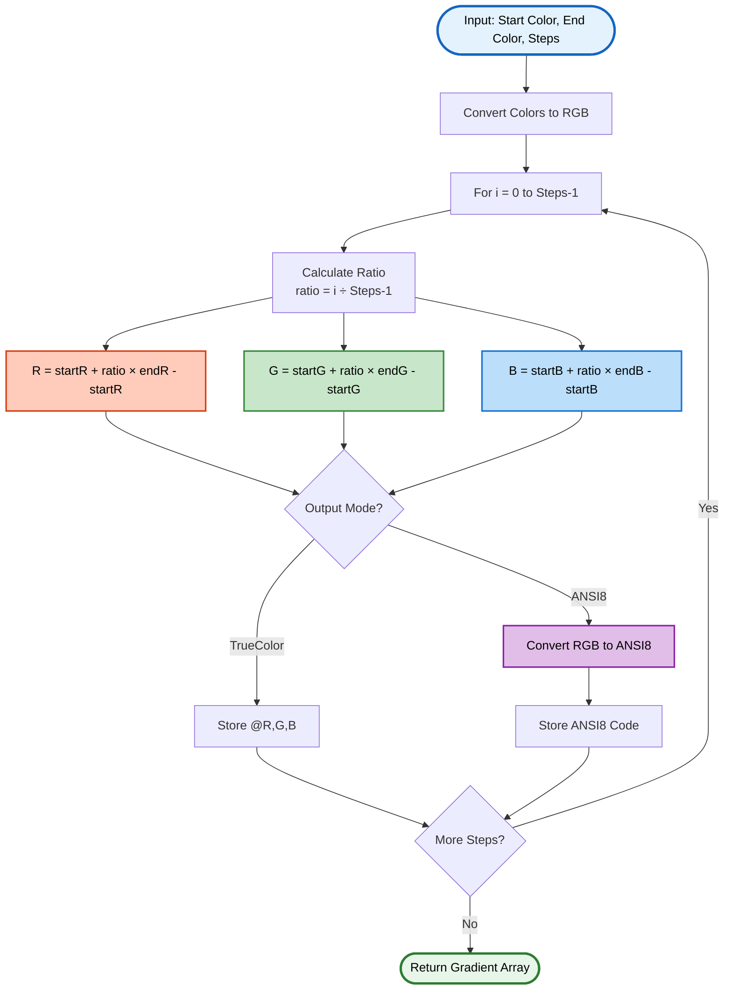
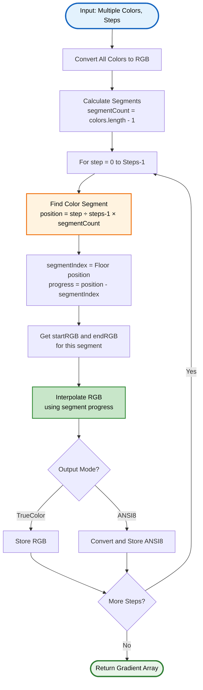
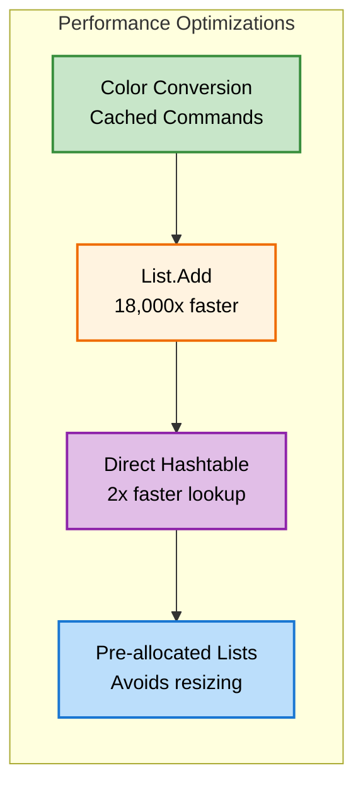
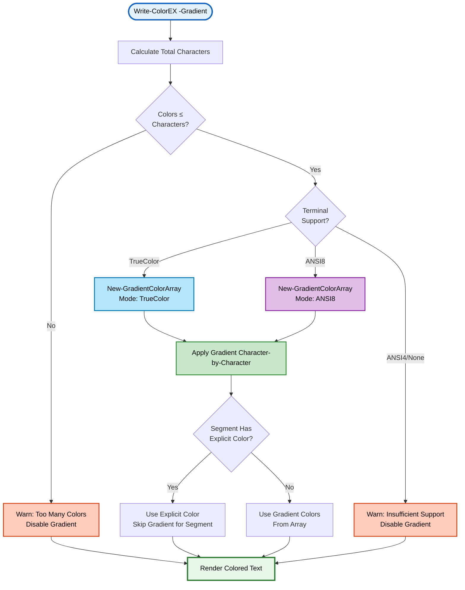

# New-GradientColorArray

> 🌈 **Generate smooth color gradients for character-by-character coloring**

---

## 📑 Table of Contents

[Synopsis](#synopsis) • [Syntax](#syntax) • [Description](#description) • [Parameters](#parameters) • [Return Values](#return-values) • [Examples](#-examples) • [Algorithm](#-interpolation-algorithm) • [Performance](#-performance-optimizations) • [Integration](#-integration-with-write-colorex) • [Best Practices](#-best-practices) • [Related](#-related-commands)

---

## Synopsis

Generates an array of interpolated colors between waypoints for smooth gradient effects in terminal output.

## Syntax

```powershell
New-GradientColorArray
    -Colors <Object[]>
    -Steps <Int32>
    -Mode <String>
    [<CommonParameters>]
```

## Description

`New-GradientColorArray` creates a gradient color array by interpolating between 2 or more color waypoints. It supports both TrueColor (24-bit RGB) and ANSI8 (256-color) output modes, making it perfect for creating visually striking rainbow text and smooth color transitions.

### ✨ Key Features

- **🎨 Multi-Stop Gradients** - Support for 2+ color waypoints
- **⚡ Highly Optimized** - Uses cached lookup tables and List<T> for performance
- **🔄 Linear Interpolation** - Smooth RGB color transitions
- **🌈 Flexible Input** - Accepts color names, hex codes, or RGB arrays
- **📊 Two Output Modes** - TrueColor RGB or ANSI8 256-color codes
- **🔧 PowerShell 5.1+** - Compatible with all modern PowerShell versions

---

## Parameters

<details open>
<summary><b>🎛️ Function Parameters</b></summary>

### `-Colors`
> **Type:** `Object[]`
> **Required:** Yes
> **Minimum:** 2 colors

Array of gradient waypoints. Accepts:
- **Color names** - `'Red'`, `'Blue'`, `'Cyan'`, etc.
- **Hex codes** - `'#FF0000'`, `'0x00FF00'`, `'RRGGBB'`
- **RGB arrays** - `@(255, 0, 0)`, `@(0, 255, 0)`

```powershell
# Two-color gradient
-Colors @('Red', 'Blue')

# Hex gradient
-Colors @('#FF0000', '#0000FF')

# Multi-stop rainbow
-Colors @('Red', 'Yellow', 'Green', 'Cyan', 'Blue', 'Magenta')
```

---

### `-Steps`
> **Type:** `Int32`
> **Required:** Yes
> **Range:** 1 to [Int32]::MaxValue

Number of interpolated colors to generate. Typically matches the total character count of the text to be colored.

```powershell
# Generate 20 colors
-Steps 20

# Match character count
-Steps "RAINBOW TEXT".Length  # 12 colors
```

---

### `-Mode`
> **Type:** `String`
> **Required:** Yes
> **ValidSet:** `'TrueColor'`, `'ANSI8'`

Output color format:
- **`TrueColor`** - Returns RGB arrays `@(R, G, B)` for 24-bit color
- **`ANSI8`** - Returns ANSI 256-color codes (0-255)

```powershell
# TrueColor mode (16.7 million colors)
-Mode TrueColor

# ANSI8 mode (256 colors)
-Mode ANSI8
```

</details>

---

## Return Values

| Mode | Return Type | Example |
|------|-------------|---------|
| `TrueColor` | `Array of @(R,G,B)` | `@(@(255,0,0), @(255,23,0), @(255,46,0), ...)` |
| `ANSI8` | `Array of Int32` | `@(196, 202, 208, 214, 220, ...)` |

The returned array has exactly `$Steps` elements, interpolated evenly between the provided colors.

---

## 📚 Examples

<details>
<summary><b>Example 1: Simple Two-Color Gradient</b></summary>

```powershell
# Generate 10 colors from Red to Blue (TrueColor)
$gradient = New-GradientColorArray -Colors @('Red', 'Blue') -Steps 10 -Mode TrueColor

# Returns:
# @(255,0,0)    # Pure red
# @(226,0,28)
# @(198,0,56)
# @(170,0,85)
# @(141,0,113)
# @(113,0,141)
# @(85,0,170)
# @(56,0,198)
# @(28,0,226)
# @(0,0,255)    # Pure blue
```

</details>

<details>
<summary><b>Example 2: Hex Color Gradient (ANSI8)</b></summary>

```powershell
# Orange to Purple gradient in ANSI8 mode
$gradient = New-GradientColorArray -Colors @('#FF8000', '#8000FF') -Steps 8 -Mode ANSI8

# Returns ANSI8 codes:
# 208, 214, 177, 171, 135, 99, 93, 93
```

</details>

<details>
<summary><b>Example 3: Multi-Stop Rainbow Gradient</b></summary>

```powershell
# Classic rainbow: Red → Yellow → Green → Cyan → Blue → Magenta
$rainbow = New-GradientColorArray -Colors @('Red','Yellow','Green','Cyan','Blue','Magenta') `
                                   -Steps 30 `
                                   -Mode TrueColor

# Returns 30 RGB arrays smoothly transitioning through all colors
```

</details>

<details>
<summary><b>Example 4: RGB Array Input</b></summary>

```powershell
# Use RGB arrays directly
$gradient = New-GradientColorArray -Colors @(@(255,0,0), @(0,255,0), @(0,0,255)) `
                                   -Steps 15 `
                                   -Mode TrueColor

# Red → Green → Blue with 15 steps
```

</details>

<details>
<summary><b>Example 5: Character-Matched Gradient</b></summary>

```powershell
# Create gradient matching text length
$text = "RAINBOW"
$charCount = $text.Length  # 7 characters

$gradient = New-GradientColorArray -Colors @('Red', 'Violet') `
                                   -Steps $charCount `
                                   -Mode TrueColor

# Returns exactly 7 colors, one per character
```

</details>

<details>
<summary><b>Example 6: Warm to Cool Gradient</b></summary>

```powershell
# Fire to ice effect
$warmToCool = New-GradientColorArray -Colors @('#FF0000', '#FF8000', '#FFFF00', '#00FFFF', '#0000FF') `
                                     -Steps 50 `
                                     -Mode TrueColor

# Smooth transition from warm reds/oranges to cool blues
```

</details>

---

## 🔄 Interpolation Algorithm

<details open>
<summary><b>Two-Color Gradient Algorithm</b></summary>



### Linear Interpolation Formula

For each RGB channel at step `i`:

```
ratio = i / (steps - 1)
value = start + (end - start) × ratio
```

**Example:** Red (255,0,0) to Blue (0,0,255) with 5 steps

| Step | Ratio | R | G | B | Result |
|------|-------|---|---|---|--------|
| 0 | 0.00 | 255 | 0 | 0 | `@(255,0,0)` Pure Red |
| 1 | 0.25 | 191 | 0 | 63 | `@(191,0,63)` |
| 2 | 0.50 | 127 | 0 | 127 | `@(127,0,127)` Purple |
| 3 | 0.75 | 63 | 0 | 191 | `@(63,0,191)` |
| 4 | 1.00 | 0 | 0 | 255 | `@(0,0,255)` Pure Blue |

</details>

<details>
<summary><b>Multi-Stop Gradient Algorithm</b></summary>



### Distribution Algorithm

For 3 colors (Red → Yellow → Blue) with 9 steps:

| Step | Position | Segment | Progress | Interpolation |
|------|----------|---------|----------|---------------|
| 0-3 | 0.00-0.75 | 0 | 0.00-0.75 | Red → Yellow |
| 4-8 | 1.00-2.00 | 1 | 0.00-1.00 | Yellow → Blue |

Steps are **evenly distributed** across color segments automatically.

</details>

---

## ⚡ Performance Optimizations

<details open>
<summary><b>Optimization Techniques</b></summary>

### 1. **List<T> Instead of Array +=**

```powershell
# ❌ BAD - Creates new array each iteration (18,000x slower)
$colors = @()
for ($i = 0; $i -lt 1000; $i++) {
    $colors += $rgb
}

# ✅ GOOD - List.Add() is constant time
$colors = [System.Collections.Generic.List[object]]::new(1000)
for ($i = 0; $i -lt 1000; $i++) {
    $null = $colors.Add($rgb)
}
```

### 2. **Cached Command Availability**

```powershell
# Check once, use many times
$hasConvertHex = $null -ne (Get-Command Convert-HexToRGB -ErrorAction SilentlyContinue)
$hasConvertANSI8 = $null -ne (Get-Command Convert-RGBToANSI8 -ErrorAction SilentlyContinue)

# Use cached checks in loop
foreach ($color in $Colors) {
    if ($hasConvertHex) {
        $rgb = Convert-HexToRGB $color
    }
}
```

### 3. **Pre-Allocated List Capacity**

```powershell
# Pre-allocate exact size (avoids array resizing)
$gradientColors = [System.Collections.Generic.List[object]]::new($Steps)
```

### 4. **Cached Color Table Access**

```powershell
# Use module's cached color table (built once, reused)
if ($null -eq $script:CachedColorTable) {
    $script:CachedColorTable = Get-ColorTableWithRGB
}
$colorEntry = $script:CachedColorTable[$colorName]
```

### Performance Metrics

| Operation | Array Count | Time (ms) | Notes |
|-----------|-------------|-----------|-------|
| Generate 10-color gradient | 10 | <1 | Instant |
| Generate 100-color gradient | 100 | ~2 | Very fast |
| Generate 1000-color gradient | 1000 | ~15 | Optimized with List<T> |

**Memory efficient**: No intermediate arrays created during interpolation.

</details>

<details>
<summary><b>Performance Comparison</b></summary>



</details>

---

## 🔗 Integration with Write-ColorEX

<details open>
<summary><b>Automatic Gradient Processing</b></summary>

`Write-ColorEX` automatically calls `New-GradientColorArray` when the `-Gradient` parameter is used:



### User-Facing Syntax

```powershell
# Simple gradient
Write-ColorEX "RAINBOW TEXT" -Gradient @('Red', 'Blue')

# Multi-stop gradient
Write-ColorEX "FULL SPECTRUM" -Gradient @('Red','Orange','Yellow','Green','Blue','Purple')

# Hex gradient
Write-ColorEX "HEX COLORS" -Gradient @('#FF0000', '#00FF00', '#0000FF')

# Gradient with style
Write-ColorEX "BOLD GRADIENT" -Gradient @('Cyan', 'Magenta') -Bold -Underline
```

</details>

<details>
<summary><b>Gradient Override Behavior</b></summary>

When using `-Gradient` with `-Color`, explicit colors override the gradient:

```powershell
# Gradient for segments 0 and 2, Yellow for segment 1
Write-ColorEX -Text 'GRAD','OVERRIDE','GRAD' `
              -Gradient @('Red','Blue') `
              -Color @($null, 'Yellow', $null)
```

**Behavior:**
1. Gradient array generated for **all characters** (static)
2. Segment 0: Uses gradient colors (character-by-character)
3. Segment 1: Uses Yellow (entire segment, skips gradient)
4. Segment 2: Uses gradient colors (continues from where segment 1 left off)

**Result:** Seamless gradient with selective overrides.

</details>

---

## 💡 Best Practices

> [!TIP]
> **Use named colors or hex for consistency** - RGB arrays work but are verbose.

> [!NOTE]
> **Gradient quality** - TrueColor produces smooth gradients; ANSI8 may show slight banding.

> [!IMPORTANT]
> **Terminal compatibility** - Gradients require ANSI8 or TrueColor terminal support.

<details>
<summary><b>Development Best Practices</b></summary>

### 1. Match Steps to Character Count

```powershell
# ✅ GOOD - Exact match
$text = "RAINBOW"
$gradient = New-GradientColorArray -Colors @('Red','Blue') -Steps $text.Length -Mode TrueColor

# ⚠️ AVOID - Mismatched steps (will need adjustment)
$gradient = New-GradientColorArray -Colors @('Red','Blue') -Steps 20 -Mode TrueColor
# Then only use first 7 colors for "RAINBOW"
```

### 2. Choose Appropriate Color Mode

```powershell
# For smooth gradients: TrueColor
New-GradientColorArray -Colors @('Red','Blue') -Steps 50 -Mode TrueColor

# For compatibility: ANSI8
New-GradientColorArray -Colors @('Red','Blue') -Steps 50 -Mode ANSI8
```

### 3. Use Complementary Colors

```powershell
# ✅ GOOD - High contrast
@('Red', 'Cyan')      # Complementary
@('Blue', 'Yellow')   # Complementary

# ⚠️ LESS VIBRANT - Similar hues
@('Red', 'DarkRed')   # Low contrast
@('Blue', 'Cyan')     # Similar
```

### 4. Multi-Stop Rainbow Order

```powershell
# ✅ GOOD - Natural rainbow order (smooth transitions)
@('Red', 'Orange', 'Yellow', 'Green', 'Blue', 'Indigo', 'Violet')
@('Red', 'Yellow', 'Green', 'Cyan', 'Blue', 'Magenta')

# ❌ BAD - Random order (jarring transitions)
@('Red', 'Blue', 'Yellow', 'Green')
```

### 5. Error Handling

```powershell
# Wrap in try-catch for production use
try {
    $gradient = New-GradientColorArray -Colors @('Red','Blue') -Steps 10 -Mode TrueColor
} catch {
    Write-Warning "Gradient generation failed: $_"
    # Fallback to solid color
}
```

</details>

<details>
<summary><b>Common Patterns</b></summary>

### Pattern 1: Header Gradient

```powershell
$header = "═══ APPLICATION HEADER ═══"
$gradient = New-GradientColorArray -Colors @('Cyan','Blue') `
                                   -Steps $header.Length `
                                   -Mode TrueColor
```

### Pattern 2: Progress Indicator

```powershell
# Green to yellow to red gradient for progress bar
$barLength = 50
$gradient = New-GradientColorArray -Colors @('Green','Yellow','Red') `
                                   -Steps $barLength `
                                   -Mode ANSI8
```

### Pattern 3: Rainbow Banner

```powershell
# Full spectrum for large text
$banner = "WELCOME TO THE APPLICATION!"
$rainbow = New-GradientColorArray -Colors @('Red','Orange','Yellow','Green','Cyan','Blue','Magenta') `
                                  -Steps $banner.Length `
                                  -Mode TrueColor
```

### Pattern 4: Warm/Cool Zones

```powershell
# Fire effect (warm colors)
$warmGradient = New-GradientColorArray -Colors @('#FF0000','#FF8000','#FFFF00') `
                                       -Steps 20 `
                                       -Mode TrueColor

# Ice effect (cool colors)
$coolGradient = New-GradientColorArray -Colors @('#00FFFF','#0080FF','#0000FF') `
                                       -Steps 20 `
                                       -Mode TrueColor
```

</details>

---

## 🌍 Cross-Platform Compatibility

<details>
<summary><b>Platform Considerations</b></summary>

### Windows

```powershell
# Windows Terminal: Full TrueColor support
New-GradientColorArray -Colors @('Red','Blue') -Steps 20 -Mode TrueColor  # ✅

# PowerShell Console (Win10 14931+): TrueColor
New-GradientColorArray -Colors @('Red','Blue') -Steps 20 -Mode TrueColor  # ✅

# PowerShell ISE: No ANSI support
New-GradientColorArray -Colors @('Red','Blue') -Steps 20 -Mode TrueColor  # ❌ Won't display
```

### Linux/macOS

```powershell
# Modern terminals (GNOME Terminal, iTerm2, etc.): Full support
New-GradientColorArray -Colors @('Red','Blue') -Steps 20 -Mode TrueColor  # ✅

# macOS Terminal.app: ANSI8 only (max 256 colors)
New-GradientColorArray -Colors @('Red','Blue') -Steps 20 -Mode ANSI8      # ✅
New-GradientColorArray -Colors @('Red','Blue') -Steps 20 -Mode TrueColor  # ⚠️ Degrades to ANSI8
```

### Automatic Detection

`Write-ColorEX` handles terminal detection automatically:

```powershell
# Automatically uses best available mode
Write-ColorEX "AUTO GRADIENT" -Gradient @('Red','Blue')
# TrueColor terminal → Uses TrueColor mode
# ANSI8 terminal → Uses ANSI8 mode
# ANSI4/None → Disables gradient with warning
```

</details>

---

## 🔍 Troubleshooting

<details>
<summary><b>Common Issues and Solutions</b></summary>

### Issue 1: Colors Look Banded (Not Smooth)

**Cause:** Using ANSI8 mode with many steps
**Solution:** Use TrueColor mode for smooth gradients

```powershell
# ⚠️ May show banding with 256 colors
New-GradientColorArray -Colors @('Red','Blue') -Steps 100 -Mode ANSI8

# ✅ Smooth with 16.7M colors
New-GradientColorArray -Colors @('Red','Blue') -Steps 100 -Mode TrueColor
```

### Issue 2: Gradient Not Displaying

**Cause:** Terminal doesn't support ANSI colors
**Solution:** Use a modern terminal (Windows Terminal, iTerm2, etc.)

```powershell
# Check terminal support first
$support = Test-AnsiSupport -Silent
if ($support -eq 'TrueColor' -or $support -eq 'ANSI8') {
    # Safe to use gradients
}
```

### Issue 3: Invalid Color Names

**Cause:** Typo in color name
**Solution:** Use valid color names or hex codes

```powershell
# ❌ Invalid
New-GradientColorArray -Colors @('Redd','Bluue') -Steps 10 -Mode TrueColor

# ✅ Valid
New-GradientColorArray -Colors @('Red','Blue') -Steps 10 -Mode TrueColor
```

### Issue 4: Performance Slow with Large Gradients

**Cause:** Very high step count (1000+)
**Solution:** Use smaller step count or ensure ANSI8 mode

```powershell
# For very long text, ANSI8 is faster
New-GradientColorArray -Colors @('Red','Blue') -Steps 5000 -Mode ANSI8  # Faster
```

</details>

---

## 🔗 Related Commands

- [`Write-ColorEX`](Write-ColorEX.md) - Main colored output function (uses gradients)
- [`Convert-HexToRGB`](Color-Conversions.md#convert-hextorgb) - Hex to RGB conversion
- [`Convert-RGBToANSI8`](Color-Conversions.md#convert-rgbtoansi8) - RGB to ANSI8 conversion
- [`Test-AnsiSupport`](Test-AnsiSupport.md) - Terminal capability detection
- [Color Conversions](Color-Conversions.md) - Complete color conversion documentation
- [Module Overview](../README.md) - Full documentation

---

## 📋 Quick Reference

<details>
<summary><b>Parameter Quick Reference</b></summary>

| Parameter | Type | Required | Description |
|-----------|------|----------|-------------|
| `Colors` | Object[] | Yes | Array of 2+ colors (names/hex/RGB) |
| `Steps` | Int32 | Yes | Number of interpolated colors to generate |
| `Mode` | String | Yes | Output mode (`TrueColor` or `ANSI8`) |

</details>

<details>
<summary><b>Common Usage Patterns</b></summary>

```powershell
# Two-color gradient (TrueColor)
New-GradientColorArray -Colors @('Red','Blue') -Steps 20 -Mode TrueColor

# Rainbow (ANSI8)
New-GradientColorArray -Colors @('Red','Yellow','Green','Cyan','Blue','Magenta') -Steps 30 -Mode ANSI8

# Hex gradient
New-GradientColorArray -Colors @('#FF0000','#0000FF') -Steps 15 -Mode TrueColor

# RGB arrays
New-GradientColorArray -Colors @(@(255,0,0),@(0,0,255)) -Steps 10 -Mode TrueColor
```

</details>

---

<div align="center">

**PSWriteColorEX** v2.0.0 | MIT License | [GitHub](https://github.com/MarkusMcNugen/PSWriteColorEX)

</div>
