# Color Conversion Functions

> 🎨 **Utilities for color format conversion and automatic degradation**

---

## 📑 Table of Contents

[Overview](#overview) • [Convert-HexToRGB](#convert-hextorgb) • [Convert-RGBToANSI8](#convert-rgbtoansi8) • [Convert-RGBToANSI4](#convert-rgbtoansi4) • [Get-ColorTableWithRGB](#get-colortablewithrgb) • [Lighten-RGBColor](#lighten-rgbcolor) • [Lighten-ColorName](#lighten-colorname) • [Lighten-ANSI8Color](#lighten-ansi8color) • [Conversion Flow](#-automatic-conversion-chain) • [Performance](#-performance-optimizations) • [Best Practices](#-best-practices)

---

## Overview

PSWriteColorEX includes optimized color conversion functions for translating between different color formats. These functions enable automatic color degradation, format flexibility, and cross-platform compatibility.

### ✨ Key Features

- **⚡ Highly Optimized** - Cached lookup tables for 5-10x faster conversions
- **🔄 Automatic Degradation** - TrueColor → ANSI8 → ANSI4 → Native
- **✅ Input Validation** - Range checking with helpful warnings
- **🎨 70+ Color Families** - Extended color names with Dark/Normal/Light variants
- **🌍 Cross-Platform** - Consistent colors across Windows, Linux, macOS
- **🔧 Environment Control** - FORCE_COLOR and NO_COLOR support

---

## Convert-HexToRGB

<details open>
<summary><b>📖 Function Details</b></summary>

### Synopsis
Converts hexadecimal color codes to RGB array format.

### Syntax
```powershell
Convert-HexToRGB [-Hex] <String> [<CommonParameters>]
```

### Description
Converts hex color strings (#RRGGBB, 0xRRGGBB, or RRGGBB format) to RGB arrays suitable for TrueColor output.

### Parameters

**`-Hex`** (String, Required)
- Hexadecimal color string in one of these formats:
  - `#RRGGBB` (standard HTML/CSS format)
  - `0xRRGGBB` (hexadecimal prefix)
  - `RRGGBB` (raw hex values)

### Return Value
Returns `@(R, G, B)` array with values 0-255. Invalid input returns gray `@(128, 128, 128)`.

### Examples

```powershell
# Standard hex format
Convert-HexToRGB "#FF8000"
# Returns: @(255, 128, 0)

# Without hash
Convert-HexToRGB "FF0000"
# Returns: @(255, 0, 0)

# With 0x prefix
Convert-HexToRGB "0x00FF00"
# Returns: @(0, 255, 0)

# Invalid format returns gray
Convert-HexToRGB "GGGGGG"
# Returns: @(128, 128, 128)
```

</details>

<details>
<summary><b>🔄 Conversion Flow Diagram</b></summary>


</details>

---

## Convert-RGBToANSI8

<details open>
<summary><b>📖 Function Details</b></summary>

### Synopsis
Converts RGB values to the nearest ANSI 256-color palette match.

### Syntax
```powershell
Convert-RGBToANSI8 [-RGB] <Int32[]> [<CommonParameters>]
```

### Description
Maps RGB color values to the closest match in the ANSI 256-color palette (8-bit) using intelligent color matching:
- **6x6x6 color cube** (colors 16-231) - 216 colors
- **24 grayscale ramp** (colors 232-255) - 24 shades
- **16 base colors** (colors 0-15) - Standard ANSI colors

### Performance
**⚡ Optimized with lookup table** - RGB to 6-level conversion cached for 5-10x faster performance.

### Parameters

**`-RGB`** (Int32[], Required)
- RGB array with format `@(R, G, B)`
- Each value must be 0-255
- Out-of-range values are clamped

### Return Value
Returns ANSI 256-color code (0-255). Uses optimized lookup table for 6-level conversions.

### Examples

```powershell
# Pure red
Convert-RGBToANSI8 @(255, 0, 0)
# Returns: 196

# Orange
Convert-RGBToANSI8 @(255, 165, 0)
# Returns: 214

# Grayscale
Convert-RGBToANSI8 @(128, 128, 128)
# Returns: 244

# Out of range (clamped)
Convert-RGBToANSI8 @(300, 400, 500)
# Clamped to: @(255, 255, 255)
# Returns: 231 (white)
```

</details>

<details>
<summary><b>🔄 Conversion Algorithm Diagram</b></summary>



```mermaid
graph TD
    Start([RGB Input<br/>@R,G,B]) --> Validate[Clamp to 0-255]

    Validate --> CheckGray{Grayscale?<br/>R≈G≈B<br/>within 10}

    CheckGray -->|Yes| CalcGray[Calculate Gray Level]
    CheckGray -->|No| CheckBase{Close to<br/>Base Color?}

    CalcGray --> MapGray[Map to Grayscale<br/>232-255]
    MapGray --> Return([Return ANSI8 Code])

    CheckBase -->|Yes| UseBase[Use Base Color<br/>0-15]
    CheckBase -->|No| UseCube[Use 6x6x6 Cube<br/>16-231]

    UseCube --> LookupR[Lookup R Level<br/>Using Cache Table]
    UseCube --> LookupG[Lookup G Level<br/>Using Cache Table]
    UseCube --> LookupB[Lookup B Level<br/>Using Cache Table]

    LookupR --> CalcCode[Calculate:<br/>16 + R×36 + G×6 + B]
    LookupG --> CalcCode
    LookupB --> CalcCode

    CalcCode --> Return
    UseBase --> Return

    style Start fill:#e3f2fd,stroke:#1565c0,stroke-width:3px,color:#000
    style Return fill:#e8f5e9,stroke:#2e7d32,stroke-width:3px,color:#000
    style LookupR fill:#fff3e0,stroke:#ef6c00,stroke-width:2px,color:#000
    style LookupG fill:#fff3e0,stroke:#ef6c00,stroke-width:2px,color:#000
    style LookupB fill:#fff3e0,stroke:#ef6c00,stroke-width:2px,color:#000
    style CalcCode fill:#c8e6c9,stroke:#388e3c,stroke-width:2px,color:#000
```

### Lookup Table Details

The **RGB6LevelLookup** table maps 256 RGB values to 6 levels (0-5):

| RGB Value Range | Level | Description |
|----------------|-------|-------------|
| 0-47 | 0 | Darkest |
| 48-114 | 1 | Dark |
| 115-154 | 2 | Mid-Dark |
| 155-194 | 3 | Mid-Light |
| 195-234 | 4 | Light |
| 235-255 | 5 | Lightest |

**Performance**: Cached at module load, eliminates repeated calculations.

</details>

---

## Convert-RGBToANSI4

<details open>
<summary><b>📖 Function Details</b></summary>

### Synopsis
Converts RGB values to the nearest ANSI 16-color match.

### Syntax
```powershell
Convert-RGBToANSI4 [-RGB] <Int32[]> [<CommonParameters>]
```

### Description
Maps RGB values to the closest match in the ANSI 16-color palette (4-bit). Intelligently determines whether to use normal (30-37) or bright (90-97) color variants based on perceived brightness.

### Algorithm
1. Calculate brightness: `(R + G + B) / 3`
2. Determine dominant color channel(s)
3. Select normal (brightness < 128) or bright (≥128) variant
4. Return appropriate ANSI code

### Parameters

**`-RGB`** (Int32[], Required)
- RGB array with format `@(R, G, B)`
- Each value must be 0-255

### Return Value
Returns ANSI 4-bit foreground code (30-37 normal, 90-97 bright).

### Examples

```powershell
# Bright red
Convert-RGBToANSI4 @(255, 0, 0)
# Returns: 91 (Bright red)

# Dark blue
Convert-RGBToANSI4 @(0, 0, 139)
# Returns: 34 (Blue)

# Yellow
Convert-RGBToANSI4 @(255, 255, 0)
# Returns: 93 (Bright yellow)

# Gray
Convert-RGBToANSI4 @(128, 128, 128)
# Returns: 37 (White/Gray)
```

</details>

<details>
<summary><b>🔄 Conversion Algorithm Diagram</b></summary>


### ANSI 4-bit Color Codes

| Code | Color | Type | RGB Approximation |
|------|-------|------|-------------------|
| 30 | Black | Normal FG | @(0,0,0) |
| 31 | Red | Normal FG | @(128,0,0) |
| 32 | Green | Normal FG | @(0,128,0) |
| 33 | Yellow | Normal FG | @(128,128,0) |
| 34 | Blue | Normal FG | @(0,0,128) |
| 35 | Magenta | Normal FG | @(128,0,128) |
| 36 | Cyan | Normal FG | @(0,128,128) |
| 37 | White/Gray | Normal FG | @(192,192,192) |
| 90 | Bright Black | Bright FG | @(128,128,128) |
| 91 | Bright Red | Bright FG | @(255,0,0) |
| 92 | Bright Green | Bright FG | @(0,255,0) |
| 93 | Bright Yellow | Bright FG | @(255,255,0) |
| 94 | Bright Blue | Bright FG | @(0,0,255) |
| 95 | Bright Magenta | Bright FG | @(255,0,255) |
| 96 | Bright Cyan | Bright FG | @(0,255,255) |
| 97 | Bright White | Bright FG | @(255,255,255) |

</details>

---

## Get-ColorTableWithRGB

<details open>
<summary><b>📖 Function Details</b></summary>

### Synopsis
Returns the complete color mapping table with RGB values.

### Syntax
```powershell
Get-ColorTableWithRGB [<CommonParameters>]
```

### Description
Returns a hashtable containing all predefined color mappings. Each entry contains:
```powershell
@(NativePS, ANSI4FG, ANSI4BG, ANSI8, @(R,G,B))
```

### Performance
**⚡ Cached at module load** - Color table built once and reused for ~1000x faster lookups.

### Return Value
Hashtable with 70+ color names as keys, each containing 5-element array:
- `[0]` - Native PowerShell color name
- `[1]` - ANSI 4-bit foreground code
- `[2]` - ANSI 4-bit background code
- `[3]` - ANSI 8-bit code
- `[4]` - RGB array `@(R, G, B)`

### Examples

```powershell
# Get full color table
$colors = Get-ColorTableWithRGB

# Access specific color
$red = $colors['Red']
# $red[0] = 'Red'        # Native PowerShell
# $red[1] = 31           # ANSI4 FG
# $red[2] = 41           # ANSI4 BG
# $red[3] = 1            # ANSI8
# $red[4] = @(255,0,0)   # RGB

# List all available colors
$colors.Keys | Sort-Object

# Check if color exists
if ($colors.ContainsKey('Orange')) {
    $orange = $colors['Orange']
}
```

</details>

<details>
<summary><b>🎨 Available Color Families (70+)</b></summary>

### Basic Colors (PowerShell Native)
| Family | Dark | Normal | Light |
|--------|------|--------|-------|
| **Neutral** | DarkGray | Gray | LightGray/White |
| **Black** | Black | LightBlack | - |
| **Red** | DarkRed | Red | LightRed |
| **Green** | DarkGreen | Green | LightGreen |
| **Blue** | DarkBlue | Blue | LightBlue |
| **Yellow** | DarkYellow | Yellow | LightYellow |
| **Cyan** | DarkCyan | Cyan | LightCyan |
| **Magenta** | DarkMagenta | Magenta | LightMagenta |

### Extended Color Families
Orange, Purple, Pink, Brown, Teal, Violet, Lime, Slate, Gold, Sky, Coral, Olive, Lavender, Mint, Salmon, Indigo, Turquoise, Ruby, Jade, Amber, Steel, Crimson, Emerald, Sapphire, Wine, Peach, Navy, Forest, Rose, Plum, Tan, Maroon, Aqua, Chartreuse, Brick

*Each with Dark, Normal, and Light variants*

### Color Family Consistency
Each color family maintains perceptual consistency across all color modes:

| Mode | Example: Orange Family |
|------|------------------------|
| **Native** | DarkYellow, DarkYellow, Yellow |
| **ANSI4** | 33, 33, 33 |
| **ANSI8** | 166, 208, 215 |
| **RGB** | @(255,140,0), @(255,165,0), @(255,195,0) |

</details>

---

## Lighten-RGBColor

<details open>
<summary><b>Lightens RGB colors for terminals without bold font support</b></summary>

### Purpose

Multiplies RGB values by a lightening factor to simulate color brightening when Bold style is applied in terminals that don't render true bold fonts.

### Syntax

```powershell
Lighten-RGBColor
    -RGB <int[]>
    [-Factor <double>]
```

### Parameters

- **RGB** (int[]) - Array of RGB values `@(R, G, B)` (0-255)
- **Factor** (double) - Lightening multiplier (default: 1.4 for 40% lighter)

### Return Value

Returns lightened RGB array `@(R, G, B)` with values clamped to 0-255 range.

### Examples

```powershell
# Lighten dark red (default 40%)
Lighten-RGBColor -RGB @(139, 0, 0)
# Returns: @(195, 0, 0)

# Lighten with custom factor (60% lighter)
Lighten-RGBColor -RGB @(100, 100, 100) -Factor 1.6
# Returns: @(160, 160, 160)

# Clamping at 255 maximum
Lighten-RGBColor -RGB @(200, 200, 200)
# Returns: @(255, 255, 255)  # Clamped to max
```

### Usage

This function is called automatically by `Write-ColorEX` when:
- `-Bold` parameter is used
- `$script:SupportsBoldFonts` is `$false` (terminal doesn't support bold fonts)
- Color mode is TrueColor (24-bit RGB)

</details>

---

## Lighten-ColorName

<details open>
<parameter name="summary"><b>Lightens color names for ANSI4/ANSI8 modes</b></summary>

### Purpose

Shifts color family names from Dark → Normal → Light variants for ANSI4/ANSI8 color modes when Bold style is applied in terminals that don't render true bold fonts.

### Syntax

```powershell
Lighten-ColorName
    -ColorName <string>
```

### Parameters

- **ColorName** (string) - Color name to lighten (e.g., "DarkRed", "Red", "Cyan")

### Return Value

Returns lightened color name (string).

### Lightening Rules

| Input Pattern | Output | Example |
|--------------|--------|---------|
| `Dark*` | Remove "Dark" prefix | `DarkRed` → `Red` |
| Normal color | Add "Light" prefix | `Red` → `LightRed` |
| `Light*` | Unchanged (already lightest) | `LightRed` → `LightRed` |

### Examples

```powershell
# Lighten dark color (Dark → Normal)
Lighten-ColorName -ColorName "DarkRed"
# Returns: "Red"

# Lighten normal color (Normal → Light)
Lighten-ColorName -ColorName "Blue"
# Returns: "LightBlue"

# Already at lightest (no change)
Lighten-ColorName -ColorName "LightGreen"
# Returns: "LightGreen"

# Works with all color families
Lighten-ColorName -ColorName "DarkSlateGray"
# Returns: "SlateGray"
```

### Usage

This function is called automatically by `Write-ColorEX` when:
- `-Bold` parameter is used
- `$script:SupportsBoldFonts` is `$false` (terminal doesn't support bold fonts)
- Color mode is ANSI8 (256-color) with named colors
- Color mode is ANSI4 with named colors (though ANSI4 terminals handle this natively with SGR 1)

### Color Family Examples

```powershell
# Orange family
Lighten-ColorName "DarkOrange"  # → "Orange"
Lighten-ColorName "Orange"      # → "LightOrange"

# Slate family
Lighten-ColorName "DarkSlate"   # → "Slate"
Lighten-ColorName "Slate"       # → "LightSlate"

# Cyan family
Lighten-ColorName "DarkCyan"    # → "Cyan"
Lighten-ColorName "Cyan"        # → "LightCyan"
```

</details>

---

## Lighten-ANSI8Color

<details open>
<parameter name="summary"><b>Algorithmically lightens ANSI8 (256-color) codes</b></summary>

### Purpose

Algorithmically lightens ANSI 256-color codes when Bold style is applied in terminals that don't render true bold fonts. Works across all ANSI8 color ranges: standard colors (0-15), RGB cube (16-231), and grayscale ramp (232-255).

This provides a **robust alternative** to color-name-based lightening, enabling:
- Direct ANSI8 code lightening (e.g., `Write-ColorEX -Text "Test" -Color 196 -Bold -ANSI8`)
- Super-lightening beyond predefined color families (e.g., `LightRed` can be lightened further)
- Consistent 1.4x factor matching TrueColor behavior

### Syntax

```powershell
Lighten-ANSI8Color
    -ANSI8Code <int>
    [-Factor <double>]
```

### Parameters

- **ANSI8Code** (int) - ANSI 256-color code to lighten (0-255, validated)
- **Factor** (double) - Lightening multiplier (default: 1.4 for 40% lighter)

### Return Value

Returns lightened ANSI 256-color code (int, 0-255). Processing varies by input range:
- **Standard colors (0-15)**: Maps dark (0-7) to bright (8-15), or converts to RGB for further lightening
- **RGB cube (16-231)**: Converts to RGB, lightens mathematically, converts back to nearest ANSI8 code
- **Grayscale ramp (232-255)**: Increments by ~25% brightness steps

### Examples

```powershell
# Lighten standard dark color (0-7 → 8-15)
Lighten-ANSI8Color -ANSI8Code 4
# Returns: 12 (Dark Blue → Bright Blue)

# Lighten already-bright standard color via RGB conversion
Lighten-ANSI8Color -ANSI8Code 9
# Returns: ~9 or nearby (Red lightened via RGB math)

# Lighten RGB cube color (e.g., bright red)
Lighten-ANSI8Color -ANSI8Code 196
# Returns: lightened red code (via RGB interpolation)

# Lighten grayscale ramp
Lighten-ANSI8Color -ANSI8Code 240
# Returns: ~246 (gray level incremented by ~6 steps)

# Lighten with custom factor (60% lighter)
Lighten-ANSI8Color -ANSI8Code 100 -Factor 1.6
# Returns: significantly lighter color

# Direct ANSI8 code with Bold (automatically lightened)
Write-ColorEX -Text "Direct Code" -Color 196 -Bold -ANSI8
# Module automatically calls Lighten-ANSI8Color internally

# Super-lighten LightRed beyond family (ANSI8 mode)
Write-ColorEX -Text "Super Light!" -Color LightRed -Bold -ANSI8
# LightRed → ANSI8 code 9 → Lighten-ANSI8Color → even lighter
```

### Usage

This function is called automatically by `Write-ColorEX` when:
- `-Bold` parameter is used
- `$script:SupportsBoldFonts` is `$false` (terminal doesn't support bold fonts)
- Color mode is ANSI8 (256-color) with **integer codes** or **named colors that can't be lightened further via Lighten-ColorName**

### Algorithm Details

#### Standard Colors (0-15)

```powershell
# Dark colors (0-7) map to bright variants (8-15)
0 (Black)       → 8 (Dark Gray)
1 (Dark Red)    → 9 (Red)
2 (Dark Green)  → 10 (Green)
3 (Dark Yellow) → 11 (Yellow)
4 (Dark Blue)   → 12 (Blue)
5 (Dark Magenta)→ 13 (Magenta)
6 (Dark Cyan)   → 14 (Cyan)
7 (Light Gray)  → 15 (White)

# Bright colors (8-15) convert to RGB, lighten, convert back
8-15 → RGB array → Lighten-RGBColor → Convert-RGBToANSI8
```

#### RGB Cube (16-231)

```powershell
# 6x6x6 color cube: Code = 16 + (36 × r) + (6 × g) + b
# where r,g,b ∈ [0,5] map to RGB [0, 95, 135, 175, 215, 255]

# Algorithm:
1. Decode ANSI8 code to r6, g6, b6 (0-5)
2. Map to RGB using: rgbLevels[r6], rgbLevels[g6], rgbLevels[b6]
3. Apply Lighten-RGBColor with Factor (default 1.4)
4. Convert back using Convert-RGBToANSI8
5. Return nearest ANSI8 code
```

#### Grayscale Ramp (232-255)

```powershell
# 24-step grayscale: Code = 232 + grayLevel (0-23)
# Each step ≈ 10 RGB units

# Algorithm:
1. Extract gray level: grayLevel = ANSI8Code - 232
2. Calculate increment: ~(Factor - 1.0) × 10 steps
3. Add increment, clamp to 23 max
4. Return: 232 + newLevel
```

### Integration with Write-ColorEX

**Named Colors + ANSI8/ANSI24 + Bold:**

```powershell
# Scenario: User provides "LightRed" with Bold in ANSI8 mode
Write-ColorEX -Text "Test" -Color LightRed -Bold -ANSI8

# Processing flow (when terminal doesn't support bold fonts):
1. Try Lighten-ColorName("LightRed") → "LightRed" (no change, already Light*)
2. Detect no change occurred
3. Convert "LightRed" to ANSI8 code: 9
4. Call Lighten-ANSI8Color(9) → lightened code (via RGB conversion)
5. Output with lightened ANSI8 code
```

**Direct ANSI8 Codes + Bold:**

```powershell
# Scenario: User provides integer ANSI8 code with Bold
Write-ColorEX -Text "Test" -Color 196 -Bold -ANSI8

# Processing flow (when terminal doesn't support bold fonts):
1. Detect integer input in ANSI8 mode
2. Call Lighten-ANSI8Color(196) → lightened code
3. Output with lightened ANSI8 code
```

### Advantages Over Lighten-ColorName

| Feature | Lighten-ColorName | Lighten-ANSI8Color |
|---------|------------------|-------------------|
| **Input** | Color name (string) | ANSI8 code (int) |
| **Works with direct codes** | ❌ No | ✅ Yes |
| **Super-lighten Light\*** | ❌ No (returns unchanged) | ✅ Yes (algorithmic) |
| **Requires color table** | ✅ Yes | ⚠️ Optional (only for RGB cube) |
| **Consistency** | Family-based | Mathematical (1.4x factor) |
| **Use case** | Named colors in ANSI4/ANSI8 | Integer codes, super-lightening |

### Performance

- **Single call**: < 10ms (fast RGB conversions)
- **100 calls**: < 50ms (optimized with Lighten-RGBColor and Convert-RGBToANSI8)
- **No lookup table needed**: Algorithmic approach, minimal overhead

### Aliases

- `LA8` - Ultra-short alias
- `Lighten-ANSI8` - Alternative name

```powershell
# Using aliases
$lightened = LA8 -ANSI8Code 196
$lightened = Lighten-ANSI8 -ANSI8Code 196
```

</details>

---

## 🔄 Automatic Conversion Chain

```mermaid
graph TD
    Input([User Input<br/>Hex/RGB/Name/Integer]) --> DetectTerm[Detect Terminal<br/>Test-AnsiSupport]

    DetectTerm --> CheckForce{FORCE_COLOR<br/>Set?}
    CheckForce -->|Yes| UseForced[Use Forced Mode]
    CheckForce -->|No| UseDetected[Use Detected Mode]

    UseForced --> DetermineMode{Target Mode}
    UseDetected --> DetermineMode

    DetermineMode -->|TrueColor| ProcessTC[TrueColor Processing]
    DetermineMode -->|ANSI8| ProcessA8[ANSI8 Processing]
    DetermineMode -->|ANSI4| ProcessA4[ANSI4 Processing]
    DetermineMode -->|None| ProcessNative[Native Processing]

    ProcessTC --> CheckTCInput{Input Type}
    CheckTCInput -->|Hex| ConvertHex[Convert-HexToRGB]
    CheckTCInput -->|RGB| ValidateRGB[Validate RGB Range]
    CheckTCInput -->|Name| GetRGBFromTable[Get RGB from Table]
    CheckTCInput -->|Integer| WarnType1[⚠️ Type Mismatch]

    ConvertHex --> OutputTC[✅ Use RGB Values]
    ValidateRGB --> OutputTC
    GetRGBFromTable --> OutputTC
    WarnType1 --> FallbackTC[Fallback to Gray]
    FallbackTC --> OutputTC

    ProcessA8 --> CheckA8Input{Input Type}
    CheckA8Input -->|Hex| HexToRGB1[Hex→RGB]
    CheckA8Input -->|RGB| RGBToANSI8[Convert-RGBToANSI8]
    CheckA8Input -->|Name| NameToANSI8[Get ANSI8 from Table]
    CheckA8Input -->|Integer 0-255| ValidateANSI8[Validate Range]

    HexToRGB1 --> RGBToANSI8
    RGBToANSI8 --> OutputA8[✅ Use ANSI8 Code]
    NameToANSI8 --> OutputA8
    ValidateANSI8 --> OutputA8

    ProcessA4 --> CheckA4Input{Input Type}
    CheckA4Input -->|Hex| HexToRGB2[Hex→RGB]
    CheckA4Input -->|RGB| RGBToANSI4[Convert-RGBToANSI4]
    CheckA4Input -->|Name| NameToANSI4[Get ANSI4 from Table]
    CheckA4Input -->|Integer 0-255| IntToANSI4[Map to ANSI4]

    HexToRGB2 --> RGBToANSI4
    RGBToANSI4 --> OutputA4[✅ Use ANSI4 Code]
    NameToANSI4 --> OutputA4
    IntToANSI4 --> OutputA4

    ProcessNative --> CheckNativeInput{Input Type}
    CheckNativeInput -->|Hex| HexChain[Hex→RGB→ANSI4→Native]
    CheckNativeInput -->|RGB| RGBChain[RGB→ANSI4→Native]
    CheckNativeInput -->|Name| DirectNative[Get Native from Table]
    CheckNativeInput -->|Integer| IntChain[Integer→ANSI4→Native]

    HexChain --> MapToNative[Map ANSI4→Native]
    RGBChain --> MapToNative
    DirectNative --> OutputNative[✅ Use Native Color]
    IntChain --> MapToNative
    MapToNative --> OutputNative

    OutputTC --> FinalOutput[🎯 Display Colored Text]
    OutputA8 --> FinalOutput
    OutputA4 --> FinalOutput
    OutputNative --> FinalOutput

    style Input fill:#e3f2fd,stroke:#1565c0,stroke-width:3px,color:#000
    style FinalOutput fill:#e8f5e9,stroke:#2e7d32,stroke-width:3px,color:#000
    style ProcessTC fill:#b3e5fc,stroke:#0277bd,stroke-width:2px,color:#000
    style ProcessA8 fill:#ce93d8,stroke:#7b1fa2,stroke-width:2px,color:#000
    style ProcessA4 fill:#fff9c4,stroke:#f9a825,stroke-width:2px,color:#000
    style ProcessNative fill:#ffccbc,stroke:#d84315,stroke-width:2px,color:#000
    style ConvertHex fill:#fff3e0,stroke:#ef6c00,stroke-width:2px,color:#000
    style RGBToANSI8 fill:#e1bee7,stroke:#8e24aa,stroke-width:2px,color:#000
    style RGBToANSI4 fill:#fff59d,stroke:#f57f17,stroke-width:2px,color:#000
    style WarnType1 fill:#ffebee,stroke:#c62828,stroke-width:2px,color:#000
```

<details open>
<summary><b>Complete Degradation Flow</b></summary>



</details>

<details>
<summary><b>Conversion Examples</b></summary>

### Example 1: TrueColor → ANSI8 Fallback
```powershell
# Terminal supports ANSI8 but not TrueColor
Write-ColorEX "Orange" -Color @(255,128,0) -TrueColor
# Automatically converts: RGB(255,128,0) → ANSI8 code 208
```

### Example 2: Hex → ANSI4 Fallback
```powershell
# Terminal supports only ANSI4
$env:FORCE_COLOR = '1'  # Force ANSI4 mode
Write-ColorEX "Orange" -Color "#FF8000" -TrueColor
# Conversion: #FF8000 → RGB(255,128,0) → ANSI4 code 93 (Yellow)
$env:FORCE_COLOR = $null
```

### Example 3: RGB → Native PowerShell
```powershell
# No ANSI support (PowerShell ISE)
$env:FORCE_COLOR = '0'
Write-ColorEX "Orange" -Color @(255,128,0) -TrueColor
# Conversion: RGB(255,128,0) → ANSI4 code 93 → "Yellow"
$env:FORCE_COLOR = $null
```

### Example 4: Mixed Input Formats
```powershell
# Automatic conversion for each format
Write-ColorEX -Text "RGB ","Hex ","Named " `
              -Color @(255,0,0),"#00FF00","Blue" `
              -TrueColor
# Each color converted to best available format
```

</details>

---

## ⚡ Performance Optimizations

<details>
<summary><b>Caching Systems Diagram</b></summary>


</details>

<details>
<summary><b>Performance Details</b></summary>

### Optimization Techniques

1. **Color Table Caching**
   - Built once at module load
   - ~1000x faster than building on demand
   - 70+ color families with all modes pre-calculated

2. **ANSI Detection Caching**
   - Terminal capabilities detected once
   - Result cached for entire session
   - `FORCE_COLOR` bypasses cache for dynamic switching

3. **RGB6Level Lookup Table**
   - 256-entry table for RGB→6-level conversion
   - Used by `Convert-RGBToANSI8`
   - 5-10x faster than calculation

4. **Direct Hashtable Access**
   - `$table[$key]` instead of `ContainsKey` + access
   - 2x faster per lookup
   - Applied to 40+ lookup locations

5. **Fast Path for Native Colors**
   - Simple colored output skips ANSI processing
   - No conversion overhead when not needed

### Benchmark Results

| Operation | Count | Time | Performance |
|-----------|-------|------|-------------|
| Color table lookup | 1000 | 0.5ms | Cached, instant |
| RGB→ANSI8 with lookup | 100 | 29ms | 5-10x optimized |
| Hashtable direct access | 100 | ~0.1ms | 2x vs ContainsKey |
| 100 Write-ColorEX calls | 100 | 97ms | Highly optimized |

</details>

---

## 🌍 Environment Variables

<details>
<summary><b>FORCE_COLOR - Override Detection</b></summary>

Override automatic terminal detection:

```powershell
$env:FORCE_COLOR = '0'  # Disable ANSI (Native colors only)
$env:FORCE_COLOR = '1'  # Force ANSI4 (16 colors)
$env:FORCE_COLOR = '2'  # Force ANSI8 (256 colors)
$env:FORCE_COLOR = '3'  # Force TrueColor (16.7M colors)

# Test with different modes
Write-ColorEX "Orange" -Color "#FF8000" -TrueColor
# Converts based on FORCE_COLOR setting

# Reset to auto-detect
$env:FORCE_COLOR = $null
```

> [!IMPORTANT]
> **Cache Bypass**: `FORCE_COLOR` bypasses the ANSI detection cache, allowing dynamic color mode switching during a session.

</details>

<details>
<summary><b>NO_COLOR - Disable All Colors</b></summary>

Disable all ANSI colors (follows [NO_COLOR standard](https://no-color.org/)):

```powershell
$env:NO_COLOR = '1'  # Disable ANSI, use native colors
Test-AnsiSupport    # Returns 'None'

# Reset
$env:NO_COLOR = $null
```

</details>

---

## 💡 Best Practices

> [!TIP]
> **Let Write-ColorEX handle conversions** - The automatic conversion chain handles all edge cases and optimization.

> [!NOTE]
> **Color conversion is lossy** - Some RGB values won't have exact matches in limited palettes. The module finds the perceptually closest match.

> [!IMPORTANT]
> **PowerShell 5.1 Compatible** - All conversion functions work with PowerShell 5.1+ on all platforms.

### Recommendations

<details>
<summary><b>Development Best Practices</b></summary>

1. **Use automatic conversion**
   ```powershell
   # Good - Let module handle it
   Write-ColorEX "Text" -Color "#FF8000"

   # Unnecessary - Manual conversion
   $rgb = Convert-HexToRGB "#FF8000"
   Write-ColorEX "Text" -Color $rgb
   ```

2. **Use `-Silent` in production**
   ```powershell
   # Suppress warnings where fallback is expected
   Write-ColorEX "Text" -Color @(300,400,500) -Silent
   ```

3. **Test across color modes**
   ```powershell
   # Test script with different FORCE_COLOR values
   foreach ($mode in 0..3) {
       $env:FORCE_COLOR = $mode
       ./my-script.ps1
   }
   $env:FORCE_COLOR = $null
   ```

4. **Use color names for maximum portability**
   ```powershell
   # Works everywhere
   Write-ColorEX "Error" -Color Red

   # May degrade on limited terminals
   Write-ColorEX "Error" -Color "#FF0000" -TrueColor
   ```

5. **Validate user input**
   ```powershell
   # Validate RGB ranges before passing
   function Get-ValidRGB {
       param($r, $g, $b)
       @(
           [Math]::Clamp($r, 0, 255),
           [Math]::Clamp($g, 0, 255),
           [Math]::Clamp($b, 0, 255)
       )
   }
   ```

</details>

---

## 🔗 Related Documentation

- [`Write-ColorEX`](Write-ColorEX.md) - Main colored output function
- [`Test-AnsiSupport`](Test-AnsiSupport.md) - Terminal capability detection
- [Module Architecture](../README.md#architecture) - Complete system overview
- [Module Overview](../README.md) - Full documentation

---

<div align="center">

**PSWriteColorEX** v2.0.0 | MIT License | [GitHub](https://github.com/MarkusMcNugen/PSWriteColorEX)

</div>
