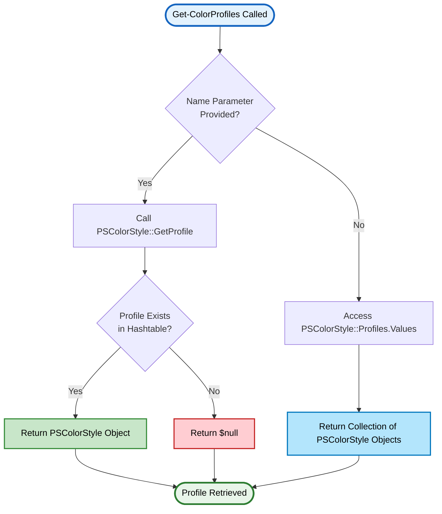
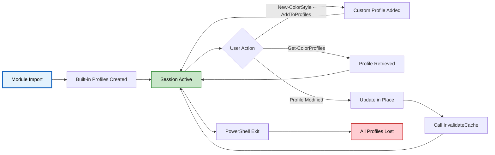

# Get-ColorProfiles

> 🗂️ **Retrieve registered color style profiles**

---

## 📑 Table of Contents

[Synopsis](#synopsis) • [Syntax](#syntax) • [Description](#description) • [Parameters](#parameters) • [Return Value](#return-value) • [Examples](#-examples) • [Profile Retrieval Flow](#-profile-retrieval-flow) • [Best Practices](#-best-practices) • [Related](#-related-commands)

---

## Synopsis

Retrieves all registered color style profiles or a specific profile by name from the session-wide profiles collection.

## Syntax

```powershell
# Get all profiles
Get-ColorProfiles
    [<CommonParameters>]

# Get specific profile by name
Get-ColorProfiles
    -Name <String>
    [<CommonParameters>]
```

## Description

`Get-ColorProfiles` is a **wrapper function** around the [`PSColorStyle`](PSColorStyle-Class.md) class that provides a simplified PowerShell-idiomatic interface for retrieving style profiles. It accesses the static `[PSColorStyle]::Profiles` hashtable and returns either all registered profiles or a specific profile by name.

> [!NOTE]
> This function wraps the `PSColorStyle::Profiles` static property and the `GetProfile()` static method. For advanced scenarios requiring direct hashtable access, see the [PSColorStyle Class documentation](PSColorStyle-Class.md).

### ✨ Key Features

- **📋 List All Profiles** - View all registered style profiles in the session
- **🔍 Retrieve by Name** - Get a specific profile for use with Write-ColorEX
- **🎭 Built-in Profiles** - Access pre-configured profiles (Error, Warning, Info, etc.)
- **🔧 Custom Profiles** - Retrieve user-created profiles added via `New-ColorStyle -AddToProfiles`
- **⚡ Fast Lookup** - Direct hashtable access for performance
- **🌍 Session Scope** - Accesses session-wide profile collection

---

## Parameters

<details open>
<summary><b>🎛️ Optional Parameters</b></summary>

### `-Name`
> **Type:** `String`
> **Required:** No
> **Pipeline Input:** No
> **Default:** `$null` (returns all profiles)

Name of a specific profile to retrieve. If not specified, all registered profiles are returned.

```powershell
# Get specific profile
Get-ColorProfiles -Name "Error"

# Get all profiles
Get-ColorProfiles
```

</details>

<details>
<summary><b>🔤 Aliases</b></summary>

Multiple aliases available for convenience:

| Alias | Type | Notes |
|-------|------|-------|
| `GCP` | Ultra-short | Minimal typing |
| `Get-ColourProfiles` | British spelling | International support |
| `Get-Profiles` | Short form | Simplified name |
| `gcprofiles` | Lowercase | Fast typing |

```powershell
# All equivalent
Get-ColorProfiles -Name "Error"
GCP -Name "Error"
Get-Profiles -Name "Error"
gcprofiles -Name "Error"
```

</details>

---

## Return Value

### When `-Name` is specified:
Returns a **single `PSColorStyle` object** or `$null` if profile doesn't exist.

```powershell
$errorStyle = Get-ColorProfiles -Name "Error"
# Returns: PSColorStyle object with Name="Error"

$missing = Get-ColorProfiles -Name "NonExistent"
# Returns: $null
```

### When `-Name` is not specified:
Returns a **collection of `PSColorStyle` objects** representing all registered profiles.

```powershell
$allProfiles = Get-ColorProfiles
# Returns: Collection of PSColorStyle objects
```

### Profile Object Properties

Each returned PSColorStyle object contains:

| Property | Type | Description |
|----------|------|-------------|
| `Name` | String | Profile identifier |
| `ForegroundColor` | Object | Text color |
| `BackgroundColor` | Object | Background color |
| `Gradient` | Object[] | Gradient colors (if set) |
| `Bold` | Bool | Bold flag |
| `Italic` | Bool | Italic flag |
| `Underline` | Bool | Underline flag |
| _(and other style properties)_ | | See [PSColorStyle-Class.md](PSColorStyle-Class.md) |

---

## 📚 Examples

<details open>
<summary><b>Example 1: List All Profiles</b></summary>

```powershell
# Get all registered profiles
$profiles = Get-ColorProfiles

# Display profile names
$profiles | ForEach-Object { $_.Name }
# Output:
# Default
# Error
# Warning
# Info
# Success
# Critical
# Debug
# (plus any custom profiles)
```

</details>

<details>
<summary><b>Example 2: Retrieve Specific Profile</b></summary>

```powershell
# Get the Error profile
$errorStyle = Get-ColorProfiles -Name "Error"

# Use with Write-ColorEX
Write-ColorEX "Error occurred!" -StyleProfile $errorStyle

# Inspect properties
$errorStyle.ForegroundColor  # "Red"
$errorStyle.Bold             # $true
```

</details>

<details>
<summary><b>Example 3: Check if Profile Exists</b></summary>

```powershell
# Safe retrieval with null check
$customStyle = Get-ColorProfiles -Name "Custom"

if ($null -ne $customStyle) {
    Write-ColorEX "Custom profile found!" -StyleProfile $customStyle
} else {
    Write-Warning "Custom profile not found. Creating default..."
    $customStyle = New-ColorStyle -Name "Custom" -ForegroundColor Cyan -AddToProfiles
}
```

</details>

<details>
<summary><b>Example 4: Display All Profile Details</b></summary>

```powershell
# Get all profiles and display detailed information
Get-ColorProfiles | ForEach-Object {
    Write-Host "`nProfile: $($_.Name)" -ForegroundColor Cyan
    Write-Host "  Foreground: $($_.ForegroundColor)"
    Write-Host "  Background: $($_.BackgroundColor)"
    Write-Host "  Bold: $($_.Bold)"
    Write-Host "  Italic: $($_.Italic)"
}
```

**Output:**
```
Profile: Default
  Foreground: Gray
  Background:
  Bold: False
  Italic: False

Profile: Error
  Foreground: Red
  Background:
  Bold: True
  Italic: False

Profile: Warning
  Foreground: Yellow
  Background:
  Bold: False
  Italic: False
...
```

</details>

<details>
<summary><b>Example 5: Filter Profiles by Property</b></summary>

```powershell
# Get all profiles with Bold enabled
$boldProfiles = Get-ColorProfiles | Where-Object { $_.Bold -eq $true }

$boldProfiles | ForEach-Object {
    Write-Host "$($_.Name) uses bold" -ForegroundColor Green
}

# Output:
# Error uses bold
# Critical uses bold
```

</details>

<details>
<summary><b>Example 6: Clone Existing Profile</b></summary>

```powershell
# Retrieve existing profile
$successStyle = Get-ColorProfiles -Name "Success"

# Clone and customize
$customSuccess = $successStyle.Clone()
$customSuccess.Name = "CustomSuccess"
$customSuccess.Bold = $true
$customSuccess.Underline = $true
$customSuccess.AddToProfiles()

# Now available for retrieval
$retrieved = Get-ColorProfiles -Name "CustomSuccess"
Write-ColorEX "Custom success!" -StyleProfile $retrieved
```

</details>

<details>
<summary><b>Example 7: Export Profile Configuration</b></summary>

```powershell
# Export all profile configurations to a hashtable
$profilesConfig = @{}

Get-ColorProfiles | ForEach-Object {
    $profilesConfig[$_.Name] = @{
        ForegroundColor = $_.ForegroundColor
        BackgroundColor = $_.BackgroundColor
        Bold = $_.Bold
        Italic = $_.Italic
        Underline = $_.Underline
    }
}

# Display configuration
$profilesConfig | ConvertTo-Json
```

</details>

<details>
<summary><b>Example 8: Use in Functions</b></summary>

```powershell
function Write-FormattedMessage {
    param(
        [string]$Message,
        [string]$ProfileName = "Info"
    )

    $profile = Get-ColorProfiles -Name $ProfileName

    if ($null -ne $profile) {
        Write-ColorEX $Message -StyleProfile $profile
    } else {
        Write-Warning "Profile '$ProfileName' not found. Using default output."
        Write-Host $Message
    }
}

# Usage
Write-FormattedMessage "Operation successful" -ProfileName "Success"
Write-FormattedMessage "Warning detected" -ProfileName "Warning"
Write-FormattedMessage "Error occurred" -ProfileName "Error"
```

</details>

<details>
<summary><b>Example 9: Compare Profiles</b></summary>

```powershell
# Compare two profiles
$profile1 = Get-ColorProfiles -Name "Error"
$profile2 = Get-ColorProfiles -Name "Critical"

Write-Host "Error Profile:"
Write-Host "  Color: $($profile1.ForegroundColor), Background: $($profile1.BackgroundColor)"
Write-Host "  Bold: $($profile1.Bold), Blink: $($profile1.Blink)"

Write-Host "`nCritical Profile:"
Write-Host "  Color: $($profile2.ForegroundColor), Background: $($profile2.BackgroundColor)"
Write-Host "  Bold: $($profile2.Bold), Blink: $($profile2.Blink)"
```

</details>

<details>
<summary><b>Example 10: Pipeline Usage</b></summary>

```powershell
# Get all profiles and apply to different messages
$messages = @(
    @{ Text = "Operation started"; Profile = "Info" }
    @{ Text = "Warning: High memory usage"; Profile = "Warning" }
    @{ Text = "Error: Connection failed"; Profile = "Error" }
    @{ Text = "Success: Task completed"; Profile = "Success" }
)

$messages | ForEach-Object {
    $style = Get-ColorProfiles -Name $_.Profile
    if ($style) {
        Write-ColorEX $_.Text -StyleProfile $style
    }
}
```

</details>

---

## 🔄 Profile Retrieval Flow

<details open>
<summary><b>Retrieval Process Diagram</b></summary>



</details>

<details>
<summary><b>Built-in Profiles</b></summary>

### Default Profiles

The module initializes these profiles automatically:

| Profile Name | Foreground | Background | Styles | Use Case |
|--------------|------------|------------|--------|----------|
| **Default** | Gray | - | None | Standard output |
| **Error** | Red | - | Bold | Error messages |
| **Warning** | Yellow | - | None | Warning messages |
| **Info** | Cyan | - | None | Informational output |
| **Success** | Green | - | None | Success messages |
| **Critical** | White | DarkRed | Bold, Blink | Critical errors |
| **Debug** | DarkGray | - | Italic | Debug output |

### Accessing Built-in Profiles

```powershell
# All built-in profiles are available immediately after module import
Import-Module PSWriteColorEX

# Retrieve any built-in profile
$errorStyle = Get-ColorProfiles -Name "Error"
$warningStyle = Get-ColorProfiles -Name "Warning"
$debugStyle = Get-ColorProfiles -Name "Debug"
```

</details>

<details>
<summary><b>Profile Lifecycle</b></summary>



### Persistence

> [!IMPORTANT]
> **Profiles are session-scoped** - they exist only for the current PowerShell session. To persist profiles across sessions, add profile creation code to your `$PROFILE` script.

```powershell
# Add to $PROFILE for persistence
Import-Module PSWriteColorEX

# Create custom profiles
New-ColorStyle -Name "MyError" -ForegroundColor Red -Bold -AddToProfiles
New-ColorStyle -Name "MySuccess" -ForegroundColor Green -AddToProfiles
```

</details>

---

## 💡 Best Practices

> [!TIP]
> **Always check for null** when retrieving profiles that might not exist.

> [!NOTE]
> **Use built-in profiles** where possible - they're optimized and pre-cached for performance.

> [!IMPORTANT]
> **Remember profiles are session-scoped** - they don't persist across PowerShell restarts unless added to `$PROFILE`.

<details>
<summary><b>Recommended Patterns</b></summary>

### 1. Safe Profile Retrieval
```powershell
# ✅ GOOD - Check for null
$profile = Get-ColorProfiles -Name "Custom"
if ($null -ne $profile) {
    Write-ColorEX "Message" -StyleProfile $profile
} else {
    Write-Warning "Profile not found"
}

# ❌ AVOID - No null check
$profile = Get-ColorProfiles -Name "Custom"
Write-ColorEX "Message" -StyleProfile $profile  # May fail if profile doesn't exist
```

### 2. Enumerate All Profiles
```powershell
# ✅ GOOD - Enumerate with details
Get-ColorProfiles | ForEach-Object {
    Write-Host "$($_.Name): $($_.ForegroundColor)" -ForegroundColor $_.ForegroundColor
}
```

### 3. Profile Existence Validation
```powershell
# ✅ GOOD - Validate before use
function Use-ProfileSafely {
    param([string]$ProfileName)

    $profile = Get-ColorProfiles -Name $ProfileName
    if ($profile) {
        return $profile
    }

    Write-Warning "Profile '$ProfileName' not found. Creating default..."
    return New-ColorStyle -Name $ProfileName -ForegroundColor Gray
}
```

### 4. Cache Profiles in Scripts
```powershell
# ✅ EFFICIENT - Cache profile lookups
$script:ErrorStyle = Get-ColorProfiles -Name "Error"
$script:SuccessStyle = Get-ColorProfiles -Name "Success"

# Use cached profiles throughout script
Write-ColorEX "Error!" -StyleProfile $script:ErrorStyle
Write-ColorEX "Success!" -StyleProfile $script:SuccessStyle
```

### 5. Dynamic Profile Selection
```powershell
# ✅ GOOD - Dynamic profile based on condition
function Write-StatusMessage {
    param(
        [string]$Message,
        [ValidateSet('Info', 'Warning', 'Error', 'Success')]
        [string]$Level = 'Info'
    )

    $profile = Get-ColorProfiles -Name $Level
    Write-ColorEX $Message -StyleProfile $profile
}

Write-StatusMessage "Operation complete" -Level "Success"
Write-StatusMessage "Be careful" -Level "Warning"
```

</details>

---

## 🔍 Troubleshooting

<details>
<summary><b>Common Issues and Solutions</b></summary>

### Issue 1: Profile Returns Null

**Symptom:** `Get-ColorProfiles -Name "MyProfile"` returns `$null`

**Causes:**
- Profile was never added to the collection
- Profile name is misspelled
- Profile was added in a different PowerShell session

**Solution:**
```powershell
# Check if profile exists
$allProfiles = Get-ColorProfiles
$allProfiles | ForEach-Object { $_.Name }

# Add profile if missing
if ($null -eq (Get-ColorProfiles -Name "MyProfile")) {
    New-ColorStyle -Name "MyProfile" -ForegroundColor Cyan -AddToProfiles
}
```

---

### Issue 2: Empty Collection Returned

**Symptom:** `Get-ColorProfiles` returns empty collection

**Cause:** This should never happen - built-in profiles are always initialized

**Solution:**
```powershell
# Force module reimport
Import-Module PSWriteColorEX -Force

# Check if profiles are now available
Get-ColorProfiles
```

---

### Issue 3: Modified Profile Not Reflecting Changes

**Symptom:** Profile changes don't appear when retrieved again

**Cause:** Profile cached parameters not invalidated

**Solution:**
```powershell
# Get profile
$profile = Get-ColorProfiles -Name "Custom"

# Modify properties
$profile.Bold = $true
$profile.ForegroundColor = "Magenta"

# MUST invalidate cache
$profile.InvalidateCache()

# Now changes are reflected
Write-ColorEX "Test" -StyleProfile $profile
```

---

### Issue 4: Profile Exists but Shows Wrong Properties

**Symptom:** Retrieved profile has unexpected property values

**Cause:** Profile was modified elsewhere in the session

**Solution:**
```powershell
# Profiles are live objects - changes affect all references
$profile1 = Get-ColorProfiles -Name "Error"
$profile1.Bold = $false  # Modifies the actual profile

$profile2 = Get-ColorProfiles -Name "Error"
# $profile2.Bold is now $false too (same object)

# To preserve original, use Clone()
$profile1 = Get-ColorProfiles -Name "Error"
$customProfile = $profile1.Clone()
$customProfile.Bold = $false  # Only affects clone
```

</details>

---

## 🔗 Related Commands

### Wrapper Functions
- [`New-ColorStyle`](New-ColorStyle.md) - Create and register new profiles (wrapper)
- [`Set-ColorDefault`](Set-ColorDefault.md) - Set default profile (wrapper)

### Core Functions
- [`Write-ColorEX`](Write-ColorEX.md) - Use profiles with main output function
- [PSColorStyle Class](PSColorStyle-Class.md) - Direct class access for advanced scenarios

### Helper Functions
- [`Write-ColorError`](Write-ColorError.md) - Uses Error profile
- [`Write-ColorWarning`](Write-ColorWarning.md) - Uses Warning profile
- [`Write-ColorInfo`](Write-ColorInfo.md) - Uses Info profile
- [`Write-ColorSuccess`](Write-ColorSuccess.md) - Uses Success profile

### Documentation
- [Module Overview](../../README.md) - Complete module documentation
- [Docs Index](../README.md) - Documentation index

---

## 📋 Quick Reference

<details>
<summary><b>Parameter Quick Reference</b></summary>

| Parameter | Type | Required | Default | Description |
|-----------|------|----------|---------|-------------|
| `Name` | String | No | `$null` | Specific profile name to retrieve |

</details>

<details>
<summary><b>Return Value Quick Reference</b></summary>

| Scenario | Return Type | Description |
|----------|-------------|-------------|
| `-Name` specified (found) | PSColorStyle | Single profile object |
| `-Name` specified (not found) | `$null` | Profile doesn't exist |
| No `-Name` | PSColorStyle[] | Collection of all profiles |

</details>

<details>
<summary><b>Common Usage Patterns</b></summary>

```powershell
# Get all profiles
Get-ColorProfiles

# Get specific profile
Get-ColorProfiles -Name "Error"

# Safe retrieval
$profile = Get-ColorProfiles -Name "Custom"
if ($profile) { ... }

# List profile names
Get-ColorProfiles | ForEach-Object { $_.Name }

# Find profiles by property
Get-ColorProfiles | Where-Object { $_.Bold }

# Use with Write-ColorEX
$style = Get-ColorProfiles -Name "Success"
Write-ColorEX "Done!" -StyleProfile $style
```

</details>

---

<div align="center">

**PSWriteColorEX** v1.0.0 | MIT License | [GitHub](https://github.com/MarkusMcNugen/PSWriteColorEX)

</div>
