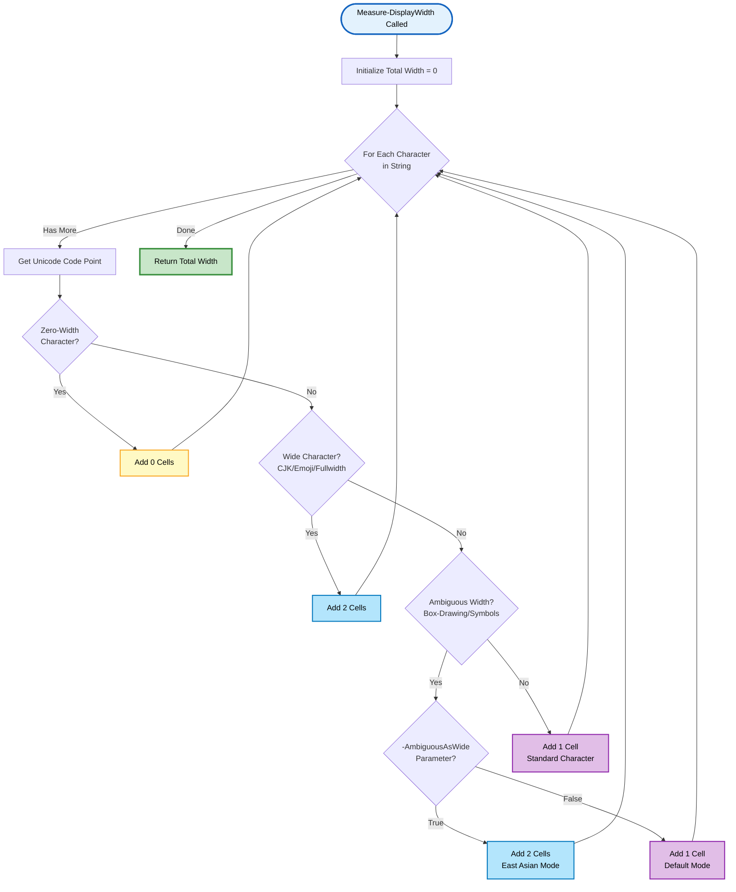
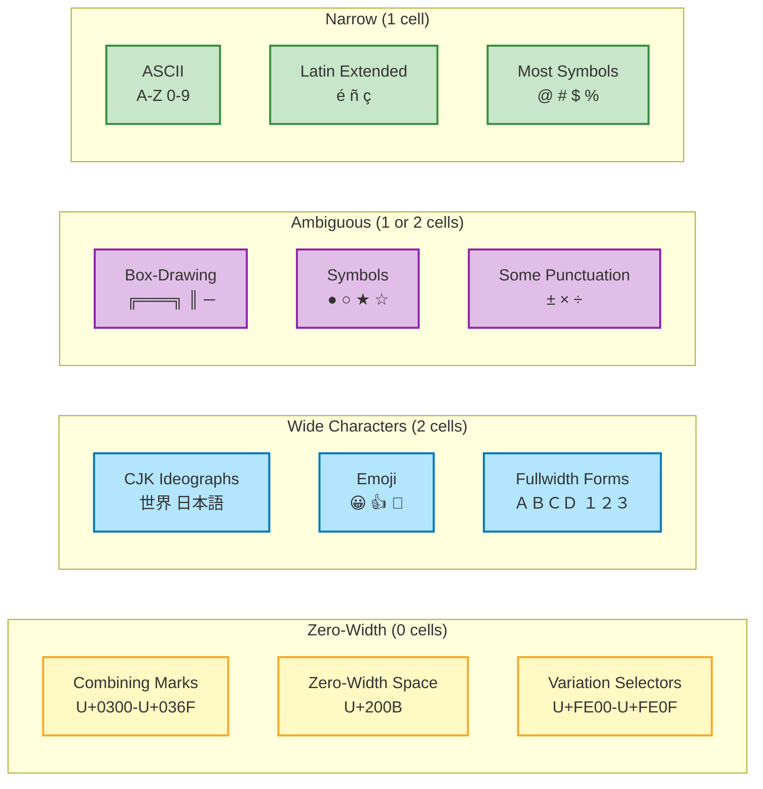

# Measure-DisplayWidth

> 📏 **Measure Unicode-aware terminal display width**

---

## 📑 Table of Contents

[Synopsis](#synopsis) • [Syntax](#syntax) • [Description](#description) • [Parameters](#parameters) • [Return Values](#return-values) • [Examples](#-examples) • [Character Width Rules](#-character-width-rules) • [Use Cases](#-use-cases) • [Related](#-related-commands)

---

## Synopsis

Calculates the terminal display width (in cells) of a string, correctly handling Unicode characters including emoji, CJK, and box-drawing.

## Syntax

```powershell
Measure-DisplayWidth
    [-Text] <String>
    [-AmbiguousAsWide]
    [<CommonParameters>]
```

## Description

`Measure-DisplayWidth` calculates how many terminal cells a string will occupy when displayed in a console. This is critical for proper alignment when using Unicode characters, as PowerShell's `.Length` property counts UTF-16 code units, not visual display width.

### The Problem

PowerShell's `.Length` doesn't understand Unicode character widths:
```powershell
"Hello".Length      # Returns 5 ✓ Correct
"世界".Length        # Returns 2 ✗ WRONG! Displays as 4 cells
"😀👍".Length       # Returns 2 ✗ WRONG! Displays as 4 cells
"Server ●".Length   # Returns 8 ✗ WRONG! Displays as 9 cells (● = 2 cells)
```

### The Solution

`Measure-DisplayWidth` returns the actual terminal display width:
```powershell
Measure-DisplayWidth "Hello"      # Returns 5 ✓
Measure-DisplayWidth "世界"        # Returns 4 ✓
Measure-DisplayWidth "😀👍"       # Returns 4 ✓
Measure-DisplayWidth "Server ●"   # Returns 9 ✓
```

### ✨ Key Features

- **📏 Accurate Width Calculation** - Correctly measures terminal cell width
- **🌏 Unicode Support** - Handles wide characters (CJK, emoji) that occupy 2 cells
- **🔤 Combining Marks** - Recognizes zero-width characters (combining diacritics)
- **📦 Box-Drawing** - Configurable treatment of East Asian Ambiguous Width characters
- **⚡ Fast Performance** - Single pass through string, no external dependencies
- **🌍 Cross-Platform** - Works on Windows, Linux, macOS with PowerShell 5.1+
- **🔄 Pipeline Support** - Accepts pipeline input

---

## Parameters

<details open>
<parameter name="summary"><b>🎛️ Command Parameters</b></summary>

### `-Text`
> **Type:** `String`
> **Position:** 0
> **Mandatory:** Yes
> **Pipeline:** Yes (ByValue)

The text string to measure. Accepts empty strings.

```powershell
Measure-DisplayWidth "Test"
Measure-DisplayWidth "Hello 世界"
"Server ●" | Measure-DisplayWidth
```

### `-AmbiguousAsWide`
> **Type:** `Switch`
> **Default:** `$false` (treat as narrow)

Treat East Asian Ambiguous Width characters as 2 cells instead of 1 cell.

**Ambiguous characters** include:
- Box-drawing: `╔═╗║╚╝╠╣╦╩╬─│┌┐└┘├┤┬┴┼`
- Symbols: `®×○●◆◇★☆`
- Some punctuation

**Default behavior (narrow):** Matches 90% of terminal configurations
**Use `-AmbiguousAsWide`:** For East Asian locales or terminals configured for wide ambiguous characters

```powershell
# Default: Box-drawing treated as narrow (1 cell each)
Measure-DisplayWidth "╔═══╗"                # Returns 5

# East Asian mode: Box-drawing treated as wide (2 cells each)
Measure-DisplayWidth "╔═══╗" -AmbiguousAsWide  # Returns 10
```

</details>

---

## Return Values

Returns `[int]` - The number of terminal cells the string will occupy.

| Character Type | Width (cells) | Examples |
|----------------|---------------|----------|
| **ASCII/Latin** | 1 | `a-z A-Z 0-9 !@#$%` |
| **Wide (CJK)** | 2 | `世界 日本語 中文 한글` |
| **Wide (Emoji)** | 2 | `😀👍🎨🌟` |
| **Wide (Symbols)** | 2 | `●` (filled circle U+25CF) |
| **Zero-width** | 0 | Combining marks (accents) |
| **Ambiguous** | 1 (default) or 2 (with `-AmbiguousAsWide`) | `╔═╗║●★` |

---

## 📚 Examples

<details>
<summary><b>Example 1: ASCII Text</b></summary>

```powershell
Measure-DisplayWidth "Hello"
# Returns: 5
# 5 ASCII characters × 1 cell each = 5 cells
```

</details>

<details>
<summary><b>Example 2: CJK Characters (Chinese, Japanese, Korean)</b></summary>

```powershell
Measure-DisplayWidth "世界"
# Returns: 4
# 2 CJK characters × 2 cells each = 4 cells

Measure-DisplayWidth "Hello 世界"
# Returns: 10
# 5 ASCII + 1 space + (2 CJK × 2) = 10 cells
```

</details>

<details>
<summary><b>Example 3: Emoji</b></summary>

```powershell
Measure-DisplayWidth "😀👍"
# Returns: 4
# 2 emoji × 2 cells each = 4 cells

Measure-DisplayWidth "Status: ✓"
# Returns: 9
# "Status: " (8) + "✓" (1) = 9 cells
```

</details>

<details>
<summary><b>Example 4: Mixed ASCII and Unicode</b></summary>

```powershell
Measure-DisplayWidth "Server ●"
# Returns: 9
# "Server " (7 ASCII) + "●" (2 cells) = 9 cells

# This is why .PadRight() breaks alignment:
"Server ●".PadRight(21)  # Adds 13 spaces (21 - 8 .Length)
                          # But displays as 22 cells! ❌ MISALIGNED

# Use AutoPad instead:
Write-ColorEX "Server ●" -AutoPad 21  # ✅ Perfectly aligned
```

</details>

<details>
<summary><b>Example 5: Box-Drawing Characters</b></summary>

```powershell
# Default: Narrow treatment (1 cell per character)
Measure-DisplayWidth "╔═══╗"
# Returns: 5
# Compatible with 90% of terminals

# East Asian mode: Wide treatment (2 cells per character)
Measure-DisplayWidth "╔═══╗" -AmbiguousAsWide
# Returns: 10
# For terminals configured for wide ambiguous chars
```

</details>

<details>
<summary><b>Example 6: Pipeline Usage</b></summary>

```powershell
# Measure multiple strings
@("Hello", "世界", "😀") | Measure-DisplayWidth
# Returns: 5, 4, 2

# Calculate padding needed for alignment
$text = "Server ●"
$targetWidth = 21
$currentWidth = Measure-DisplayWidth $text
$paddingNeeded = $targetWidth - $currentWidth
Write-Host "Need $paddingNeeded spaces for perfect alignment"
# Output: "Need 12 spaces for perfect alignment"
```

</details>

<details>
<summary><b>Example 7: Combining Marks (Zero-Width)</b></summary>

```powershell
# é can be represented two ways:
$composed = "é"     # Single precomposed character (U+00E9)
$decomposed = "é"   # 'e' (U+0065) + combining acute (U+0301)

Measure-DisplayWidth $composed
# Returns: 1 (single character)

Measure-DisplayWidth $decomposed
# Returns: 1 (base char 1 + combining mark 0 = 1 cell)
```

</details>

<details>
<summary><b>Example 8: Real-World Table Alignment</b></summary>

```powershell
# Build a perfectly aligned table with Unicode
$services = @(
    @{Name="Web Server"; Status="●"}    # ● = 2 cells
    @{Name="Database";   Status="●"}
    @{Name="Cache";      Status="○"}    # ○ = 2 cells
)

foreach ($svc in $services) {
    $name = $svc.Name + " " + $svc.Status
    $width = Measure-DisplayWidth $name
    $padding = " " * (25 - $width)
    Write-Host "$name$padding[OK]"
}

# Output (perfectly aligned):
# Web Server ●          [OK]
# Database ●            [OK]
# Cache ○               [OK]
```

</details>

---

## 🔄 Width Calculation Flow

<details open>
<summary><b>Unicode Width Detection Logic</b></summary>



</details>

<details>
<summary><b>Character Category Examples</b></summary>



</details>

---

## 📐 Character Width Rules

### Wide Characters (2 cells)

**CJK Unified Ideographs:**
- Chinese: `中文`, `汉字`
- Japanese: `日本語`, `漢字`
- Korean: `한글`, `조선말`
- Ranges: U+4E00-9FFF, U+3400-4DBF, U+20000-2FFFD

**Emoji:**
- Smileys: `😀😃😄😁😆`
- Symbols: `❤️🔥✨🎉👍`
- Flags: `🇺🇸🇬🇧🇯🇵`
- Ranges: U+1F300-1F9FF (and others)

**Other Wide Characters:**
- Filled symbols: `●` (U+25CF), `■` (U+25A0)
- Fullwidth Latin: `Ａ` (U+FF21) vs `A` (U+0041)
- Hangul Syllables: U+AC00-D7A3

### Narrow Characters (1 cell)

**ASCII (U+0020-007E):**
- Letters: `a-z A-Z`
- Digits: `0-9`
- Punctuation: `!@#$%^&*()`
- Symbols: `+-=<>[]{}|\/`

**Latin Extended:**
- Accented characters: `àáâãäå èéêë`
- Ranges: U+0080-024F

**Common Symbols:**
- Checkmark: `✓` (U+2713)
- Multiplication: `×` (U+00D7)
- Degree: `°` (U+00B0)

### Zero-Width Characters (0 cells)

**Combining Diacritical Marks:**
- Acute: ´ (U+0301)
- Grave: ` (U+0300)
- Tilde: ~ (U+0303)
- Range: U+0300-036F

**Zero-Width Joiners:**
- ZWSP: U+200B
- ZWNJ: U+200C
- ZWJ: U+200D

### Ambiguous Width (Configurable)

**Default: 1 cell | With `-AmbiguousAsWide`: 2 cells**

**Box-Drawing (U+2500-257F):**
- `╔═╗║╚╝╠╣╦╩╬`
- `─│┌┐└┘├┤┬┴┼`
- `━┃┏┓┗┛┣┫┳┻╋`

**Symbols:**
- `●○◆◇★☆`
- `®©™§¶†‡`
- `±×÷≠≤≥`

> [!TIP]
> **When to use `-AmbiguousAsWide`:**
> - Terminal configured for East Asian languages
> - Target audience primarily uses CJK locales
> - Terminal emulator set to "wide ambiguous" mode
>
> **Default (narrow) is recommended for:**
> - Western locales and mixed audiences
> - Maximum cross-platform compatibility
> - Windows Terminal, VS Code, most modern terminals

---

## 🎯 Use Cases

### 1. Text Padding and Alignment

```powershell
# Problem: .PadRight() breaks with Unicode
"Server ●".PadRight(20)  # Misaligned! ❌

# Solution: Use Measure-DisplayWidth + manual padding
$text = "Server ●"
$width = Measure-DisplayWidth $text
$padding = " " * (20 - $width)
"$text$padding"  # ✅ Perfect alignment!

# Better: Use AutoPad (does this automatically)
Write-ColorEX "Server ●" -AutoPad 20  # ✅ Best solution!
```

### 2. Table Column Alignment

```powershell
function Format-TableRow {
    param([string]$Text, [int]$ColumnWidth)

    $displayWidth = Measure-DisplayWidth $Text
    $padding = " " * ($ColumnWidth - $displayWidth)
    return "$Text$padding"
}

Format-TableRow "Server ●" 20  # Returns "Server ●            "
```

### 3. Progress Bars

```powershell
function Show-Progress {
    param([int]$Percent, [int]$BarWidth = 50)

    $filled = [math]::Floor($BarWidth * $Percent / 100)
    $bar = "█" * $filled + "░" * ($BarWidth - $filled)

    # Verify bar width is correct
    $actualWidth = Measure-DisplayWidth $bar
    Write-Host "[$bar] $Percent%"
}

Show-Progress 75  # [███████████████████████████████████████░░░░░░░░░░░░░░] 75%
```

### 4. Center Text

```powershell
function Center-Text {
    param([string]$Text, [int]$ConsoleWidth = $Host.UI.RawUI.WindowSize.Width)

    $textWidth = Measure-DisplayWidth $Text
    $leftPadding = [math]::Max(0, [math]::Floor(($ConsoleWidth - $textWidth) / 2))

    (" " * $leftPadding) + $Text
}

Center-Text "═══ Hello 世界 ═══"  # Perfectly centered!
```

### 5. Truncate Text

```powershell
function Truncate-Text {
    param([string]$Text, [int]$MaxWidth)

    $currentWidth = 0
    $result = ""

    foreach ($char in [char[]]$Text) {
        $charWidth = Measure-DisplayWidth $char
        if ($currentWidth + $charWidth -le $MaxWidth) {
            $result += $char
            $currentWidth += $charWidth
        } else {
            break
        }
    }

    return $result
}

Truncate-Text "Hello 世界 World" 10  # Returns "Hello 世界"
```

---

## 🔗 Related Commands

- **[Write-ColorEX](Write-ColorEX.md)** - Uses Measure-DisplayWidth for AutoPad feature
- **[Test-AnsiSupport](Test-AnsiSupport.md)** - Detect terminal capabilities
- **[PSColorStyle Class](PSColorStyle-Class.md)** - Style profiles with AutoPad support

---

## 💡 Performance Notes

- **Single pass algorithm** - O(n) time complexity where n = string length
- **No external dependencies** - Uses built-in .NET `Char.ConvertToUtf32()`
- **Typical performance:**
  - Short strings (< 100 chars): < 0.1ms
  - Long strings (1000+ chars): 0.1-0.5ms
- **Cached by AutoPad** - When used with `-AutoPad`, result is used immediately

---

## 🐛 Known Limitations

1. **Terminal Font Matters:** This function calculates the *standard* Unicode width. Some terminals may render characters differently based on font configuration.

2. **Emoji Sequences:** Complex emoji (ZWJ sequences, skin tone modifiers) may not always report correct width. The function uses wcwidth() standard rules.

3. **Terminal Configuration:** Ambiguous width behavior depends on terminal locale settings. Default (narrow) works for 90% of cases.

4. **Right-to-Left (RTL):** Width calculation is correct, but terminal RTL rendering may affect visual alignment.

---

## 📖 Technical Background

This function implements the **East Asian Width** property from Unicode Standard Annex #11 (UAX#11). It categorizes characters into:

- **F** (Fullwidth) - 2 cells
- **W** (Wide) - 2 cells
- **A** (Ambiguous) - 1 or 2 cells (configurable via `-AmbiguousAsWide`)
- **N** (Neutral/Narrow) - 1 cell
- **H** (Halfwidth) - 1 cell
- **Na** (Not applicable) - 1 cell

Zero-width characters (combining marks, ZWJ, ZWNJ) are explicitly handled as 0 cells.

**References:**
- [UAX #11: East Asian Width](https://www.unicode.org/reports/tr11/)
- [wcwidth() specification](https://www.cl.cam.ac.uk/~mgk25/ucs/wcwidth.c)
