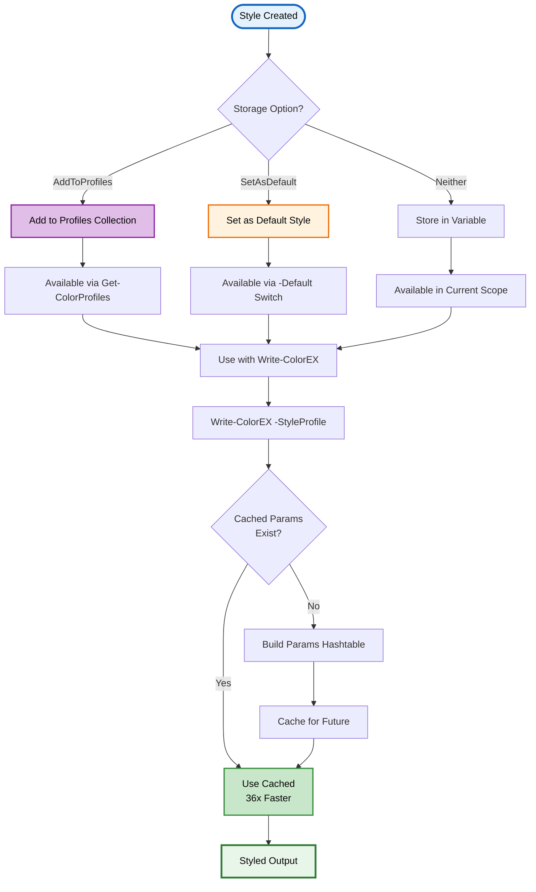
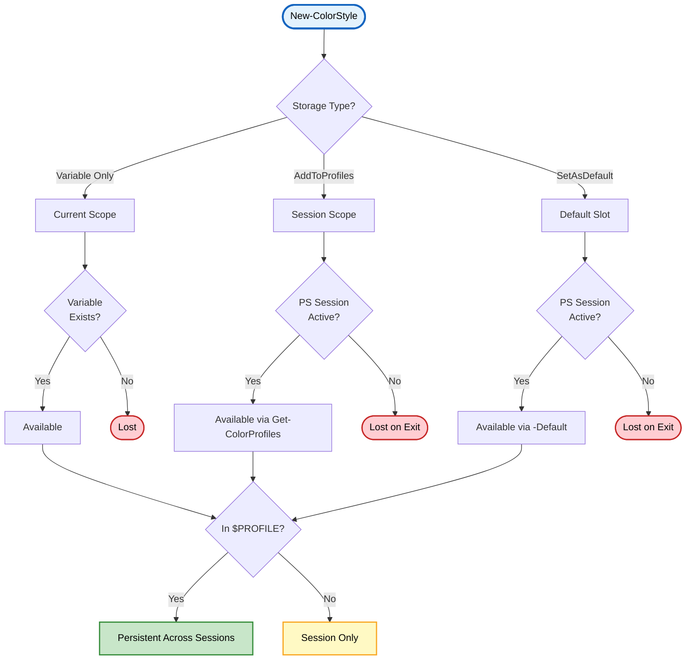
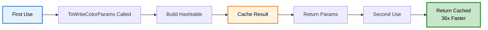

# New-ColorStyle

> 🎨 **Create reusable custom color style profiles**

---

## 📑 Table of Contents

[Synopsis](#synopsis) • [Syntax](#syntax) • [Description](#description) • [Parameters](#parameters) • [Return Value](#return-value) • [Examples](#-examples) • [Style Creation Flow](#-style-creation-flow) • [Profile Management](#-profile-management) • [Best Practices](#-best-practices) • [Related](#-related-commands)

---

## Synopsis

Creates a new PSColorStyle object with customizable formatting, colors, gradients, and behavior that can be reused throughout your script.

## Syntax

```powershell
New-ColorStyle
    -Name <String>
    [-ForegroundColor <Object>]
    [-BackgroundColor <Object>]
    [-Gradient <Object[]>]
    [-Bold]
    [-Italic]
    [-Underline]
    [-Blink]
    [-Faint]
    [-CrossedOut]
    [-DoubleUnderline]
    [-Overline]
    [-ShowTime]
    [-NoNewLine]
    [-HorizontalCenter]
    [-StartTab <Int32>]
    [-StartSpaces <Int32>]
    [-LinesBefore <Int32>]
    [-LinesAfter <Int32>]
    [-AddToProfiles]
    [-SetAsDefault]
    [<CommonParameters>]
```

## Description

`New-ColorStyle` is a **wrapper function** around the [`PSColorStyle`](PSColorStyle-Class.md) class that provides a simplified PowerShell-idiomatic interface for creating customizable style profiles. It creates style profiles that can be reused with Write-ColorEX, encapsulating all formatting options including colors, gradients, text styling, and layout into a single reusable object.

> [!NOTE]
> This function wraps the `PSColorStyle` class constructors and instance methods (`AddToProfiles()`, `SetAsDefault()`). For advanced scenarios requiring direct class manipulation or fine-grained control, see the [PSColorStyle Class documentation](PSColorStyle-Class.md).

### ✨ Key Features

- **🎯 Reusable Profiles** - Create once, use many times
- **🌈 Gradient Support** - Include smooth color transitions
- **💾 Profile Storage** - Save to session-wide collection
- **🔧 Flexible Configuration** - All Write-ColorEX parameters supported
- **⚡ Performance Optimized** - Cached parameter conversion (36x faster)
- **🔄 Cloneable** - Create variations from existing styles

---

## Parameters

<details open>
<summary><b>🎛️ Required Parameters</b></summary>

### `-Name`
> **Type:** `String`
> **Required:** Yes
> **Pipeline Input:** No

Unique identifier for the style profile. Should be descriptive and meaningful.

```powershell
# Good names
-Name "Header"
-Name "SQLQuery"
-Name "ErrorCritical"

# Avoid generic names
-Name "Style1"
-Name "Test"
```

</details>

<details>
<summary><b>🎨 Color Parameters</b></summary>

### `-ForegroundColor`
> **Type:** `Object`
> **Default:** `"Gray"`
> **Pipeline Input:** No

Text color. Accepts:
- Color names (`'Red'`, `'Cyan'`, `'DarkGreen'`)
- Hex codes (`'#FF0000'`, `'0xFF8000'`)
- RGB arrays (`@(255, 128, 0)`)

```powershell
# Named color
-ForegroundColor "Cyan"

# Hex color
-ForegroundColor "#FF6B35"

# RGB array
-ForegroundColor @(255, 107, 53)
```

### `-BackgroundColor`
> **Type:** `Object`
> **Default:** `$null` (no background)
> **Pipeline Input:** No

Background color. Accepts same formats as ForegroundColor.

### `-Gradient`
> **Type:** `Object[]`
> **Default:** `$null`
> **Pipeline Input:** No
> **Minimum:** 2 colors

Array of colors for smooth gradient transitions. Requires ANSI8 or TrueColor terminal support.

```powershell
# Two-color gradient
-Gradient @('Red', 'Blue')

# Multi-stop gradient
-Gradient @('Red', 'Orange', 'Yellow', 'Green', 'Blue')

# Hex gradient
-Gradient @('#FF0000', '#0000FF')

# RGB gradient
-Gradient @(@(255,0,0), @(0,0,255))
```

> [!IMPORTANT]
> When using `-Gradient`, it overrides `-ForegroundColor` for text coloring.

</details>

<details>
<summary><b>✒️ Text Style Parameters</b></summary>

| Switch | Description | Terminal Support |
|--------|-------------|------------------|
| `-Bold` | Make text bold | Widespread |
| `-Italic` | Italicize text | Most modern terminals |
| `-Underline` | Underline text | Nearly universal |
| `-Blink` | Blinking text | Limited |
| `-Faint` | Reduced intensity | Limited |
| `-CrossedOut` | Strikethrough | Moderate |
| `-DoubleUnderline` | Double underline | VTE 0.76+ |
| `-Overline` | Line above text | VTE 0.52+, Konsole |

</details>

<details>
<summary><b>📐 Formatting Parameters</b></summary>

| Parameter | Type | Default | Description |
|-----------|------|---------|-------------|
| `-StartTab` | `Int32` | `0` | Number of tabs before text |
| `-StartSpaces` | `Int32` | `0` | Number of spaces before text |
| `-LinesBefore` | `Int32` | `0` | Empty lines before output |
| `-LinesAfter` | `Int32` | `0` | Empty lines after output |

</details>

<details>
<summary><b>⚙️ Behavior Parameters</b></summary>

| Switch | Description |
|--------|-------------|
| `-ShowTime` | Prefix output with timestamp |
| `-NoNewLine` | Suppress newline after output |
| `-HorizontalCenter` | Center text horizontally |
| `-AddToProfiles` | Save style to profile collection |
| `-SetAsDefault` | Set as default style for `-Default` switch |

</details>

<details>
<summary><b>🔤 Aliases</b></summary>

Multiple aliases available for convenience:

| Alias | Type |
|-------|------|
| `NCS` | Ultra-short |
| `New-ColourStyle` | British spelling |
| `New-Style` | Short form |
| `ncstyle` | Lowercase |

```powershell
# All equivalent
New-ColorStyle -Name "Test" -ForegroundColor Cyan
NCS -Name "Test" -ForegroundColor Cyan
New-Style -Name "Test" -ForegroundColor Cyan
```

</details>

---

## Return Value

Returns a `PSColorStyle` object with the following capabilities:

| Feature | Description |
|---------|-------------|
| **Use with Write-ColorEX** | Pass to `-StyleProfile` parameter |
| **Modification** | Change properties after creation |
| **Cloning** | Create variations with `.Clone()` method |
| **Caching** | Parameter conversion cached for performance |
| **Profile Access** | Retrieved via `Get-ColorProfiles` if added |

---

## 📚 Examples

<details>
<summary><b>Example 1: Simple Error Style</b></summary>

```powershell
$errorStyle = New-ColorStyle -Name "CustomError" `
                             -ForegroundColor Red `
                             -Bold

Write-ColorEX "Critical error occurred!" -StyleProfile $errorStyle
```

</details>

<details>
<summary><b>Example 2: Complex Header Style</b></summary>

```powershell
$headerStyle = New-ColorStyle -Name "Header" `
                              -ForegroundColor Cyan `
                              -BackgroundColor DarkBlue `
                              -Bold -Underline `
                              -HorizontalCenter `
                              -LinesBefore 1 `
                              -LinesAfter 1

Write-ColorEX "═══ REPORT HEADER ═══" -StyleProfile $headerStyle
```

</details>

<details>
<summary><b>Example 3: Gradient Style Profile</b></summary>

```powershell
# Rainbow gradient header style
$rainbowStyle = New-ColorStyle -Name "Rainbow" `
                               -Gradient @('Red','Orange','Yellow','Green','Cyan','Blue','Magenta') `
                               -Bold `
                               -HorizontalCenter

Write-ColorEX "RAINBOW HEADER TEXT" -StyleProfile $rainbowStyle
```

</details>

<details>
<summary><b>Example 4: Save to Profile Collection</b></summary>

```powershell
# Create and save SQL style
New-ColorStyle -Name "SQL" `
               -ForegroundColor Blue `
               -Italic `
               -StartTab 1 `
               -AddToProfiles

# Later in script - retrieve and use
$sqlStyle = Get-ColorProfiles -Name "SQL"
Write-ColorEX "SELECT * FROM Users WHERE Active = 1" -StyleProfile $sqlStyle
```

</details>

<details>
<summary><b>Example 5: Set as Default</b></summary>

```powershell
New-ColorStyle -Name "ScriptDefault" `
               -ForegroundColor Green `
               -ShowTime `
               -SetAsDefault

# All -Default calls now use this style
Write-ColorEX "Starting process..." -Default
Write-ColorEX "Loading configuration..." -Default
Write-ColorEX "Ready" -Default
# Output: [timestamp] green text
```

</details>

<details>
<summary><b>Example 6: Brand Colors with TrueColor</b></summary>

```powershell
$brandStyle = New-ColorStyle -Name "CompanyBrand" `
                             -ForegroundColor "#FF6B35" `
                             -BackgroundColor "#1A1A2E" `
                             -Bold `
                             -AddToProfiles

Write-ColorEX "  ACME Corporation  " -StyleProfile $brandStyle -TrueColor
```

</details>

<details>
<summary><b>Example 7: Modify Style After Creation</b></summary>

```powershell
$style = New-ColorStyle -Name "Dynamic" -ForegroundColor Cyan

# Modify properties
$style.Bold = $true
$style.Underline = $true
$style.Gradient = @('Cyan', 'Magenta')

# Invalidate cache after modifications
$style.InvalidateCache()

Write-ColorEX "Modified style" -StyleProfile $style
```

</details>

<details>
<summary><b>Example 8: Clone and Customize</b></summary>

```powershell
# Create base style
$baseStyle = New-ColorStyle -Name "Base" `
                            -ForegroundColor Cyan `
                            -Bold

# Clone and customize
$variantStyle = $baseStyle.Clone()
$variantStyle.Name = "Variant"
$variantStyle.ForegroundColor = "Magenta"
$variantStyle.Italic = $true

Write-ColorEX "Base style" -StyleProfile $baseStyle
Write-ColorEX "Variant style" -StyleProfile $variantStyle
```

</details>

<details>
<summary><b>Example 9: Customize Helper Function Profiles</b></summary>

```powershell
# Get existing profile
$errorProfile = [PSColorStyle]::GetProfile("Error")

# Add gradient
$errorProfile.Gradient = @('Red', 'DarkRed')

# Now all Write-ColorError calls use gradient
Write-ColorError "Error with gradient effect!"
```

</details>

<details>
<summary><b>Example 10: Fire Gradient Style</b></summary>

```powershell
$fireStyle = New-ColorStyle -Name "FireGradient" `
                            -Gradient @('#8B0000', '#FF0000', '#FF8000', '#FFD700') `
                            -Bold `
                            -AddToProfiles

Write-ColorEX "HOT FLAME EFFECT" -StyleProfile $fireStyle
```

</details>

---

## 🔄 Style Creation Flow

```mermaid
graph TD
    Start([New-ColorStyle Called]) --> CreateObj[Create PSColorStyle Object]
    CreateObj --> SetName[Set Name Property]
    SetName --> SetFG[Set ForegroundColor]
    SetFG --> SetBG[Set BackgroundColor]
    SetBG --> SetGrad{Gradient<br/>Provided?}

    SetGrad -->|Yes| AddGrad[Set Gradient Property]
    SetGrad -->|No| SkipGrad[Skip Gradient]

    AddGrad --> SetStyles[Set Style Flags]
    SkipGrad --> SetStyles

    SetStyles --> ApplyBold{Bold Switch?}
    ApplyBold -->|Yes| SetBold[Bold = True]
    ApplyBold -->|No| NextStyle1[Continue]

    SetBold --> ApplyItalic{Italic Switch?}
    NextStyle1 --> ApplyItalic

    ApplyItalic -->|Yes| SetItalic[Italic = True]
    ApplyItalic -->|No| NextStyle2[Continue]

    SetItalic --> MoreStyles[Set Remaining Styles:<br/>Underline, Blink, etc.]
    NextStyle2 --> MoreStyles

    MoreStyles --> SetFormat[Set Formatting:<br/>StartTab, StartSpaces, etc.]
    SetFormat --> CheckAddProfiles{AddToProfiles<br/>Switch?}

    CheckAddProfiles -->|Yes| AddToCollection[Call style.AddToProfiles]
    CheckAddProfiles -->|No| CheckDefault{SetAsDefault<br/>Switch?}

    AddToCollection --> CheckDefault

    CheckDefault -->|Yes| SetDefault[Call style.SetAsDefault]
    CheckDefault -->|No| ReturnStyle[Return PSColorStyle Object]

    SetDefault --> ReturnStyle

    style Start fill:#e3f2fd,stroke:#1565c0,stroke-width:3px,color:#000
    style ReturnStyle fill:#e8f5e9,stroke:#2e7d32,stroke-width:3px,color:#000
    style SetGrad fill:#fff3e0,stroke:#ef6c00,stroke-width:2px,color:#000
    style AddGrad fill:#b3e5fc,stroke:#0277bd,stroke-width:2px,color:#000
    style AddToCollection fill:#c8e6c9,stroke:#388e3c,stroke-width:2px,color:#000
    style SetDefault fill:#e1bee7,stroke:#8e24aa,stroke-width:2px,color:#000
```

<details open>
<summary><b>Creation and Initialization Diagram</b></summary>



</details>

<details>
<summary><b>Style Usage Flow</b></summary>



</details>

---

## 🗂️ Profile Management

<details open>
<summary><b>Profile Storage Options</b></summary>

### Temporary Style (Variable Only)

```powershell
$tempStyle = New-ColorStyle -Name "Temp" -ForegroundColor Cyan
# Only available while $tempStyle variable exists
# Lost when variable goes out of scope
```

### Session Style (Profile Collection)

```powershell
New-ColorStyle -Name "SQL" -ForegroundColor Blue -AddToProfiles
# Available throughout PowerShell session
# Retrieved with: Get-ColorProfiles -Name "SQL"
# Lost when PowerShell closes
```

### Default Style

```powershell
New-ColorStyle -Name "ScriptDefault" -ForegroundColor Green -SetAsDefault
# Becomes the default for Write-ColorEX -Default
# Remains until changed or session ends
```

### Persistent Style (Profile Script)

```powershell
# Add to $PROFILE to persist across sessions
New-ColorStyle -Name "MyDefault" -ForegroundColor Cyan -Bold -SetAsDefault
```

</details>

<details>
<summary><b>Profile Lifecycle</b></summary>



</details>

---

## ⚡ Performance Considerations

<details>
<summary><b>Caching System</b></summary>

PSColorStyle objects cache their parameter conversion for optimal performance:



### Performance Metrics

| Operation | First Call | Cached Calls | Improvement |
|-----------|------------|--------------|-------------|
| ToWriteColorParams | ~0.4ms | ~0.011ms | **36x faster** |
| Write-ColorEX with profile | Normal | Optimized | Cached params |
| 100 calls with same profile | ~40ms | ~10ms | **4x faster** |

### Cache Invalidation

```powershell
# Modify style properties
$style.Bold = $true
$style.Gradient = @('Red', 'Blue')

# Must invalidate cache after modifications
$style.InvalidateCache()
```

</details>

---

## 💡 Best Practices

> [!TIP]
> **Define styles at script start** - Create all styles in a setup section for easy maintenance.

> [!NOTE]
> **Use descriptive names** - "ErrorCritical" is better than "Style1".

> [!IMPORTANT]
> **Invalidate cache after modifications** - Always call `.InvalidateCache()` if you modify a style after creation.

<details>
<summary><b>Development Best Practices</b></summary>

### 1. Centralized Style Definitions

```powershell
# Define all styles at the beginning
function Initialize-Styles {
    $script:HeaderStyle = New-ColorStyle -Name "Header" -ForegroundColor Cyan -Bold -HorizontalCenter
    $script:ErrorStyle = New-ColorStyle -Name "Error" -Gradient @('Red','DarkRed') -Bold
    $script:SuccessStyle = New-ColorStyle -Name "Success" -ForegroundColor Green
    $script:SQLStyle = New-ColorStyle -Name "SQL" -ForegroundColor Blue -Italic -StartTab 1
}

Initialize-Styles
```

### 2. Use Profiles for Shared Styles

```powershell
# Create once
New-ColorStyle -Name "AppStyle" -ForegroundColor Cyan -Bold -AddToProfiles

# Use anywhere in session
function Show-Status {
    $appStyle = Get-ColorProfiles -Name "AppStyle"
    Write-ColorEX $Status -StyleProfile $appStyle
}
```

### 3. Gradient Best Practices

```powershell
# ✅ GOOD - Complementary colors
New-ColorStyle -Name "Fire" -Gradient @('Red','Orange','Yellow')

# ✅ GOOD - Smooth transitions
New-ColorStyle -Name "Ocean" -Gradient @('Blue','Cyan','White')

# ⚠️ AVOID - Too many colors for short text
New-ColorStyle -Name "Rainbow" -Gradient @('Red','Orange','Yellow','Green','Blue','Indigo','Violet')
# Better for longer text
```

### 4. Terminal Compatibility

```powershell
# Check support before using advanced features
$ansiSupport = Test-AnsiSupport -Silent

if ($ansiSupport -eq 'TrueColor') {
    $style = New-ColorStyle -Name "Gradient" -Gradient @('#FF0000','#0000FF')
} else {
    $style = New-ColorStyle -Name "Basic" -ForegroundColor Red
}
```

### 5. Style Variations

```powershell
# Create base style
$baseHeader = New-ColorStyle -Name "BaseHeader" -ForegroundColor Cyan -Bold

# Clone and customize for variations
$errorHeader = $baseHeader.Clone()
$errorHeader.Name = "ErrorHeader"
$errorHeader.ForegroundColor = "Red"

$successHeader = $baseHeader.Clone()
$successHeader.Name = "SuccessHeader"
$successHeader.ForegroundColor = "Green"
```

</details>

---

## 🌍 Cross-Platform Considerations

<details>
<summary><b>Platform-Specific Notes</b></summary>

### Windows
- Full support in Windows Terminal
- PowerShell 5.1: Bold only lightens colors (doesn't render bold fonts)
- PowerShell 7+: Proper bold rendering
- Gradients require TrueColor or ANSI8 support

### Linux/Unix
- Full support in modern terminals (GNOME Terminal, Konsole)
- Gradient support widely available
- Style support varies by terminal

### macOS
- iTerm2: Full support including gradients
- Terminal.app: ANSI8 max (no TrueColor gradients)
- VS Code: Full TrueColor support

</details>

---

## 🔍 Troubleshooting

<details>
<summary><b>Common Issues and Solutions</b></summary>

### Issue 1: Gradient Not Displaying

**Symptom:** Gradient appears as solid color

**Solutions:**
```powershell
# Check terminal support
Test-AnsiSupport -Silent

# If ANSI4 or None, gradients won't work
# Use solid colors instead
$style = New-ColorStyle -Name "Fallback" -ForegroundColor Cyan
```

### Issue 2: Style Changes Not Applying

**Symptom:** Modified style properties don't take effect

**Solution:**
```powershell
$style.Bold = $true
$style.InvalidateCache()  # MUST call after modifications
```

### Issue 3: Style Not Found in Profiles

**Symptom:** `Get-ColorProfiles -Name "MyStyle"` returns nothing

**Solution:**
```powershell
# Ensure you used -AddToProfiles
New-ColorStyle -Name "MyStyle" -ForegroundColor Cyan -AddToProfiles
# NOT just: New-ColorStyle -Name "MyStyle" -ForegroundColor Cyan
```

### Issue 4: Default Style Not Working

**Symptom:** `-Default` switch doesn't use custom style

**Solution:**
```powershell
# Ensure you used -SetAsDefault
New-ColorStyle -Name "Custom" -ForegroundColor Green -SetAsDefault
# NOT just: New-ColorStyle -Name "Custom" -ForegroundColor Green
```

</details>

---

## 🔗 Related Commands

- [`Write-ColorEX`](Write-ColorEX.md) - Use styles with main output function
- [`Get-ColorProfiles`](Get-ColorProfiles.md) - Retrieve saved style profiles
- [`Set-ColorDefault`](Set-ColorDefault.md) - Set default style
- [PSColorStyle Class](../README.md#pscolorstyle-class) - Class documentation
- [Module Overview](../README.md) - Complete documentation

---

## 📋 Quick Reference

<details>
<summary><b>Parameter Quick Reference</b></summary>

| Parameter | Type | Description |
|-----------|------|-------------|
| `Name` | String | Style identifier (required) |
| `ForegroundColor` | Object | Text color |
| `BackgroundColor` | Object | Background color |
| `Gradient` | Object[] | Gradient colors (2+) |
| `Bold` | Switch | Bold text |
| `Italic` | Switch | Italic text |
| `Underline` | Switch | Underline text |
| `StartTab` | Int32 | Tab indentation |
| `StartSpaces` | Int32 | Space indentation |
| `LinesBefore` | Int32 | Empty lines before |
| `LinesAfter` | Int32 | Empty lines after |
| `ShowTime` | Switch | Include timestamp |
| `NoNewLine` | Switch | Suppress newline |
| `HorizontalCenter` | Switch | Center text |
| `AddToProfiles` | Switch | Save to profiles |
| `SetAsDefault` | Switch | Set as default |

</details>

<details>
<summary><b>Common Usage Patterns</b></summary>

```powershell
# Simple style
New-ColorStyle -Name "Simple" -ForegroundColor Cyan

# Bold style
New-ColorStyle -Name "Bold" -ForegroundColor Red -Bold

# Gradient style
New-ColorStyle -Name "Rainbow" -Gradient @('Red','Yellow','Green','Blue')

# Complex style
New-ColorStyle -Name "Header" -ForegroundColor Cyan -Bold -Underline -HorizontalCenter

# Save to profiles
New-ColorStyle -Name "SQL" -ForegroundColor Blue -Italic -AddToProfiles

# Set as default
New-ColorStyle -Name "Default" -ForegroundColor Green -SetAsDefault
```

</details>

---

<div align="center">

**PSWriteColorEX** v2.0.0 | MIT License | [GitHub](https://github.com/MarkusMcNugen/PSWriteColorEX)

</div>
