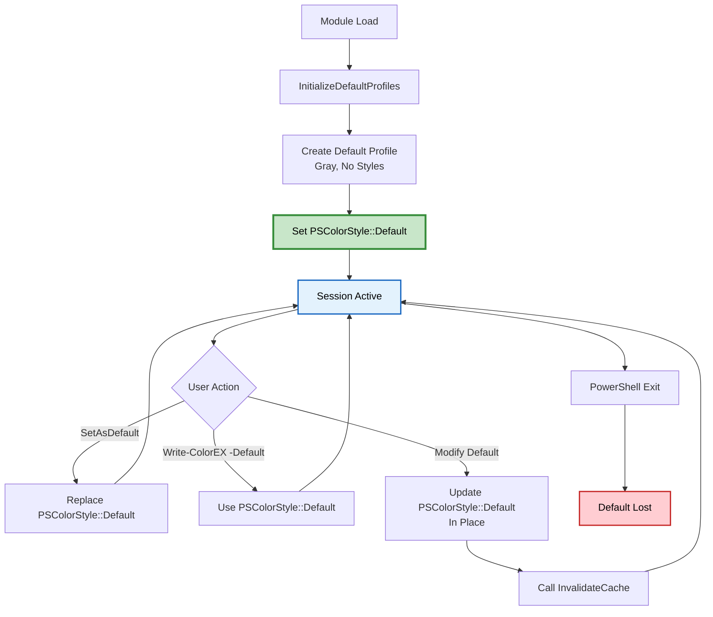
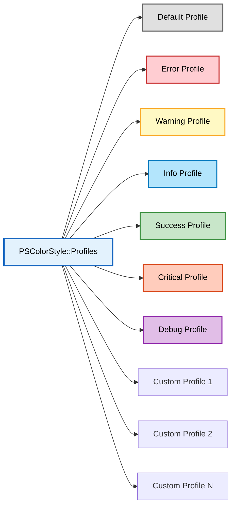
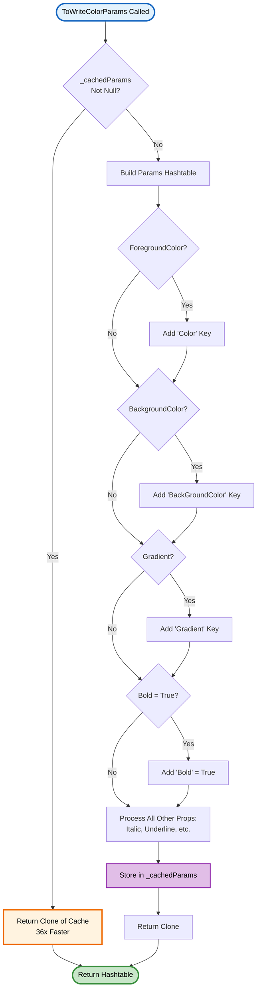
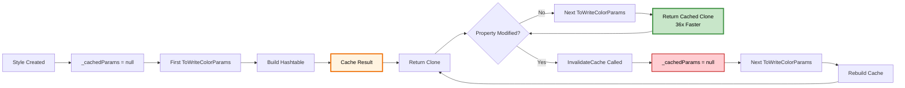

# PSColorStyle Class

> 🎨 **PowerShell class for managing reusable color and style configurations**

---

## 📑 Table of Contents

[Overview](#overview) • [Class Structure](#class-structure) • [Properties](#properties) • [Constructors](#constructors) • [Instance Methods](#instance-methods) • [Static Methods](#static-methods) • [Static Properties](#static-properties) • [Examples](#-examples) • [Singleton Pattern](#-singleton-pattern) • [Caching System](#-caching-system) • [Best Practices](#-best-practices) • [Related](#-related-commands)

---

## Overview

`PSColorStyle` is a PowerShell class that encapsulates color, styling, and formatting configurations for use with Write-ColorEX. It implements a singleton pattern for default styles and provides a centralized profile management system.

### ✨ Key Features

- **🎯 Object-Oriented Design** - Encapsulates all style properties in a single object
- **💾 Singleton Pattern** - Static Default property and Profiles collection
- **⚡ Performance Optimized** - Parameter caching with 36x speed improvement
- **🔄 Cloneable** - Create style variations with `.Clone()` method
- **🔧 Wrapper Functions** - `New-ColorStyle`, `Set-ColorDefault`, `Get-ColorProfiles`
- **🌍 Session Scope** - Styles persist for entire PowerShell session

---

## Class Structure

```powershell
class PSColorStyle {
    # Instance Properties
    [string]$Name
    [object]$ForegroundColor
    [object]$BackgroundColor
    [object[]]$Gradient
    [string[]]$Style
    [int]$StartTab
    [int]$StartSpaces
    [int]$LinesBefore
    [int]$LinesAfter
    [bool]$Bold
    [bool]$Italic
    [bool]$Underline
    [bool]$Blink
    [bool]$Faint
    [bool]$CrossedOut
    [bool]$DoubleUnderline
    [bool]$Overline
    [bool]$ShowTime
    [bool]$NoNewLine
    [bool]$HorizontalCenter

    # Static Properties
    static [PSColorStyle]$Default
    static [hashtable]$Profiles

    # Hidden Properties
    hidden [hashtable]$_cachedParams
}
```

---

## Properties

<details open>
<summary><b>🎨 Color Properties</b></summary>

### `Name`
> **Type:** `String`
> **Access:** Public

Unique identifier for the style. Used as the key in the Profiles hashtable.

```powershell
$style = [PSColorStyle]::new("CustomError")
$style.Name  # Returns "CustomError"
```

### `ForegroundColor`
> **Type:** `Object`
> **Access:** Public
> **Default:** `"Gray"`

Text color. Accepts:
- Color names (`'Red'`, `'Cyan'`, `'DarkGreen'`)
- Hex codes (`'#FF0000'`, `'0xFF8000'`)
- RGB arrays (`@(255, 128, 0)`)
- ANSI integers (`196`, `208`)

```powershell
$style.ForegroundColor = "Cyan"           # Color name
$style.ForegroundColor = "#FF6B35"        # Hex code
$style.ForegroundColor = @(255, 107, 53)  # RGB array
$style.ForegroundColor = 208              # ANSI 8-bit code
```

### `BackgroundColor`
> **Type:** `Object`
> **Access:** Public
> **Default:** `$null`

Background color. Accepts same formats as ForegroundColor. Use `$null` for no background.

```powershell
$style.BackgroundColor = "DarkBlue"
$style.BackgroundColor = $null  # Remove background
```

### `Gradient`
> **Type:** `Object[]`
> **Access:** Public
> **Default:** `$null`

Array of colors for smooth gradient transitions. Requires 2+ colors. Overrides ForegroundColor when set.

```powershell
# Two-color gradient
$style.Gradient = @('Red', 'Blue')

# Multi-stop gradient
$style.Gradient = @('Red', 'Orange', 'Yellow', 'Green', 'Blue')

# Hex gradient
$style.Gradient = @('#FF0000', '#FF8000', '#0000FF')
```

> [!IMPORTANT]
> When Gradient is set, it takes precedence over ForegroundColor for text coloring.

</details>

<details>
<summary><b>✒️ Text Style Properties</b></summary>

All text style properties are boolean switches:

| Property | Type | Default | Description | Terminal Support |
|----------|------|---------|-------------|------------------|
| `Bold` | `Bool` | `$false` | Bold text | Widespread |
| `Italic` | `Bool` | `$false` | Italic text | Most modern |
| `Underline` | `Bool` | `$false` | Underline text | Nearly universal |
| `Blink` | `Bool` | `$false` | Blinking text | Limited |
| `Faint` | `Bool` | `$false` | Reduced intensity | Limited |
| `CrossedOut` | `Bool` | `$false` | Strikethrough | Moderate |
| `DoubleUnderline` | `Bool` | `$false` | Double underline | VTE 0.76+ |
| `Overline` | `Bool` | `$false` | Line above text | VTE 0.52+, Windows Terminal |

```powershell
$style.Bold = $true
$style.Italic = $true
$style.Underline = $true
$style.CrossedOut = $true
$style.Overline = $true
```

> [!NOTE]
> Setting boolean properties to `$true` enables the style. Set to `$false` to disable.

</details>

<details>
<summary><b>📐 Formatting Properties</b></summary>

### `StartTab`
> **Type:** `Int32`
> **Default:** `0`

Number of tab characters to insert before text.

```powershell
$style.StartTab = 2  # Two tabs before text
```

### `StartSpaces`
> **Type:** `Int32`
> **Default:** `0`

Number of space characters to insert before text.

```powershell
$style.StartSpaces = 4  # Four spaces before text
```

### `LinesBefore`
> **Type:** `Int32`
> **Default:** `0`

Number of empty lines to print before output.

```powershell
$style.LinesBefore = 1  # One blank line before
```

### `LinesAfter`
> **Type:** `Int32`
> **Default:** `0`

Number of empty lines to print after output.

```powershell
$style.LinesAfter = 1  # One blank line after
```

</details>

<details>
<summary><b>⚙️ Behavior Properties</b></summary>

### `ShowTime`
> **Type:** `Bool`
> **Default:** `$false`

Prefix output with timestamp.

```powershell
$style.ShowTime = $true
# Output: [2025-01-14 10:30:45] Your text here
```

### `NoNewLine`
> **Type:** `Bool`
> **Default:** `$false`

Suppress newline after output (keeps cursor on same line).

```powershell
$style.NoNewLine = $true
```

### `HorizontalCenter`
> **Type:** `Bool`
> **Default:** `$false`

Center text horizontally in the terminal window.

```powershell
$style.HorizontalCenter = $true
```

</details>

<details>
<summary><b>🔒 Hidden Properties</b></summary>

### `_cachedParams`
> **Type:** `Hashtable`
> **Access:** Hidden (internal use)
> **Default:** `$null`

Internal cache for parameter hashtable. Populated by `ToWriteColorParams()` method for performance optimization (36x faster on subsequent calls).

> [!WARNING]
> This is a hidden property. Modifying it directly can cause unexpected behavior. Use `InvalidateCache()` method instead.

</details>

---

## Constructors

<details open>
<summary><b>🏗️ Constructor Overloads</b></summary>

### Default Constructor
```powershell
PSColorStyle()
```

Creates a style with default values:
- **Name:** `"Custom"`
- **ForegroundColor:** `"Gray"`
- **BackgroundColor:** `$null`
- All boolean properties: `$false`
- All integer properties: `0`

**Example:**
```powershell
$style = [PSColorStyle]::new()
$style.Name             # "Custom"
$style.ForegroundColor  # "Gray"
```

---

### Constructor with Name
```powershell
PSColorStyle([string]$name)
```

Creates a style with a custom name and default colors.

**Parameters:**
- `$name` - Unique identifier for the style

**Example:**
```powershell
$style = [PSColorStyle]::new("ErrorStyle")
$style.Name             # "ErrorStyle"
$style.ForegroundColor  # "Gray" (default)
```

---

### Constructor with Name and Colors
```powershell
PSColorStyle([string]$name, [object]$foreground, [object]$background)
```

Creates a fully configured style.

**Parameters:**
- `$name` - Unique identifier
- `$foreground` - Foreground color (color name, hex, RGB array)
- `$background` - Background color or `$null`

**Example:**
```powershell
$style = [PSColorStyle]::new("Header", "Cyan", "DarkBlue")
$style.Name             # "Header"
$style.ForegroundColor  # "Cyan"
$style.BackgroundColor  # "DarkBlue"

# With hex colors
$style = [PSColorStyle]::new("Brand", "#FF6B35", "#1A1A2E")

# With RGB array
$style = [PSColorStyle]::new("Custom", @(255, 128, 0), $null)
```

---

### Hidden Initialize Method
```powershell
hidden [void]Initialize([string]$name, [object]$foreground, [object]$background)
```

Internal method called by all constructors to set default values. Not intended for direct use.

</details>

---

## Instance Methods

<details open>
<summary><b>🔧 SetAsDefault()</b></summary>

### Signature
```powershell
[void]SetAsDefault()
```

### Description
Sets the current style instance as the global default style. This default is used when `Write-ColorEX` is called with the `-Default` switch.

### Parameters
None

### Return Value
`void` (no return value)

### Side Effects
- Updates the static `[PSColorStyle]::Default` property
- Affects all subsequent `Write-ColorEX -Default` calls
- Does not automatically add to Profiles collection

### Example
```powershell
# Create and set as default
$myDefault = [PSColorStyle]::new("MyDefault", "Cyan", $null)
$myDefault.Bold = $true
$myDefault.SetAsDefault()

# Now all -Default calls use this style
Write-ColorEX "This is cyan and bold" -Default
```

### Related
- [`Set-ColorDefault`](Set-ColorDefault.md) - Wrapper function
- [`[PSColorStyle]::Default`](#default) - Static property

</details>

<details>
<summary><b>🗂️ AddToProfiles()</b></summary>

### Signature
```powershell
[void]AddToProfiles()
```

### Description
Adds the current style instance to the session-wide Profiles collection using the `Name` property as the key. Makes the style retrievable via `GetProfile()` or `Get-ColorProfiles`.

### Parameters
None

### Return Value
`void` (no return value)

### Side Effects
- Adds style to `[PSColorStyle]::Profiles` hashtable
- Overwrites existing profile with same name (if any)
- Style remains available throughout PowerShell session

### Example
```powershell
# Create and add to profiles
$errorStyle = [PSColorStyle]::new("CustomError", "Red", $null)
$errorStyle.Bold = $true
$errorStyle.AddToProfiles()

# Later in script - retrieve and use
$style = [PSColorStyle]::GetProfile("CustomError")
Write-ColorEX "Error occurred!" -StyleProfile $style
```

### Related
- [`GetProfile()`](#getprofilestring-name) - Static method to retrieve profiles
- [`Get-ColorProfiles`](Get-ColorProfiles.md) - Wrapper function

</details>

<details>
<summary><b>📦 ToWriteColorParams()</b></summary>

### Signature
```powershell
[hashtable]ToWriteColorParams()
```

### Description
Converts the style properties into a hashtable compatible with `Write-ColorEX` splatting. Uses internal caching for performance optimization (36x faster on subsequent calls).

### Parameters
None

### Return Value
`Hashtable` - Parameter dictionary ready for splatting to `Write-ColorEX`

### Caching Behavior
1. **First call:** Builds hashtable, caches it in `_cachedParams`, returns clone
2. **Subsequent calls:** Returns clone of cached hashtable (36x faster)
3. **After modifications:** Cache remains valid until `InvalidateCache()` is called

### Example
```powershell
$style = [PSColorStyle]::new("Test", "Cyan", $null)
$style.Bold = $true
$style.Underline = $true

# Get parameters for splatting
$params = $style.ToWriteColorParams()

# $params contains:
# @{
#     Color = 'Cyan'
#     Bold = $true
#     Underline = $true
# }

# Use with Write-ColorEX
Write-ColorEX @params -Text "Styled output"
```

### Performance
| Operation | First Call | Cached Calls | Improvement |
|-----------|-----------|--------------|-------------|
| ToWriteColorParams | ~0.4ms | ~0.011ms | **36x faster** |

### Related
- [`InvalidateCache()`](#invalidatecache) - Clear cache after modifications
- [Caching System](#-caching-system) - Detailed caching explanation

</details>

<details>
<summary><b>🗑️ InvalidateCache()</b></summary>

### Signature
```powershell
hidden [void]InvalidateCache()
```

### Description
Clears the internal parameter cache (`_cachedParams`). **Must be called after modifying any properties** to ensure `ToWriteColorParams()` returns updated values.

### Parameters
None

### Return Value
`void` (no return value)

### When to Use
Call this method after:
- Changing color properties (`ForegroundColor`, `BackgroundColor`, `Gradient`)
- Modifying style flags (`Bold`, `Italic`, `Underline`, etc.)
- Updating formatting properties (`StartTab`, `LinesBefore`, etc.)
- Changing behavior properties (`ShowTime`, `NoNewLine`, etc.)

### Example
```powershell
# Create style
$style = [PSColorStyle]::new("Dynamic", "Cyan", $null)

# First use - builds cache
Write-ColorEX "Cyan text" -StyleProfile $style

# Modify properties
$style.ForegroundColor = "Magenta"
$style.Bold = $true

# MUST invalidate cache
$style.InvalidateCache()

# Now uses updated properties
Write-ColorEX "Magenta bold text" -StyleProfile $style
```

> [!WARNING]
> **Forgetting to call `InvalidateCache()` after property changes will result in the old cached values being used.**

### Related
- [`ToWriteColorParams()`](#towritecolorparams) - Method that uses the cache

</details>

<details>
<summary><b>🔄 Clone()</b></summary>

### Signature
```powershell
[PSColorStyle]Clone()
```

### Description
Creates a deep copy of the current style instance with a modified name (`Name + "_Copy"`). The clone does not share the parameter cache with the original.

### Parameters
None

### Return Value
`PSColorStyle` - New instance with identical properties (except Name)

### Behavior
- Copies all property values
- Appends `"_Copy"` to the original name
- Cache is **not** copied (`_cachedParams = $null`)
- Clone is independent - changes don't affect original

### Example
```powershell
# Create base style
$baseStyle = [PSColorStyle]::new("Base", "Cyan", $null)
$baseStyle.Bold = $true
$baseStyle.Underline = $true

# Clone and customize
$variant = $baseStyle.Clone()
$variant.Name = "Variant"  # Change name
$variant.ForegroundColor = "Magenta"  # Change color
$variant.Italic = $true  # Add italic

# Original is unchanged
Write-ColorEX "Base: Cyan, Bold, Underline" -StyleProfile $baseStyle
Write-ColorEX "Variant: Magenta, Bold, Underline, Italic" -StyleProfile $variant
```

### Use Cases
- Creating style variations
- Building a family of related styles
- Prototyping new styles from existing ones
- Preserving original style while experimenting

### PowerShell 5.1 Compatibility
> [!NOTE]
> The `Clone()` method uses explicit property copying instead of reflection for PowerShell 5.1 compatibility.

### Related
- [Constructors](#constructors) - Alternative to cloning

</details>

---

## Static Methods

<details open>
<summary><b>🔍 GetProfile([string] $name)</b></summary>

### Signature
```powershell
static [PSColorStyle]GetProfile([string]$name)
```

### Description
Retrieves a style profile from the static Profiles collection by name. Returns `$null` if profile doesn't exist.

### Parameters
- `$name` - Name of the profile to retrieve

### Return Value
- `PSColorStyle` - The requested style profile
- `$null` - If profile doesn't exist

### Example
```powershell
# Retrieve built-in profile
$errorStyle = [PSColorStyle]::GetProfile("Error")

# Check if profile exists
$customStyle = [PSColorStyle]::GetProfile("Custom")
if ($null -ne $customStyle) {
    Write-ColorEX "Found custom style" -StyleProfile $customStyle
} else {
    Write-Warning "Custom style not found"
}
```

### Built-in Profiles
The module initializes these profiles automatically:

| Profile Name | Colors | Styles | Use Case |
|--------------|--------|--------|----------|
| `Default` | Gray | None | Standard output |
| `Error` | Red | Bold | Error messages |
| `Warning` | Yellow | None | Warning messages |
| `Info` | Cyan | None | Informational output |
| `Success` | Green | None | Success messages |
| `Critical` | White on DarkRed | Bold, Blink | Critical errors |
| `Debug` | DarkGray | Italic | Debug output |

### Related
- [`Get-ColorProfiles`](Get-ColorProfiles.md) - Wrapper function
- [`AddToProfiles()`](#addtoprofiles) - Add custom profiles

</details>

<details>
<summary><b>🏁 InitializeDefaultProfiles()</b></summary>

### Signature
```powershell
static [void]InitializeDefaultProfiles()
```

### Description
Initializes the built-in style profiles (Default, Error, Warning, Info, Success, Critical, Debug) and pre-warms their parameter caches. Called automatically during module initialization.

### Parameters
None

### Return Value
`void` (no return value)

### Side Effects
- Creates 7 built-in style profiles
- Sets `[PSColorStyle]::Default` to the Default profile
- Adds all profiles to `[PSColorStyle]::Profiles`
- Pre-warms caches by calling `ToWriteColorParams()` on each

### Initialization Details
```powershell
# What this method does:

# 1. Default Profile
$defaultProfile = [PSColorStyle]::new("Default", "Gray", $null)
[PSColorStyle]::Default = $defaultProfile
[PSColorStyle]::Profiles["Default"] = $defaultProfile

# 2. Error Profile
$errorProfile = [PSColorStyle]::new("Error", "Red", $null)
$errorProfile.Bold = $true
$errorProfile.AddToProfiles()

# 3. Warning Profile
$warningProfile = [PSColorStyle]::new("Warning", "Yellow", $null)
$warningProfile.AddToProfiles()

# 4. Info Profile
$infoProfile = [PSColorStyle]::new("Info", "Cyan", $null)
$infoProfile.AddToProfiles()

# 5. Success Profile
$successProfile = [PSColorStyle]::new("Success", "Green", $null)
$successProfile.AddToProfiles()

# 6. Critical Profile
$criticalProfile = [PSColorStyle]::new("Critical", "White", "DarkRed")
$criticalProfile.Bold = $true
$criticalProfile.Blink = $true
$criticalProfile.AddToProfiles()

# 7. Debug Profile
$debugProfile = [PSColorStyle]::new("Debug", "DarkGray", $null)
$debugProfile.Italic = $true
$debugProfile.AddToProfiles()

# 8. Pre-warm caches (performance optimization)
$null = $defaultProfile.ToWriteColorParams()
$null = $errorProfile.ToWriteColorParams()
# ... (all profiles)
```

### When It's Called
- Automatically during `Import-Module PSWriteColorEX`
- Called once per module load
- Not intended for manual invocation

> [!NOTE]
> You typically don't need to call this method manually. The module initialization handles it.

</details>

---

## Static Properties

<details open>
<summary><b>🌟 Default</b></summary>

### Signature
```powershell
static [PSColorStyle]$Default
```

### Description
Holds the current default style instance used when `Write-ColorEX` is called with the `-Default` switch.

### Access
Read/Write (though typically modified via `SetAsDefault()` method)

### Initial Value
Set to a Gray-colored style during module initialization.

### Example
```powershell
# Access current default
$currentDefault = [PSColorStyle]::Default

# Check default properties
$currentDefault.ForegroundColor  # "Gray" (initially)
$currentDefault.Bold             # $false (initially)

# Modify current default
$currentDefault.Bold = $true
$currentDefault.InvalidateCache()

# Or replace entirely
$newDefault = [PSColorStyle]::new("MyDefault", "Cyan", $null)
[PSColorStyle]::Default = $newDefault
```

### Related
- [`SetAsDefault()`](#setasdefault) - Recommended way to update
- [`Set-ColorDefault`](Set-ColorDefault.md) - Wrapper function

</details>

<details>
<summary><b>🗂️ Profiles</b></summary>

### Signature
```powershell
static [hashtable]$Profiles
```

### Description
Static hashtable that stores all registered style profiles. Keys are style names (strings), values are PSColorStyle instances.

### Access
Read/Write (though typically modified via `AddToProfiles()` method)

### Initial Value
Empty hashtable `@{}`, populated during module initialization with 7 built-in profiles.

### Example
```powershell
# View all profile names
[PSColorStyle]::Profiles.Keys

# Get all profile objects
[PSColorStyle]::Profiles.Values

# Access specific profile
$errorStyle = [PSColorStyle]::Profiles["Error"]

# Add profile manually (not recommended - use AddToProfiles instead)
$customStyle = [PSColorStyle]::new("Custom", "Magenta", $null)
[PSColorStyle]::Profiles["Custom"] = $customStyle

# Check if profile exists
if ([PSColorStyle]::Profiles.ContainsKey("Custom")) {
    Write-Host "Custom profile exists"
}

# Remove a profile
[PSColorStyle]::Profiles.Remove("Custom")
```

### Built-in Profiles
After module initialization, contains:
- `Default`
- `Error`
- `Warning`
- `Info`
- `Success`
- `Critical`
- `Debug`

### Related
- [`AddToProfiles()`](#addtoprofiles) - Recommended way to add profiles
- [`GetProfile()`](#getprofilestring-name) - Recommended way to retrieve profiles
- [`Get-ColorProfiles`](Get-ColorProfiles.md) - Wrapper function

</details>

---

## 📚 Examples

<details open>
<summary><b>Example 1: Basic Class Usage</b></summary>

```powershell
# Create a style instance
$style = [PSColorStyle]::new("Header", "Cyan", "DarkBlue")

# Set properties
$style.Bold = $true
$style.Underline = $true
$style.HorizontalCenter = $true
$style.LinesBefore = 1
$style.LinesAfter = 1

# Use with Write-ColorEX
Write-ColorEX "REPORT HEADER" -StyleProfile $style
```

</details>

<details>
<summary><b>Example 2: Using Static Default</b></summary>

```powershell
# Create custom default style
$myDefault = [PSColorStyle]::new("MyDefault", "Green", $null)
$myDefault.Bold = $true
$myDefault.ShowTime = $true

# Set as default
$myDefault.SetAsDefault()

# All -Default calls now use this style
Write-ColorEX "Application started" -Default
Write-ColorEX "Loading configuration" -Default
Write-ColorEX "Ready" -Default
# Output: [timestamp] green bold text
```

</details>

<details>
<summary><b>Example 3: Profile Management</b></summary>

```powershell
# Create and register multiple styles
$sqlStyle = [PSColorStyle]::new("SQL", "Blue", $null)
$sqlStyle.Italic = $true
$sqlStyle.StartTab = 1
$sqlStyle.AddToProfiles()

$jsonStyle = [PSColorStyle]::new("JSON", "Magenta", $null)
$jsonStyle.Italic = $true
$jsonStyle.AddToProfiles()

$xmlStyle = [PSColorStyle]::new("XML", "Yellow", $null)
$xmlStyle.Italic = $true
$xmlStyle.AddToProfiles()

# Later - retrieve and use
$sql = [PSColorStyle]::GetProfile("SQL")
Write-ColorEX "SELECT * FROM Users" -StyleProfile $sql

$json = [PSColorStyle]::GetProfile("JSON")
Write-ColorEX '{"status": "success"}' -StyleProfile $json

# View all registered profiles
[PSColorStyle]::Profiles.Keys
```

</details>

<details>
<summary><b>Example 4: Modifying Existing Profiles</b></summary>

```powershell
# Get built-in Error profile
$errorStyle = [PSColorStyle]::GetProfile("Error")

# Modify it
$errorStyle.BackgroundColor = "DarkRed"
$errorStyle.Gradient = @('Red', 'DarkRed')
$errorStyle.Blink = $true

# CRITICAL: Invalidate cache after modifications
$errorStyle.InvalidateCache()

# Now all Write-ColorError calls use the modified style
Write-ColorError "Critical system failure!"
```

</details>

<details>
<summary><b>Example 5: Cloning and Variations</b></summary>

```powershell
# Create base header style
$baseHeader = [PSColorStyle]::new("BaseHeader", "Cyan", $null)
$baseHeader.Bold = $true
$baseHeader.Underline = $true
$baseHeader.HorizontalCenter = $true
$baseHeader.LinesBefore = 1
$baseHeader.LinesAfter = 1

# Clone for success header
$successHeader = $baseHeader.Clone()
$successHeader.Name = "SuccessHeader"
$successHeader.ForegroundColor = "Green"
$successHeader.AddToProfiles()

# Clone for error header
$errorHeader = $baseHeader.Clone()
$errorHeader.Name = "ErrorHeader"
$errorHeader.ForegroundColor = "Red"
$errorHeader.AddToProfiles()

# Clone for warning header
$warningHeader = $baseHeader.Clone()
$warningHeader.Name = "WarningHeader"
$warningHeader.ForegroundColor = "Yellow"
$warningHeader.AddToProfiles()

# Use the variants
Write-ColorEX "SUCCESS REPORT" -StyleProfile $successHeader
Write-ColorEX "ERROR REPORT" -StyleProfile $errorHeader
Write-ColorEX "WARNING REPORT" -StyleProfile $warningHeader
```

</details>

<details>
<summary><b>Example 6: Gradient Styles</b></summary>

```powershell
# Fire gradient
$fireStyle = [PSColorStyle]::new("Fire", $null, $null)
$fireStyle.Gradient = @('#8B0000', '#FF0000', '#FF8000', '#FFD700')
$fireStyle.Bold = $true

Write-ColorEX "HOT FLAMES" -StyleProfile $fireStyle

# Ocean gradient
$oceanStyle = [PSColorStyle]::new("Ocean", $null, $null)
$oceanStyle.Gradient = @('Blue', 'Cyan', 'White')
$oceanStyle.Italic = $true

Write-ColorEX "OCEAN WAVES" -StyleProfile $oceanStyle

# Rainbow gradient
$rainbowStyle = [PSColorStyle]::new("Rainbow", $null, $null)
$rainbowStyle.Gradient = @('Red','Orange','Yellow','Green','Cyan','Blue','Magenta')
$rainbowStyle.Bold = $true
$rainbowStyle.HorizontalCenter = $true

Write-ColorEX "RAINBOW ARCH" -StyleProfile $rainbowStyle
```

</details>

<details>
<summary><b>Example 7: Parameter Conversion and Splatting</b></summary>

```powershell
# Create style
$style = [PSColorStyle]::new("Custom", "Cyan", "DarkBlue")
$style.Bold = $true
$style.Italic = $true
$style.StartSpaces = 4

# Convert to parameters
$params = $style.ToWriteColorParams()

# $params now contains:
# @{
#     Color = 'Cyan'
#     BackGroundColor = 'DarkBlue'
#     Bold = $true
#     Italic = $true
#     StartSpaces = 4
# }

# Use with splatting
Write-ColorEX @params -Text "Styled message"

# Or add additional parameters
$params['Text'] = "Another message"
$params['LogFile'] = "output.log"
Write-ColorEX @params
```

</details>

<details>
<summary><b>Example 8: Direct Static Property Access</b></summary>

```powershell
# Access current default directly
$currentDefault = [PSColorStyle]::Default
Write-Host "Current default color: $($currentDefault.ForegroundColor)"
Write-Host "Current default is bold: $($currentDefault.Bold)"

# Modify default in place
$currentDefault.Italic = $true
$currentDefault.InvalidateCache()

# List all registered profiles
Write-Host "Registered profiles:"
[PSColorStyle]::Profiles.Keys | ForEach-Object {
    $profile = [PSColorStyle]::Profiles[$_]
    Write-Host "  $_ - $($profile.ForegroundColor)"
}

# Replace default entirely
$newDefault = [PSColorStyle]::new("NewDefault", "#3498db", $null)
$newDefault.Bold = $true
[PSColorStyle]::Default = $newDefault
```

</details>

<details>
<summary><b>Example 9: Complex Formatting Style</b></summary>

```powershell
# Create complex report style
$reportStyle = [PSColorStyle]::new("Report", "Cyan", $null)
$reportStyle.Bold = $true
$reportStyle.ShowTime = $true
$reportStyle.StartTab = 1
$reportStyle.LinesBefore = 1

# Create section header style
$sectionStyle = [PSColorStyle]::new("Section", "Yellow", $null)
$sectionStyle.Bold = $true
$sectionStyle.Underline = $true
$sectionStyle.HorizontalCenter = $true
$sectionStyle.LinesBefore = 1
$sectionStyle.LinesAfter = 1

# Create detail style
$detailStyle = [PSColorStyle]::new("Detail", "Gray", $null)
$detailStyle.StartSpaces = 8

# Use in report
Write-ColorEX "SYSTEM REPORT" -StyleProfile $sectionStyle
Write-ColorEX "Report generated" -StyleProfile $reportStyle
Write-ColorEX "Status: Online" -StyleProfile $detailStyle
Write-ColorEX "Uptime: 99.9%" -StyleProfile $detailStyle
Write-ColorEX "Memory: 42% used" -StyleProfile $detailStyle
```

</details>

<details>
<summary><b>Example 10: Wrapper Function Comparison</b></summary>

```powershell
# Using class directly
$style1 = [PSColorStyle]::new("Direct", "Cyan", $null)
$style1.Bold = $true
$style1.AddToProfiles()
$style1.SetAsDefault()

# Using wrapper function (simpler)
$style2 = New-ColorStyle -Name "Wrapper" `
                         -ForegroundColor Cyan `
                         -Bold `
                         -AddToProfiles `
                         -SetAsDefault

# Both achieve the same result
# Wrapper is more PowerShell-idiomatic
# Direct class use provides more control
```

</details>

---

## 🎯 Singleton Pattern

<details open>
<summary><b>Pattern Implementation</b></summary>

### Default Style Singleton

The `[PSColorStyle]::Default` static property implements a singleton pattern for the default style:



### Benefits
- **Single source of truth** for default styling
- **Global access** via static property
- **Consistent behavior** across all `-Default` calls
- **Easy to replace** via `SetAsDefault()`

### Example
```powershell
# Only one default exists at any time
Write-Host "Current default: $([PSColorStyle]::Default.ForegroundColor)"

# Replace the singleton
$newDefault = [PSColorStyle]::new("New", "Magenta", $null)
$newDefault.SetAsDefault()

Write-Host "New default: $([PSColorStyle]::Default.ForegroundColor)"
# Output: New default: Magenta
```

</details>

<details>
<summary><b>Profiles Collection Pattern</b></summary>

### Centralized Profile Registry

The `[PSColorStyle]::Profiles` static hashtable provides a centralized registry:



### Benefits
- **Session-wide availability** of named styles
- **No variable pollution** in user scope
- **Easy retrieval** via `GetProfile()` or `Get-ColorProfiles`
- **Consistent naming** prevents conflicts

</details>

---

## ⚡ Caching System

<details open>
<summary><b>How Caching Works</b></summary>

### Parameter Conversion Caching

The `ToWriteColorParams()` method implements an intelligent caching system:



### Cache Lifecycle



### Performance Impact

| Scenario | Performance |
|----------|-------------|
| **First call** to ToWriteColorParams | ~0.4ms |
| **Cached call** to ToWriteColorParams | ~0.011ms **(36x faster)** |
| 100 Write-ColorEX calls with same style | ~10ms total |
| 100 Write-ColorEX calls without caching | ~40ms total |
| **Overall improvement** | **4x faster** for repeated use |

</details>

<details>
<summary><b>Cache Invalidation</b></summary>

### When to Invalidate

You **must** call `InvalidateCache()` after modifying:

✅ **Color Properties**
```powershell
$style.ForegroundColor = "Magenta"
$style.BackgroundColor = "DarkBlue"
$style.Gradient = @('Red', 'Blue')
$style.InvalidateCache()  # REQUIRED
```

✅ **Style Flags**
```powershell
$style.Bold = $true
$style.Italic = $true
$style.Underline = $true
$style.InvalidateCache()  # REQUIRED
```

✅ **Formatting Properties**
```powershell
$style.StartTab = 2
$style.LinesBefore = 1
$style.HorizontalCenter = $true
$style.InvalidateCache()  # REQUIRED
```

✅ **Behavior Properties**
```powershell
$style.ShowTime = $true
$style.NoNewLine = $true
$style.InvalidateCache()  # REQUIRED
```

❌ **Do NOT Invalidate After**
```powershell
$style.Name = "NewName"  # Name change doesn't affect params
# No need to invalidate
```

### Automatic Invalidation

The `New-ColorStyle` wrapper function handles caching automatically - you only need to manually invalidate when modifying an existing instance.

</details>

---

## 💡 Best Practices

> [!TIP]
> **Use wrapper functions** (`New-ColorStyle`, `Set-ColorDefault`, `Get-ColorProfiles`) for most scenarios. Direct class access is for advanced use cases.

> [!IMPORTANT]
> **Always call `InvalidateCache()`** after modifying style properties to ensure changes take effect.

> [!NOTE]
> **Pre-register common styles** at script start and add them to Profiles for easy retrieval.

<details open>
<summary><b>Recommended Patterns</b></summary>

### 1. Use Wrappers for Creation
```powershell
# ✅ RECOMMENDED - Clear and PowerShell-idiomatic
$style = New-ColorStyle -Name "Header" -ForegroundColor Cyan -Bold

# ⚠️ ADVANCED - Direct class use
$style = [PSColorStyle]::new("Header", "Cyan", $null)
$style.Bold = $true
```

### 2. Centralize Style Definitions
```powershell
# ✅ GOOD - All styles defined in one place
function Initialize-AppStyles {
    New-ColorStyle -Name "Header" -ForegroundColor Cyan -Bold -HorizontalCenter -AddToProfiles
    New-ColorStyle -Name "Error" -ForegroundColor Red -Bold -AddToProfiles
    New-ColorStyle -Name "Success" -ForegroundColor Green -AddToProfiles
    New-ColorStyle -Name "SQL" -ForegroundColor Blue -Italic -AddToProfiles
}

Initialize-AppStyles
```

### 3. Use Cloning for Variations
```powershell
# ✅ GOOD - Efficient style variations
$baseStyle = [PSColorStyle]::new("Base", "Cyan", $null)
$baseStyle.Bold = $true

$variant1 = $baseStyle.Clone()
$variant1.Name = "Variant1"
$variant1.ForegroundColor = "Magenta"

$variant2 = $baseStyle.Clone()
$variant2.Name = "Variant2"
$variant2.ForegroundColor = "Yellow"
```

### 4. Always Invalidate After Modifications
```powershell
# ✅ CORRECT
$style.ForegroundColor = "Magenta"
$style.Bold = $true
$style.InvalidateCache()  # CRITICAL

# ❌ WRONG - Cache not invalidated
$style.ForegroundColor = "Magenta"
$style.Bold = $true
# Changes won't take effect on next use!
```

### 5. Check Profile Existence
```powershell
# ✅ GOOD - Check before use
$customStyle = [PSColorStyle]::GetProfile("Custom")
if ($null -ne $customStyle) {
    Write-ColorEX "Message" -StyleProfile $customStyle
} else {
    Write-Warning "Custom style not found"
}
```

### 6. Use Profiles for Session-Wide Styles
```powershell
# ✅ GOOD - Add to profiles for reuse
New-ColorStyle -Name "AppDefault" -ForegroundColor Cyan -Bold -AddToProfiles

# Later anywhere in session
$style = Get-ColorProfiles -Name "AppDefault"
Write-ColorEX "Message" -StyleProfile $style
```

### 7. Preserve Built-in Profiles
```powershell
# ✅ GOOD - Clone before modifying
$customError = [PSColorStyle]::GetProfile("Error").Clone()
$customError.Name = "CustomError"
$customError.Gradient = @('Red', 'DarkRed')
$customError.AddToProfiles()

# ⚠️ AVOID - Modifying built-in profiles
$errorStyle = [PSColorStyle]::GetProfile("Error")
$errorStyle.Gradient = @('Red', 'DarkRed')
# Now Write-ColorError uses gradient (may be unexpected)
```

</details>

<details>
<summary><b>Performance Optimization</b></summary>

### 1. Reuse Style Instances
```powershell
# ✅ OPTIMAL - Single style, multiple uses
$headerStyle = [PSColorStyle]::new("Header", "Cyan", $null)
$headerStyle.Bold = $true

for ($i = 0; $i -lt 1000; $i++) {
    Write-ColorEX "Header $i" -StyleProfile $headerStyle
}
# Cache hit on every iteration (36x faster)

# ❌ SLOW - Creating style in loop
for ($i = 0; $i -lt 1000; $i++) {
    $style = [PSColorStyle]::new("Header", "Cyan", $null)
    $style.Bold = $true
    Write-ColorEX "Header $i" -StyleProfile $style
}
# No cache benefit, creates 1000 instances
```

### 2. Pre-warm Caches
```powershell
# ✅ GOOD - Pre-warm at initialization
function Initialize-Styles {
    $script:HeaderStyle = New-ColorStyle -Name "Header" -ForegroundColor Cyan -Bold
    $script:ErrorStyle = New-ColorStyle -Name "Error" -ForegroundColor Red -Bold

    # Pre-warm caches
    $null = $script:HeaderStyle.ToWriteColorParams()
    $null = $script:ErrorStyle.ToWriteColorParams()
}

Initialize-Styles
```

### 3. Use Profiles Collection
```powershell
# ✅ FASTER - Single hashtable lookup
New-ColorStyle -Name "SQL" -ForegroundColor Blue -Italic -AddToProfiles

# Later - fast retrieval
$style = [PSColorStyle]::GetProfile("SQL")

# ❌ SLOWER - Multiple variable lookups
$script:SQLStyle = New-ColorStyle -Name "SQL" -ForegroundColor Blue -Italic
$script:JSONStyle = New-ColorStyle -Name "JSON" -ForegroundColor Magenta -Italic
$script:XMLStyle = New-ColorStyle -Name "XML" -ForegroundColor Yellow -Italic
```

</details>

---

## 🔍 Troubleshooting

<details>
<summary><b>Common Issues and Solutions</b></summary>

### Issue 1: Style Changes Not Applying

**Symptom:** Modified style properties don't take effect

**Cause:** Cache not invalidated after property changes

**Solution:**
```powershell
$style.ForegroundColor = "Magenta"
$style.Bold = $true

# MUST invalidate cache
$style.InvalidateCache()

Write-ColorEX "Test" -StyleProfile $style  # Now uses updated properties
```

---

### Issue 2: Profile Not Found

**Symptom:** `GetProfile()` returns `$null`

**Cause:** Style not added to Profiles collection

**Solution:**
```powershell
# ❌ WRONG - Not added to profiles
$style = [PSColorStyle]::new("Custom", "Cyan", $null)

# ✅ CORRECT - Add to profiles
$style = [PSColorStyle]::new("Custom", "Cyan", $null)
$style.AddToProfiles()

# Or use wrapper
New-ColorStyle -Name "Custom" -ForegroundColor Cyan -AddToProfiles
```

---

### Issue 3: Default Style Not Working

**Symptom:** `-Default` switch doesn't use expected style

**Cause:** Style not set as default

**Solution:**
```powershell
# ❌ WRONG - Not set as default
$style = [PSColorStyle]::new("MyDefault", "Green", $null)

# ✅ CORRECT - Set as default
$style = [PSColorStyle]::new("MyDefault", "Green", $null)
$style.SetAsDefault()

# Or use wrapper
New-ColorStyle -Name "MyDefault" -ForegroundColor Green -SetAsDefault
```

---

### Issue 4: Cloned Style Shares Cache

**Symptom:** Modifying clone affects original

**Cause:** Misunderstanding of clone behavior

**Solution:**
```powershell
# Clone() creates independent instances
$original = [PSColorStyle]::new("Original", "Cyan", $null)
$clone = $original.Clone()

# These are independent - no sharing
$clone.ForegroundColor = "Magenta"
$clone.InvalidateCache()

# Original is unchanged
Write-ColorEX "Original is still Cyan" -StyleProfile $original
Write-ColorEX "Clone is Magenta" -StyleProfile $clone
```

---

### Issue 5: Gradient Not Displaying

**Symptom:** Gradient appears as solid color

**Cause:** Terminal doesn't support TrueColor/ANSI8

**Solution:**
```powershell
# Check terminal support
$support = Test-AnsiSupport -Silent

if ($support -eq 'TrueColor' -or $support -eq 'ANSI8') {
    $style = [PSColorStyle]::new("Gradient", $null, $null)
    $style.Gradient = @('Red', 'Blue')
} else {
    # Fallback to solid color
    $style = [PSColorStyle]::new("Fallback", "Red", $null)
}
```

</details>

---

## 🔗 Related Commands

### Wrapper Functions
- [`New-ColorStyle`](New-ColorStyle.md) - Create style profiles (recommended)
- [`Set-ColorDefault`](Set-ColorDefault.md) - Set default style (recommended)
- [`Get-ColorProfiles`](Get-ColorProfiles.md) - Retrieve profiles (recommended)

### Core Functions
- [`Write-ColorEX`](Write-ColorEX.md) - Main colored output function
- Helper Functions:
  - [`Write-ColorError`](Write-ColorError.md) - Uses Error profile
  - [`Write-ColorWarning`](Write-ColorWarning.md) - Uses Warning profile
  - [`Write-ColorInfo`](Write-ColorInfo.md) - Uses Info profile
  - [`Write-ColorSuccess`](Write-ColorSuccess.md) - Uses Success profile
  - [`Write-ColorCritical`](Write-ColorCritical.md) - Uses Critical profile
  - [`Write-ColorDebug`](Write-ColorDebug.md) - Uses Debug profile

### Documentation
- [Module Overview](../README.md) - Complete documentation
- [Terminal Compatibility](../README.md#terminal-compatibility-matrix) - ANSI support details

---

## 📋 Quick Reference

<details>
<summary><b>Property Quick Reference</b></summary>

| Property | Type | Default | Description |
|----------|------|---------|-------------|
| `Name` | String | "Custom" | Style identifier |
| `ForegroundColor` | Object | "Gray" | Text color |
| `BackgroundColor` | Object | `$null` | Background color |
| `Gradient` | Object[] | `$null` | Gradient colors |
| `Bold` | Bool | `$false` | Bold text |
| `Italic` | Bool | `$false` | Italic text |
| `Underline` | Bool | `$false` | Underline text |
| `Blink` | Bool | `$false` | Blinking text |
| `Faint` | Bool | `$false` | Reduced intensity |
| `CrossedOut` | Bool | `$false` | Strikethrough |
| `DoubleUnderline` | Bool | `$false` | Double underline |
| `Overline` | Bool | `$false` | Line above text |
| `StartTab` | Int32 | 0 | Tab indentation |
| `StartSpaces` | Int32 | 0 | Space indentation |
| `LinesBefore` | Int32 | 0 | Empty lines before |
| `LinesAfter` | Int32 | 0 | Empty lines after |
| `ShowTime` | Bool | `$false` | Include timestamp |
| `NoNewLine` | Bool | `$false` | Suppress newline |
| `HorizontalCenter` | Bool | `$false` | Center text |

</details>

<details>
<summary><b>Method Quick Reference</b></summary>

| Method | Returns | Description |
|--------|---------|-------------|
| `SetAsDefault()` | void | Set as global default |
| `AddToProfiles()` | void | Add to Profiles collection |
| `ToWriteColorParams()` | Hashtable | Convert to parameters (cached) |
| `InvalidateCache()` | void | Clear parameter cache |
| `Clone()` | PSColorStyle | Create deep copy |
| `GetProfile($name)` | PSColorStyle | Get profile by name (static) |
| `InitializeDefaultProfiles()` | void | Initialize built-ins (static) |

</details>

<details>
<summary><b>Common Usage Patterns</b></summary>

```powershell
# Create instance
$style = [PSColorStyle]::new("Name", "Color", $null)

# Set properties
$style.Bold = $true

# Add to profiles
$style.AddToProfiles()

# Set as default
$style.SetAsDefault()

# Retrieve profile
$retrieved = [PSColorStyle]::GetProfile("Name")

# Clone for variation
$variant = $style.Clone()

# Convert to params
$params = $style.ToWriteColorParams()

# Invalidate after changes
$style.InvalidateCache()
```

</details>

---

<div align="center">

**PSWriteColorEX** v1.0.0 | MIT License | [GitHub](https://github.com/MarkusMcNugen/PSWriteColorEX)

</div>
