```mermaid
graph TD
    Input([User Calls Write-ColorEX]) --> Level1{Explicit<br/>Parameters?}

    Level1 -->|Yes| UseExplicit[Use Explicit Parameters<br/>Highest Priority]
    Level1 -->|No| Level2{-StyleProfile<br/>Specified?}

    Level2 -->|Yes| UseProfile[Use Style Profile<br/>2nd Priority]
    Level2 -->|No| Level3{-Default<br/>Switch?}

    Level3 -->|Yes| UseDefault[Use Default Style<br/>3rd Priority]
    Level3 -->|No| UseNone[Use Built-in Defaults<br/>Lowest Priority]

    UseExplicit --> Override[Override Any Conflicts]
    Override --> FinalParams[Final Parameters]

    UseProfile --> Merge1[Merge with Explicit]
    Merge1 --> FinalParams

    UseDefault --> Merge2[Merge with Explicit + Profile]
    Merge2 --> FinalParams

    UseNone --> FinalParams
    FinalParams --> Render([🎨 Render Output])

    style Input fill:#e3f2fd,stroke:#1565c0,stroke-width:3px,color:#000
    style Render fill:#e8f5e9,stroke:#2e7d32,stroke-width:3px,color:#000
    style UseExplicit fill:#ffcdd2,stroke:#c62828,stroke-width:2px,color:#000
    style UseProfile fill:#fff9c4,stroke:#f9a825,stroke-width:2px,color:#000
    style UseDefault fill:#c8e6c9,stroke:#388e3c,stroke-width:2px,color:#000
    style UseNone fill:#e0e0e0,stroke:#616161,stroke-width:2px,color:#000
```

# Set-ColorDefault

> 🎨 **Configure default styling for Write-ColorEX**

---

## 📑 Table of Contents

[Synopsis](#synopsis) • [Syntax](#syntax) • [Description](#description) • [Parameters](#parameters) • [Examples](#-examples) • [Parameter Flow](#-parameter-set-flow) • [Integration](#-integration-with-write-colorex) • [Best Practices](#-best-practices) • [Related](#-related-commands)

---

## Synopsis

Sets the default color style that will be used when `Write-ColorEX` is called with the `-Default` switch.

## Syntax

```powershell
# Using individual properties
Set-ColorDefault
    [-ForegroundColor <Object>]
    [-BackgroundColor <Object>]
    [-Bold]
    [-Italic]
    [-Underline]
    [-ShowTime]
    [-StartTab <Int32>]
    [-StartSpaces <Int32>]
    [<CommonParameters>]

# Using a PSColorStyle object
Set-ColorDefault
    -Style <PSColorStyle>
    [<CommonParameters>]
```

## Description

`Set-ColorDefault` is a **wrapper function** around the [`PSColorStyle`](PSColorStyle-Class.md) class that provides a simplified PowerShell-idiomatic interface for configuring the default styling. It configures the default styling that will be applied when using `Write-ColorEX -Default`, allowing you to establish consistent formatting across your script or session without repeatedly specifying style parameters.

> [!NOTE]
> This function wraps the `PSColorStyle::Default` static property and the `SetAsDefault()` instance method. For advanced scenarios requiring fine-grained control, see the [PSColorStyle Class documentation](PSColorStyle-Class.md).

### ✨ Key Features

- **🔧 Two Configuration Methods** - Use style object or individual properties
- **💾 Session Persistence** - Default remains active for entire session
- **🔄 Dynamic Updates** - Change default at any time during execution
- **🎭 Profile Integration** - Automatically adds to profiles collection
- **⚡ Performance Optimized** - Cached parameters for fast application
- **🌍 Universal Scope** - Affects all subsequent `-Default` calls

---

## Parameters

<details open>
<summary><b>🎛️ Parameter Sets</b></summary>

### Parameter Set: `Object`

Used when providing a pre-configured PSColorStyle object.

#### `-Style`
> **Type:** `PSColorStyle`
> **Required:** Yes (for Object parameter set)
> **Pipeline Input:** No

A PSColorStyle object to set as the default. The object's `SetAsDefault()` method is called to configure the global default.

```powershell
# Example: Using a style object
$myStyle = New-ColorStyle -Name "MyDefault" -ForegroundColor Cyan -Bold
Set-ColorDefault -Style $myStyle
```

---

### Parameter Set: `Properties`

Used when configuring individual style properties.

#### `-ForegroundColor`
> **Type:** `Object`
> **Default:** `"Gray"`
> **Pipeline Input:** No

Default text color. Accepts:
- Color names (e.g., `'Red'`, `'Cyan'`, `'DarkGreen'`)
- Hex codes (e.g., `'#FF0000'`, `'0xFF8000'`)
- RGB arrays (e.g., `@(255, 128, 0)`)

#### `-BackgroundColor`
> **Type:** `Object`
> **Default:** `$null` (no background)
> **Pipeline Input:** No

Default background color. Accepts same formats as ForegroundColor.

#### Style Switches

| Switch | Description | Type |
|--------|-------------|------|
| `-Bold` | Make default text bold | Switch |
| `-Italic` | Make default text italic | Switch |
| `-Underline` | Underline default text | Switch |
| `-ShowTime` | Always show timestamp | Switch |

#### Formatting Parameters

| Parameter | Type | Default | Description |
|-----------|------|---------|-------------|
| `-StartTab` | `Int32` | `0` | Default tab indentation |
| `-StartSpaces` | `Int32` | `0` | Default space indentation |

</details>

<details>
<summary><b>🔤 Aliases</b></summary>

The function provides multiple aliases for flexibility:

| Alias | Type | Notes |
|-------|------|-------|
| `SCD` | Ultra-short | Minimal typing |
| `Set-ColourDefault` | British spelling | International support |
| `Set-DefaultColor` | Alternative order | Natural naming |
| `Set-DefaultColour` | British alternative | International variant |

```powershell
# All equivalent
Set-ColorDefault -ForegroundColor Cyan
SCD -ForegroundColor Cyan
Set-DefaultColor -ForegroundColor Cyan
```

</details>

---

## 📚 Examples

<details>
<summary><b>Example 1: Simple Color Default</b></summary>

```powershell
# Set default to cyan
Set-ColorDefault -ForegroundColor Cyan

# All subsequent -Default calls use cyan
Write-ColorEX "This is cyan" -Default
Write-ColorEX "This is also cyan" -Default
```

</details>

<details>
<summary><b>Example 2: Styled Default with Bold</b></summary>

```powershell
# Set default to bold green
Set-ColorDefault -ForegroundColor Green -Bold

# Now all -Default calls are bold green
Write-ColorEX "Success message" -Default
Write-ColorEX "Another success" -Default
```

</details>

<details>
<summary><b>Example 3: Complex Default Styling</b></summary>

```powershell
# Set comprehensive default style
Set-ColorDefault -ForegroundColor Cyan `
                 -BackgroundColor DarkBlue `
                 -Bold `
                 -Italic `
                 -StartTab 1 `
                 -ShowTime

Write-ColorEX "Fully styled output" -Default
# Output: [timestamp] [indent] bold italic cyan on dark blue
```

</details>

<details>
<summary><b>Example 4: Using Style Object</b></summary>

```powershell
# Create a custom style
$headerStyle = New-ColorStyle -Name "Header" `
                               -ForegroundColor "#FF6B35" `
                               -Bold `
                               -Underline `
                               -HorizontalCenter

# Set as default
Set-ColorDefault -Style $headerStyle

Write-ColorEX "CENTERED HEADER" -Default
```

</details>

<details>
<summary><b>Example 5: Session-Wide Default</b></summary>

```powershell
# Set default at script start
Set-ColorDefault -ForegroundColor Yellow -Bold

# Use throughout script
Write-ColorEX "Starting process..." -Default
Start-Process "notepad.exe"
Write-ColorEX "Process started" -Default

# Override when needed
Write-ColorEX "Error occurred!" -Color Red -Bold
Write-ColorEX "Continuing..." -Default
```

</details>

<details>
<summary><b>Example 6: Reset to Original</b></summary>

```powershell
# Reset to module default (gray, no styling)
Set-ColorDefault -ForegroundColor Gray

# Or create a minimal style
$plainStyle = New-ColorStyle -Name "Plain" -ForegroundColor Gray
Set-ColorDefault -Style $plainStyle
```

</details>

<details>
<summary><b>Example 7: TrueColor Default</b></summary>

```powershell
# Set TrueColor default with RGB
Set-ColorDefault -ForegroundColor @(255, 128, 0)

# Use with TrueColor mode
Write-ColorEX "Orange text" -Default -TrueColor
```

</details>

<details>
<summary><b>Example 8: Timestamped Logging Default</b></summary>

```powershell
# Set default for log-style output
Set-ColorDefault -ForegroundColor Cyan -ShowTime

# All output now has timestamps
Write-ColorEX "Application started" -Default
Write-ColorEX "Loading configuration" -Default
Write-ColorEX "Ready" -Default
# Output format: [2025-01-14 10:30:45] Application started
```

</details>

---

## 🔄 Parameter Set Flow

```mermaid
graph TD
    Start([Set-ColorDefault Called]) --> CheckParams{Which Parameters<br/>Provided?}

    CheckParams -->|Style Object| ObjectSet[Parameter Set: Object]
    CheckParams -->|Individual Properties| PropertiesSet[Parameter Set: Properties]

    ObjectSet --> ValidateStyle{Style is<br/>PSColorStyle?}
    ValidateStyle -->|Yes| CallSetAsDefault[Call Style.SetAsDefault]
    ValidateStyle -->|No| Error1[⚠️ Parameter Error]

    PropertiesSet --> CreateStyle[Create New PSColorStyle]
    CreateStyle --> SetName[Name = 'Default']
    SetName --> SetColors[Set ForegroundColor<br/>BackgroundColor]
    SetColors --> SetStyles[Set Style Flags:<br/>Bold, Italic, Underline]
    SetStyles --> SetFormatting[Set Formatting:<br/>ShowTime, StartTab, StartSpaces]
    SetFormatting --> CallSetDefault[Call newStyle.SetAsDefault]
    CallSetDefault --> AddProfiles[Call newStyle.AddToProfiles]

    CallSetAsDefault --> UpdateGlobal[Update PSColorStyle Default]
    AddProfiles --> UpdateGlobal
    UpdateGlobal --> InvalidateCache[Invalidate Style Cache]
    InvalidateCache --> Success([Default Style Set])

    Error1 --> Fail([Error])

    style Start fill:#e3f2fd,stroke:#1565c0,stroke-width:3px,color:#000
    style Success fill:#e8f5e9,stroke:#2e7d32,stroke-width:3px,color:#000
    style Fail fill:#ffebee,stroke:#c62828,stroke-width:3px,color:#000
    style ObjectSet fill:#b3e5fc,stroke:#0277bd,stroke-width:2px,color:#000
    style PropertiesSet fill:#e1bee7,stroke:#8e24aa,stroke-width:2px,color:#000
    style CreateStyle fill:#fff3e0,stroke:#ef6c00,stroke-width:2px,color:#000
    style UpdateGlobal fill:#c8e6c9,stroke:#388e3c,stroke-width:2px,color:#000
```

<details open>
<summary><b>Parameter Set Selection Diagram</b></summary>



</details>

<details>
<summary><b>PSColorStyle Class Integration</b></summary>


</details>

---

## 🔗 Integration with Write-ColorEX

```mermaid
graph TD
    Start([Write-ColorEX Called]) --> CheckDefault{-Default<br/>Switch?}

    CheckDefault -->|No| NormalProcessing[Process Colors Normally]
    CheckDefault -->|Yes| CheckExists{PSColorStyle Default<br/>Exists?}

    CheckExists -->|No| UseBuiltIn[Use Built-in Default<br/>Gray, No Styling]
    CheckExists -->|Yes| LoadDefault[Load Default Style]

    LoadDefault --> GetParams[Call ToWriteColorParams]
    GetParams --> CheckCache{Cached Params<br/>Available?}

    CheckCache -->|Yes| UseCached[Use Cached Params<br/>36x Faster]
    CheckCache -->|No| BuildParams[Build Params Hashtable]
    BuildParams --> CacheParams[Cache for Future Calls]
    CacheParams --> UseCached

    UseCached --> ApplyParams[Apply Style Parameters]
    ApplyParams --> CheckOverride{User Override<br/>Parameters?}

    CheckOverride -->|Yes| MergeParams[Merge with Defaults<br/>User Params Win]
    CheckOverride -->|No| UseAll[Use All Default Params]

    MergeParams --> ProcessOutput[Process Output with Styling]
    UseAll --> ProcessOutput
    UseBuiltIn --> ProcessOutput
    NormalProcessing --> ProcessOutput

    ProcessOutput --> Output([📄 Styled Output])

    style Start fill:#e3f2fd,stroke:#1565c0,stroke-width:3px,color:#000
    style Output fill:#e8f5e9,stroke:#2e7d32,stroke-width:3px,color:#000
    style LoadDefault fill:#c8e6c9,stroke:#388e3c,stroke-width:2px,color:#000
    style UseCached fill:#fff3e0,stroke:#ef6c00,stroke-width:2px,color:#000
    style ApplyParams fill:#e1bee7,stroke:#8e24aa,stroke-width:2px,color:#000
```

<details open>
<summary><b>Default Style Application Flow</b></summary>



</details>

<details>
<summary><b>Parameter Priority Hierarchy</b></summary>



</details>

<details>
<summary><b>Integration Example</b></summary>

```powershell
# Set session default
Set-ColorDefault -ForegroundColor Cyan -Bold

# Method 1: Use default style
Write-ColorEX "Uses cyan bold" -Default

# Method 2: Partial override
Write-ColorEX "Green bold (overrides color only)" -Color Green -Default

# Method 3: Complete override
Write-ColorEX "Red italic (ignores default)" -Color Red -Italic

# Method 4: Use with style profile
$errorStyle = [PSColorStyle]::GetProfile("Error")
Write-ColorEX "Uses Error profile (overrides default)" -StyleProfile $errorStyle

# Priority demonstration
Set-ColorDefault -ForegroundColor Yellow
Write-ColorEX "I am yellow" -Default
Write-ColorEX "I am cyan (explicit wins)" -Color Cyan -Default
```

**Parameter Resolution:**
1. Explicit `-Color Cyan` beats `-Default`
2. `-StyleProfile` beats `-Default`
3. `-Default` beats built-in defaults
4. Explicit parameters always win

</details>

---

## 🔄 Default Style Lifecycle

<details open>
<summary><b>Complete Lifecycle Diagram</b></summary>


</details>

<details>
<summary><b>Persistence Scope</b></summary>

### Session Scope

The default style persists for the **entire PowerShell session** until:

1. **PowerShell exits** - Default is lost, resets on next session
2. **Module is reloaded** - `Import-Module -Force` resets to gray
3. **New default is set** - Calling `Set-ColorDefault` again replaces it


### No File Persistence

> [!IMPORTANT]
> **The default style is NOT saved to disk.** It exists only in memory for the current session.

To make a default persistent across sessions:

```powershell
# Add to your PowerShell profile ($PROFILE)
Import-Module PSWriteColorEX
Set-ColorDefault -ForegroundColor Cyan -Bold
```

### Profile Access

The default can be accessed and modified directly:

```powershell
# Access the current default
$currentDefault = [PSColorStyle]::Default

# Check default properties
$currentDefault.ForegroundColor  # Returns current color
$currentDefault.Bold             # Returns $true or $false

# Modify and reapply
$currentDefault.Italic = $true
$currentDefault.SetAsDefault()   # Apply changes
```

</details>

---

## ⚡ Performance Considerations

<details>
<summary><b>Caching System</b></summary>

### Style Parameter Caching

`Set-ColorDefault` leverages the PSColorStyle caching system for optimal performance:


### Performance Metrics

| Operation | First Call | Cached Calls | Improvement |
|-----------|-----------|--------------|-------------|
| Set-ColorDefault (Object) | ~0.5ms | N/A | Instant |
| Set-ColorDefault (Properties) | ~1ms | N/A | One-time |
| ToWriteColorParams (uncached) | ~0.4ms | N/A | One-time |
| ToWriteColorParams (cached) | N/A | ~0.011ms | **36x faster** |
| Write-ColorEX -Default (100x) | ~97ms total | Includes cache benefits | Optimized |

### Best Practices for Performance

```powershell
# ✅ GOOD: Set once, use many times
Set-ColorDefault -ForegroundColor Cyan -Bold
for ($i = 0; $i -lt 1000; $i++) {
    Write-ColorEX "Line $i" -Default  # Uses cached params
}

# ⚠️ AVOID: Setting default repeatedly
for ($i = 0; $i -lt 1000; $i++) {
    Set-ColorDefault -ForegroundColor Cyan -Bold  # Unnecessary overhead
    Write-ColorEX "Line $i" -Default
}
```

</details>

---

## 💡 Best Practices

> [!TIP]
> **Set defaults early in your script** for consistent formatting throughout.

> [!NOTE]
> **Explicit parameters override defaults** - Use `-Default` as a baseline, override when needed.

> [!IMPORTANT]
> **Default styles are session-scoped** - They reset when PowerShell restarts.

<details>
<summary><b>Development Best Practices</b></summary>

### 1. Set Defaults at Script Start

```powershell
# Beginning of script
Set-ColorDefault -ForegroundColor Cyan -Bold

# Rest of script uses -Default for standard output
Write-ColorEX "Starting process..." -Default
Write-ColorEX "Loading configuration..." -Default
Write-ColorEX "Ready" -Default
```

### 2. Use Style Objects for Complex Defaults

```powershell
# Create reusable style
$appDefaultStyle = New-ColorStyle -Name "AppDefault" `
                                  -ForegroundColor "#3498db" `
                                  -Bold `
                                  -StartSpaces 2 `
                                  -ShowTime

Set-ColorDefault -Style $appDefaultStyle
```

### 3. Override When Necessary

```powershell
Set-ColorDefault -ForegroundColor Cyan

# Standard output
Write-ColorEX "Normal message" -Default

# Error override
Write-ColorEX "Error occurred!" -Color Red -Bold

# Back to default
Write-ColorEX "Continuing..." -Default
```

### 4. Profile Integration for Consistency

```powershell
# Add to $PROFILE for session consistency
function Initialize-MyColorDefaults {
    if (Get-Module PSWriteColorEX) {
        Set-ColorDefault -ForegroundColor Cyan -Bold -ShowTime
    }
}

Initialize-MyColorDefaults
```

### 5. Context-Aware Defaults

```powershell
# Different defaults for different contexts
if ($env:ENVIRONMENT -eq 'Production') {
    Set-ColorDefault -ForegroundColor Yellow -Bold
} elseif ($env:ENVIRONMENT -eq 'Development') {
    Set-ColorDefault -ForegroundColor Cyan
} else {
    Set-ColorDefault -ForegroundColor Gray
}
```

### 6. Preserve Original for Reset

```powershell
# Save original default
$originalDefault = [PSColorStyle]::Default.Clone()

# Set temporary default
Set-ColorDefault -ForegroundColor Yellow

# ... do work ...

# Restore original
Set-ColorDefault -Style $originalDefault
```

### 7. Use with Helper Functions

```powershell
# Set general default
Set-ColorDefault -ForegroundColor Cyan

# Helper functions override automatically
Write-ColorError "Error message"      # Red, bold (Error profile)
Write-ColorSuccess "Success message"  # Green (Success profile)
Write-ColorEX "Normal message" -Default # Cyan (default)
```

</details>

<details>
<summary><b>Common Patterns</b></summary>

### Pattern 1: Application Output Style

```powershell
# Set application-wide default for informational output
Set-ColorDefault -ForegroundColor Cyan -StartSpaces 2

Write-ColorEX "Application: MyApp v1.0" -Default
Write-ColorEX "Initializing..." -Default
Write-ColorEX "Ready" -Default
```

### Pattern 2: Logging Style

```powershell
# Set default for log-style output with timestamps
Set-ColorDefault -ForegroundColor Gray -ShowTime

Write-ColorEX "System started" -Default -LogFile "app.log"
Write-ColorEX "Processing data" -Default -LogFile "app.log"
Write-ColorEX "Complete" -Default -LogFile "app.log"
```

### Pattern 3: Interactive Prompts

```powershell
# Set default for interactive prompts
Set-ColorDefault -ForegroundColor Yellow -Bold

Write-ColorEX "Enter your choice:" -Default -NoNewLine
$choice = Read-Host
```

### Pattern 4: Section Headers

```powershell
# Set default for section headers
Set-ColorDefault -ForegroundColor Cyan -Bold -HorizontalCenter -LinesBefore 1 -LinesAfter 1

Write-ColorEX "CONFIGURATION" -Default
Write-ColorEX "PROCESSING" -Default
Write-ColorEX "RESULTS" -Default
```

</details>

---

## 🌍 Cross-Platform Compatibility

<details>
<summary><b>Platform Considerations</b></summary>

### Windows

```powershell
# TrueColor default on Windows Terminal
Set-ColorDefault -ForegroundColor @(52, 152, 219) -Bold

# Fallback for older terminals
Set-ColorDefault -ForegroundColor Cyan -Bold
```

### Linux/macOS

```powershell
# TrueColor default on modern terminals
Set-ColorDefault -ForegroundColor "#3498db" -Bold

# Automatic degradation on limited terminals
# Module handles conversion automatically
```

### Color Mode Awareness

The default style automatically adapts to terminal capabilities:


</details>

---

## 🔍 Troubleshooting

<details>
<summary><b>Common Issues and Solutions</b></summary>

### Issue 1: Default Not Being Applied

**Symptom:** `Write-ColorEX -Default` doesn't use expected style

**Solutions:**
```powershell
# Check if default is set
$currentDefault = [PSColorStyle]::Default
$currentDefault | Format-List

# Verify you're using -Default switch
Write-ColorEX "Test" -Default  # ✅ Correct
Write-ColorEX "Test"            # ❌ Won't use default

# Check for parameter override
Write-ColorEX "Test" -Color Red -Default  # Color parameter wins
```

### Issue 2: Default Reset After Module Reload

**Symptom:** Default reverts to gray after `Import-Module -Force`

**Solution:**
```powershell
# Add to a function in your profile
function Set-MyDefaults {
    Import-Module PSWriteColorEX -Force
    Set-ColorDefault -ForegroundColor Cyan -Bold
}

# Call instead of Import-Module
Set-MyDefaults
```

### Issue 3: Style Not Updating

**Symptom:** Changes to default style don't appear

**Solution:**
```powershell
# Ensure you call Set-ColorDefault again
$currentDefault = [PSColorStyle]::Default
$currentDefault.Bold = $true

# ❌ Changes not applied yet
Write-ColorEX "Test" -Default

# ✅ Must re-apply
$currentDefault.SetAsDefault()
Write-ColorEX "Test" -Default
```

### Issue 4: TrueColor Default Not Working

**Symptom:** RGB/hex colors in default appear as basic colors

**Solution:**
```powershell
# Check terminal support
Test-AnsiSupport -Silent

# If not TrueColor, colors auto-degrade
Set-ColorDefault -ForegroundColor @(255, 128, 0)
Write-ColorEX "Test" -Default -TrueColor  # Add -TrueColor flag

# Or use named colors for compatibility
Set-ColorDefault -ForegroundColor Orange
```

</details>

---

## 🔗 Related Commands

- [`New-ColorStyle`](New-ColorStyle.md) - Create custom style profiles
- [`Get-ColorProfiles`](Get-ColorProfiles.md) - Retrieve available style profiles
- [`Write-ColorEX`](Write-ColorEX.md) - Main colored output function
- [PSColorStyle Class](../README.md#pscolorstyle-class) - Style class documentation
- [Module Overview](../README.md) - Complete documentation

---

## 📋 Quick Reference

<details>
<summary><b>Parameter Quick Reference</b></summary>

| Parameter | Type | Default | Description |
|-----------|------|---------|-------------|
| `Style` | PSColorStyle | - | Use style object |
| `ForegroundColor` | Object | Gray | Text color |
| `BackgroundColor` | Object | null | Background color |
| `Bold` | Switch | - | Bold text |
| `Italic` | Switch | - | Italic text |
| `Underline` | Switch | - | Underline text |
| `ShowTime` | Switch | - | Show timestamp |
| `StartTab` | Int32 | 0 | Tab indentation |
| `StartSpaces` | Int32 | 0 | Space indentation |

</details>

<details>
<summary><b>Common Usage Patterns</b></summary>

```powershell
# Minimal
Set-ColorDefault -ForegroundColor Cyan

# Styled
Set-ColorDefault -ForegroundColor Green -Bold

# Complete
Set-ColorDefault -ForegroundColor Cyan -BackgroundColor DarkBlue -Bold -ShowTime

# Object-based
$style = New-ColorStyle -Name "Custom" -ForegroundColor Yellow -Bold
Set-ColorDefault -Style $style

# TrueColor
Set-ColorDefault -ForegroundColor @(52, 152, 219) -Bold
```

</details>

---

<div align="center">

**PSWriteColorEX** v2.0.0 | MIT License | [GitHub](https://github.com/MarkusMcNugen/PSWriteColorEX)

</div>
