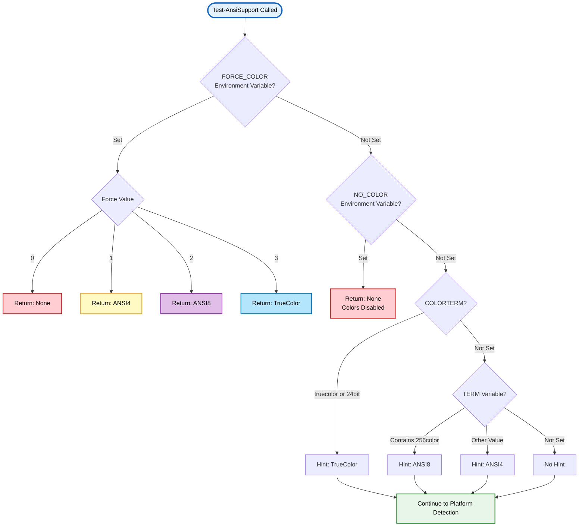
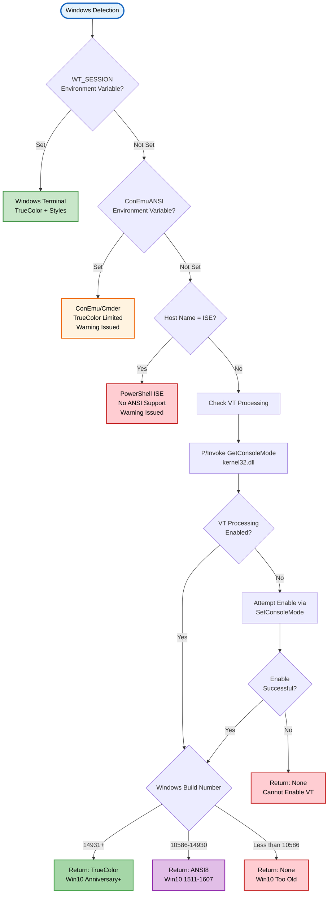
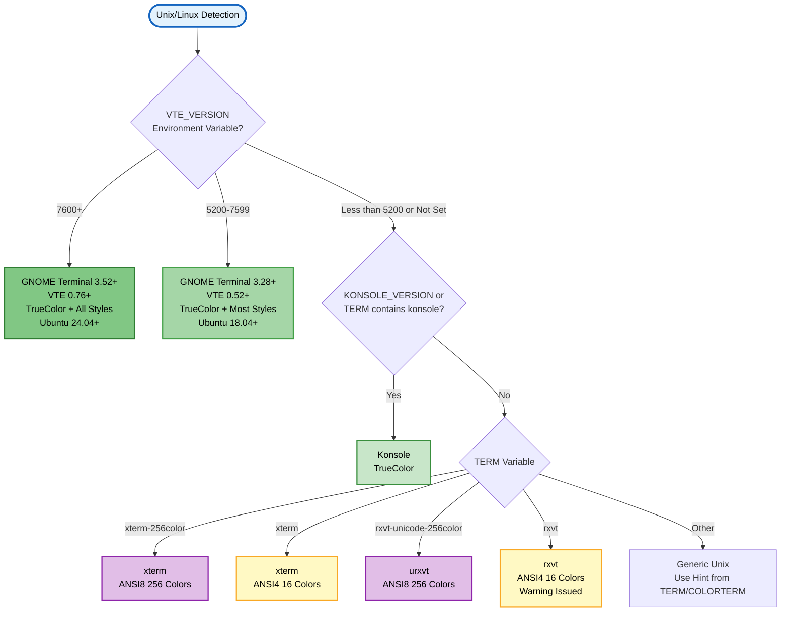
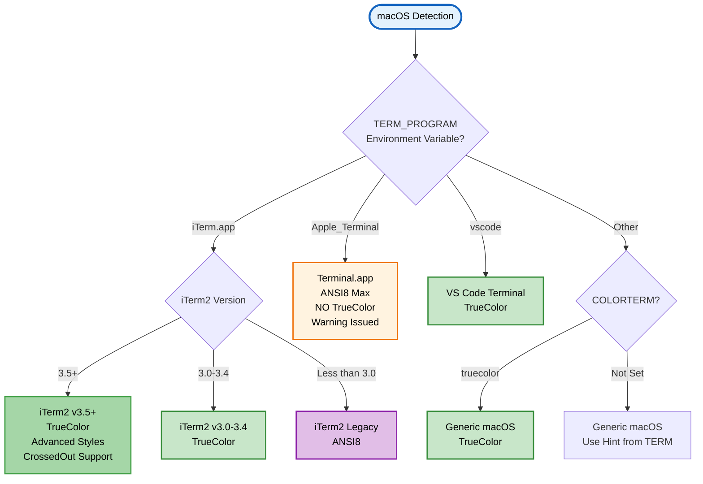
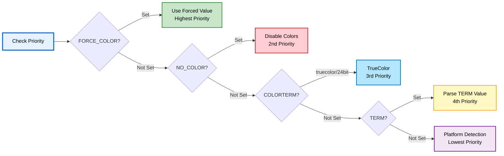
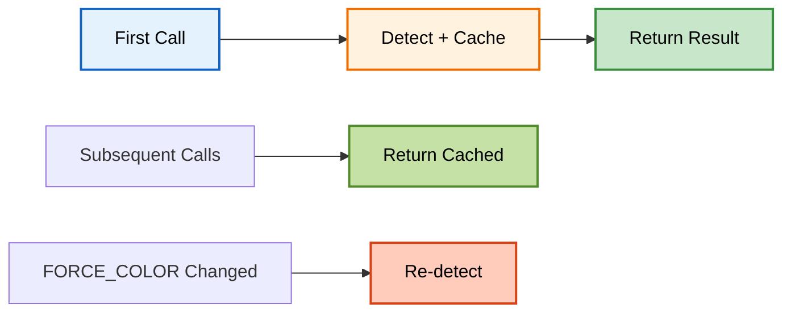

# Test-AnsiSupport

> 🔍 **Detect terminal ANSI color support level**

---

## 📑 Table of Contents

[Synopsis](#synopsis) • [Syntax](#syntax) • [Description](#description) • [Parameters](#parameters) • [Return Values](#return-values) • [Examples](#-examples) • [Detection Flow](#-detection-flow) • [Platform Notes](#-platform-specific-notes) • [Related](#-related-commands)

---

## Synopsis

Tests and returns the ANSI color support level of the current terminal.

## Syntax

```powershell
Test-AnsiSupport
    [-Silent]
    [<CommonParameters>]
```

## Description

`Test-AnsiSupport` detects the color capabilities of the current terminal environment. It checks for TrueColor (24-bit), ANSI 256-color (8-bit), ANSI 16-color (4-bit), or no ANSI support. The function is cross-platform and automatically enables Virtual Terminal Processing on Windows when possible.

### ✨ Key Features

- **🎨 Automatic Detection** - Identifies terminal color capabilities
- **🌍 Cross-Platform** - Windows, Linux, macOS support
- **⚡ Cached Results** - Detection runs once per session for performance
- **🔧 Auto-Enable** - Attempts to enable VT Processing on Windows
- **📊 Detailed Info** - Returns color level and style support details
- **🤫 Silent Mode** - Suppresses warnings for clean output

---

## Parameters

<details open>
<summary><b>🎛️ Command Parameters</b></summary>

### `-Silent`
> **Type:** `Switch`
> **Default:** `$false`

Suppresses warning messages about ANSI support issues or enablement instructions.

```powershell
# Show warnings about limitations
Test-AnsiSupport

# Silent mode (no warnings)
Test-AnsiSupport -Silent
```

</details>

---

## Return Values

Returns a `PSCustomObject` with the following properties:

### ColorSupport (String)

| Value | Description | Colors Available | Typical Terminals |
|-------|-------------|-----------------|-------------------|
| `'TrueColor'` | 24-bit RGB support | 16.7 million | Windows Terminal, iTerm2, GNOME Terminal 3.28+ |
| `'ANSI8'` | 8-bit ANSI support | 256 | macOS Terminal.app, xterm-256color |
| `'ANSI4'` | 4-bit ANSI support | 16 | Basic xterm, older terminals |
| `'None'` | No ANSI support | Native PS only | PowerShell ISE, Windows <10586 |

### SupportsBoldFonts (Boolean)

| Value | Description |
|-------|-------------|
| `$true` | Terminal renders true bold fonts (heavier font weight) |
| `$false` | Terminal only brightens colors with Bold SGR (module auto-lightens colors) |

**Terminals with Bold Font Support:** PowerShell 7+/Windows Terminal, iTerm2, VTE 0.56+, Konsole, VS Code, mintty, urxvt, ConEmu

**Terminals with Color Brightening Only:** conhost (all PowerShell versions), PowerShell 5.1 (all terminals), macOS Terminal.app, xterm (default), VTE < 0.56

### Details (Hashtable)

Contains additional terminal information: PowerShell version, terminal type, style support capabilities, and warnings.

---

## 📚 Examples

<details>
<summary><b>Example 1: Basic Detection</b></summary>

```powershell
$ansiInfo = Test-AnsiSupport
Write-Host "Color Support: $($ansiInfo.ColorSupport)"
Write-Host "Bold Fonts: $($ansiInfo.SupportsBoldFonts)"
# Output:
# Color Support: TrueColor
# Bold Fonts: True
```

</details>

<details>
<summary><b>Example 2: Silent Detection with Conditional Logic</b></summary>

```powershell
$info = Test-AnsiSupport -Silent

switch ($info.ColorSupport) {
    'TrueColor' { Write-Host "Full RGB support! (16.7 million colors)" }
    'ANSI8'     { Write-Host "256 colors available" }
    'ANSI4'     { Write-Host "16 colors available" }
    'None'      { Write-Host "Using native colors only" }
}

if ($info.SupportsBoldFonts) {
    Write-Host "Terminal supports true bold fonts"
} else {
    Write-Host "Module will auto-lighten colors when using Bold"
}
```

</details>

<details>
<summary><b>Example 3: Accessing Detailed Information</b></summary>

```powershell
$ansiInfo = Test-AnsiSupport -Silent
$ansiInfo.Details.TerminalType    # 'Windows Terminal'
$ansiInfo.Details.StyleSupport.Bold     # $true
$ansiInfo.Details.StyleSupport.Italic   # $true
```

</details>

<details>
<summary><b>Example 3: Conditional Color Mode</b></summary>

```powershell
$ansi = Test-AnsiSupport -Silent
if ($ansi.ColorSupport -eq 'TrueColor') {
    Write-ColorEX "Beautiful gradient" -Color "#FF0000" -TrueColor
} else {
    Write-ColorEX "Standard colors" -Color Red
}
```

</details>

<details>
<summary><b>Example 4: Environment Information</b></summary>

```powershell
$support = Test-AnsiSupport
@{
    ColorSupport = $support
    Terminal = $env:TERM
    ColorTerm = $env:COLORTERM
    Platform = $PSVersionTable.OS
} | Format-Table
```

</details>

<details>
<summary><b>Example 5: Force Specific Color Mode</b></summary>

```powershell
# Temporarily force ANSI8 for testing
$env:FORCE_COLOR = 2
$support = Test-AnsiSupport -Silent
Write-Host "Forced to: $support"

# Reset to auto-detect
$env:FORCE_COLOR = $null
```

</details>

---

## 🔄 Detection Flow

<details open>
<summary><b>Complete Detection Logic Diagram</b></summary>

### Phase 1: Initial Environment Variable Checks



### Phase 2: Windows Platform Detection



### Phase 3: Unix/Linux Platform Detection



### Phase 4: macOS Platform Detection



</details>

<details>
<summary><b>Environment Variables Priority</b></summary>



</details>

---

## 🔧 Detection Methods

<details>
<summary><b>Windows Detection Process</b></summary>

### Detection Steps
1. **Windows Terminal** - Checks `WT_SESSION` environment variable
2. **ConEmu/Cmder** - Checks `ConEmuANSI` environment variable
3. **VS Code** - Checks `TERM_PROGRAM=vscode`
4. **Git Bash (mintty)** - Checks `TERM` contains mintty
5. **PowerShell ISE** - Checks `$Host.Name` for ISE
6. **Virtual Terminal Processing** - P/Invoke to kernel32.dll
7. **Windows Build** - Checks OS version for capability level

### Virtual Terminal Processing

The function uses P/Invoke to check and enable VT Processing:

```powershell
# C# P/Invoke definitions
[DllImport("kernel32.dll")]
public static extern bool GetConsoleMode(IntPtr hConsoleHandle, out uint lpMode);

[DllImport("kernel32.dll")]
public static extern bool SetConsoleMode(IntPtr hConsoleHandle, uint dwMode);
```

### Build Requirements
- **Build 10586+**: ANSI 256-color support
- **Build 14931+**: TrueColor support

</details>

<details>
<summary><b>Unix/Linux Detection Process</b></summary>

### Detection Steps
1. **VTE Version** - `VTE_VERSION` for GNOME Terminal and derivatives
2. **Konsole** - Checks `KONSOLE_VERSION` or TERM contains konsole
3. **xterm** - Examines TERM for xterm-256color or xterm
4. **rxvt** - Detects rxvt-unicode vs basic rxvt
5. **Generic** - Falls back to TERM and COLORTERM analysis

### VTE-Based Terminals
- **VTE 0.76+** (GNOME 3.52+, Ubuntu 24.04+): All styles including DoubleUnderline
- **VTE 0.52+** (GNOME 3.28+, Ubuntu 18.04+): TrueColor + most styles

</details>

<details>
<summary><b>macOS Detection Process</b></summary>

### Detection Steps
1. **iTerm2** - Checks `TERM_PROGRAM=iTerm.app`
2. **Terminal.app** - Checks `TERM_PROGRAM=Apple_Terminal`
3. **VS Code** - Checks `TERM_PROGRAM=vscode`
4. **Generic** - Falls back to TERM and COLORTERM

### Known Limitations
- **Terminal.app**: Maximum ANSI 256 colors (no TrueColor)
- **iTerm2 v3.0+**: Full TrueColor support
- **iTerm2 v3.5+**: Advanced styles (CrossedOut, etc.)

</details>

---

## 🌍 Platform-Specific Notes

<details>
<summary><b>Windows Platforms</b></summary>

| Terminal | Color Support | Build Requirement | Auto-Enable | Notes |
|----------|--------------|-------------------|-------------|-------|
| **Windows Terminal** | TrueColor | Any | ✅ | Best Windows experience |
| **PowerShell 7+ Console** | TrueColor | 14931+ | ✅ | Native support |
| **PowerShell 5.1 Console** | ANSI8 | 10586+ | ✅ | Requires VT enable |
| **ConEmu/Cmder** | TrueColor* | Any | ✅ | Limited (bottom buffer only) |
| **Git Bash (mintty)** | TrueColor | Any | ✅ | Full support |
| **VS Code Terminal** | TrueColor | Any | ✅ | xterm emulation |
| **PowerShell ISE** | None | N/A | ❌ | No ANSI support ever |

> [!WARNING]
> **PowerShell ISE** does not and will never support ANSI escape sequences. Use Windows Terminal or PowerShell 7+ for color support.

</details>

<details>
<summary><b>macOS Platforms</b></summary>

| Terminal | Color Support | Version Requirement | Notes |
|----------|--------------|---------------------|-------|
| **iTerm2** | TrueColor | v3.0+ | v3.5+ for advanced styles |
| **Terminal.app** | ANSI8 | Any | Max 256 colors, no TrueColor |
| **VS Code** | TrueColor | Any | Full xterm emulation |
| **Alacritty** | TrueColor | Any | Modern GPU-accelerated |

> [!TIP]
> For best macOS experience, use iTerm2 v3.5+ or VS Code integrated terminal.

</details>

<details>
<summary><b>Linux Platforms</b></summary>

| Terminal | Color Support | Notes |
|----------|--------------|-------|
| **GNOME Terminal 3.52+** | TrueColor | All styles supported |
| **GNOME Terminal 3.28+** | TrueColor | Most styles (no DoubleUnderline) |
| **Konsole** | TrueColor | Full support |
| **xterm-256color** | ANSI8 | 256 colors |
| **rxvt-unicode** | ANSI8 | urxvt with 256 colors |
| **basic xterm/rxvt** | ANSI4 | 16 colors only |

</details>

---

## ⚙️ Environment Variables

<details>
<summary><b>Environment Variable Reference</b></summary>

### Override Variables

| Variable | Purpose | Values | Priority |
|----------|---------|--------|----------|
| `FORCE_COLOR` | Override detection | 0=None, 1=ANSI4, 2=ANSI8, 3=TrueColor | Highest |
| `NO_COLOR` | Disable colors | Any value disables | 2nd |

### Detection Variables

| Variable | Purpose | Example Values | Priority |
|----------|---------|---------------|----------|
| `COLORTERM` | Color capability | truecolor, 24bit | 3rd |
| `TERM` | Terminal type | xterm-256color, xterm | 4th |
| `TERM_PROGRAM` | Program name | iTerm.app, vscode, Apple_Terminal | 5th |
| `VTE_VERSION` | VTE library version | 5200, 7600 | Terminal-specific |
| `WT_SESSION` | Windows Terminal session ID | GUID | Windows |
| `ConEmuANSI` | ConEmu ANSI support | ON | Windows |
| `KONSOLE_VERSION` | Konsole version | Version string | Linux |

### Usage Examples

```powershell
# Force TrueColor for testing
$env:FORCE_COLOR = 3
Test-AnsiSupport -Silent  # Returns 'TrueColor'

# Disable all colors
$env:NO_COLOR = 1
Test-AnsiSupport -Silent  # Returns 'None'

# Reset to auto-detect
$env:FORCE_COLOR = $null
$env:NO_COLOR = $null
```

</details>

---

## 🔒 Permanent Enablement

<details>
<summary><b>Windows Virtual Terminal Processing</b></summary>

If the function detects that ANSI could be enabled permanently on Windows:

```powershell
# Run in Administrator PowerShell to enable permanently
Set-ItemProperty HKCU:\Console VirtualTerminalLevel -Type DWORD 1

# Verify the setting
Get-ItemProperty HKCU:\Console VirtualTerminalLevel

# Restart PowerShell and test
Test-AnsiSupport
```

> [!NOTE]
> This setting only affects the Windows PowerShell console (conhost). Windows Terminal and PowerShell 7+ have VT processing enabled by default.

</details>

---

## 🚀 Integration

<details>
<summary><b>Module Integration</b></summary>

This function is automatically called by Write-ColorEX to determine the best color mode. The result is **cached** for the session to improve performance.

### Automatic Usage
```powershell
# Write-ColorEX calls Test-AnsiSupport internally
Write-ColorEX -Text "Auto-detects best mode" -Color Red
```

### Manual Usage Benefits
Manual calls are useful for:

1. **Debugging terminal issues**
   ```powershell
   Test-AnsiSupport  # See warnings and details
   ```

2. **Conditional formatting logic**
   ```powershell
   if ((Test-AnsiSupport -Silent).ColorSupport -eq 'TrueColor') {
       # Use advanced features
   }
   ```

3. **Performance optimization**
   ```powershell
   $global:ColorSupport = Test-AnsiSupport -Silent
   # Use cached value in loops
   ```

### Cache Behavior



> [!IMPORTANT]
> **Cache Bypass**: Setting `FORCE_COLOR` bypasses the cache to allow dynamic color mode switching during a session.

</details>

---

## 🔗 Related Commands

- [`Write-ColorEX`](Write-ColorEX.md) - Main colored output function
- [`Convert-RGBToANSI8`](Color-Conversions.md#convert-rgbtoansi8) - RGB to 256-color conversion
- [`Convert-RGBToANSI4`](Color-Conversions.md#convert-rgbtoansi4) - RGB to 16-color conversion
- [Module Overview](../README.md) - Complete documentation
- [Color Conversions](Color-Conversions.md) - Color conversion details

---

<div align="center">

**PSWriteColorEX** v2.0.0 | MIT License | [GitHub](https://github.com/MarkusMcNugen/PSWriteColorEX)

</div>
