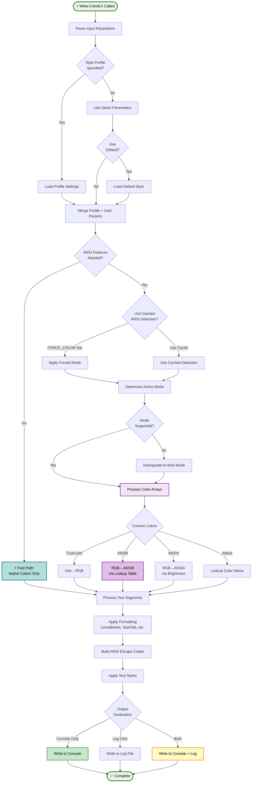
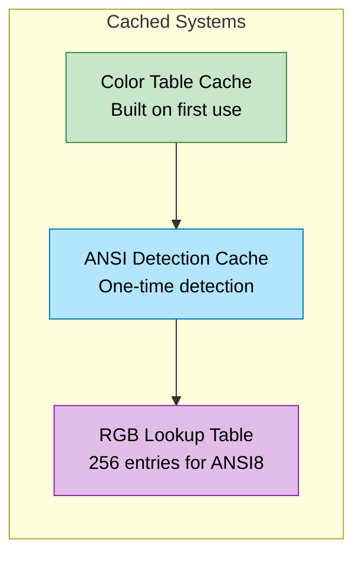

# Write-ColorEX

> 🎨 **Advanced colored console output with TrueColor support for PowerShell**

---

## 📑 Table of Contents

[Synopsis](#synopsis) • [Description](#description) • [Syntax](#syntax) • [Parameters](#parameters) • [Examples](#-examples) • [Colors](#-available-colors) • [Platform Support](#️-platform-compatibility) • [Execution Flow](#-execution-flow) • [Tips](#-tips--best-practices) • [Related](#-related-commands)

---

## Synopsis

Write-ColorEX is an advanced wrapper around Write-Host that provides extensive color options, ANSI support, and logging capabilities with automatic terminal detection and graceful color degradation.

## Description

Write-ColorEX enhances PowerShell console output with support for multiple color modes, text styling, and cross-platform compatibility. It automatically detects terminal capabilities and gracefully degrades from TrueColor → ANSI 256 → ANSI 16 → Native colors.

### ✨ Key Features

- **🌈 TrueColor (24-bit RGB)** - 16.7 million colors with hex and RGB support
- **🎯 ANSI 256 & 16 color** - Full ANSI color palette support
- **🎨 44 Color Families** - 129 color names, most with Dark/Normal/Light variants
- **💅 Text Styling** - Bold, italic, underline, and more effects
- **📝 Logging** - File logging with timestamps and retry logic
- **🌍 Cross-platform** - Windows, Linux, macOS compatibility
- **⚡ Auto-detection** - Automatic color mode selection
- **🔄 Graceful Degradation** - Falls back to best available color mode
- **⚡ Performance Optimized** - Cached color tables, optimized string operations, fast path for native colors

---

## Syntax

```powershell
Write-ColorEX
    [-Text] <String[]>
    [-Color <Array>]
    [-BackGroundColor <Array>]
    [-Gradient <Object[]>]
    [-TrueColor]
    [-ANSI8]
    [-ANSI4]
    [-Style <Object>]
    [-StyleProfile <PSColorStyle>]
    [-Default]
    [-Bold] [-Italic] [-Underline] [-Blink]
    [-Faint] [-CrossedOut] [-DoubleUnderline] [-Overline]
    [-StartTab <Int32>]
    [-StartSpaces <Int32>]
    [-LinesBefore <Int32>]
    [-LinesAfter <Int32>]
    [-HorizontalCenter]
    [-AutoPad <Int32>]
    [-PadLeft]
    [-PadChar <Char>]
    [-ShowTime]
    [-NoNewLine]
    [-BlankLine]
    [-LogFile <String>]
    [-LogPath <String>]
    [-LogLevel <String>]
    [-LogTime]
    [-DateTimeFormat <String>]
    [-LogRetry <Int32>]
    [-Encoding <String>]
    [-NoConsoleOutput]
    [-Debugging]
    [-Silent]
    [<CommonParameters>]
```

---

## Parameters

<details open>
<summary><b>🎯 Core Parameters</b></summary>

### `-Text`
> **Type:** `String[]`
> **Position:** 0
> **Aliases:** `T`

Text to display. Accepts an array of strings for multi-colored output.

```powershell
Write-ColorEX -Text "Hello", " World"
Write-ColorEX -Text @("Part1", "Part2", "Part3")
```

### `-Color`
> **Type:** `Array`
> **Aliases:** `C`, `ForegroundColor`, `FGC`

Foreground color(s) for text. Accepts multiple formats:

| Format | Example | Description |
|--------|---------|-------------|
| **Color name** | `"Red"`, `"DarkOrange"` | 129 names in 44 color families |
| **Hex code** | `"#FF0000"`, `"#FF8000"` | Any mode; without a mode switch, the best mode the terminal has |
| **RGB array** | `@(255,0,0)` | One array for one segment needs `-TrueColor`; one array per segment, `@(@(255,0,0), @(0,0,255))`, works in any mode |
| **ANSI integer** | `196`, `38` | With `-ANSI8` or `-ANSI4` |

```powershell
# Named colors
Write-ColorEX -Text "Red text" -Color Red

# Extended color families
Write-ColorEX -Text "Orange" -Color Orange

# Hex colors (TrueColor)
Write-ColorEX -Text "Orange" -Color "#FF8000" -TrueColor

# RGB arrays (TrueColor)
Write-ColorEX -Text "Custom" -Color @(128,64,192) -TrueColor

# ANSI integers
Write-ColorEX -Text "ANSI 256" -Color 208 -ANSI8

# Multiple colors
Write-ColorEX -Text "R","G","B" -Color Red,Green,Blue
```

### `-BackGroundColor`
> **Type:** `Array`
> **Aliases:** `B`, `BGC`

Background color(s) with same format options as `-Color`.

```powershell
Write-ColorEX -Text "Highlighted" -Color White -BackGroundColor DarkBlue
Write-ColorEX -Text "RGB BG" -BackGroundColor @(64,0,128) -TrueColor
```

</details>

<details>
<summary><b>🎨 Color Mode Switches</b></summary>

| Switch | Alias | Description | Colors | Priority |
|--------|-------|-------------|--------|----------|
| `-TrueColor` | `TC` | 24-bit RGB mode | 16.7M | Highest |
| `-ANSI8` | `A8` | 8-bit ANSI mode | 256 | Medium |
| `-ANSI4` | `A4` | 4-bit ANSI mode | 16 | Lowest |

> [!NOTE]
> If no mode is specified, colors are the console's 16 colors (a color name takes its nearest console color), unless a color is a hex code or an RGB array per segment: then the line uses the best mode the terminal has (TrueColor, else the nearest 256-color, 16-color or console color), with no fallback warning. `-Gradient` picks TrueColor or ANSI8, whichever is the best the terminal has. A mode the terminal does not support falls back to the best one it has.
> If multiple modes are specified, priority is: TrueColor > ANSI8 > ANSI4

> [!TIP]
> The module maintains ANSI integer support when using `-ANSI4` or `-ANSI8` switches: `-Color` and `-BackGroundColor` take color numbers 0-255 with `-ANSI8`, and ANSI4 codes with `-ANSI4` (30-37 and 90-97 for `-Color`, 40-47 and 100-107 for `-BackGroundColor`).

</details>

<details>
<summary><b>🎭 Style Parameters</b></summary>

### Text Effects

| Parameter | Description | Terminal Support |
|-----------|-------------|------------------|
| `-Bold` | Makes text bold¹ | Universal |
| `-Italic` | Applies italic styling | Most terminals |
| `-Underline` | Underlines the text | Universal |
| `-Blink` | Makes text blink | Limited |
| `-Faint` | Decreases text intensity | Most terminals |
| `-CrossedOut` | Strikes through text² | Most terminals |
| `-DoubleUnderline` | Double underline | Modern terminals |
| `-Overline` | Line above text | Modern terminals |

¹ **Bold with Auto-Lightening:** Module automatically detects if your terminal supports true bold fonts (PS7+ in Windows Terminal or the console, iTerm2, modern Linux terminals) or only brightens colors (PS5.1 in conhost or Windows Terminal, macOS Terminal.app, xterm). In terminals that only brighten colors, the module automatically lightens colors for you. A color name takes the next lighter name in its family in every mode (DarkRed → Red → LightRed, with `Get-LighterColorName`); colors with no lighter name are lightened by mode:
- **TrueColor:** Multiplies RGB by 1.4 (40% lighter), each channel at least 102, with `Get-LighterRGBColor`
- **ANSI8:** Algorithmically lightens ANSI8 codes using `Get-LighterANSI8Color` (supports direct codes, named colors with no lighter name, and super-lightening beyond Light\* families)
- **ANSI4:** Handled by terminal SGR (automatic brightening)

**Super-Lightening:** In ANSI8/ANSI24 modes, colors like `LightRed` can be lightened beyond their predefined family using algorithmic lightening.
² Alias: `Strikethrough`

### `-Style`
> **Type:** `Object`
> **Aliases:** `S`

Apply multiple styles per text segment:

```powershell
# Single style per segment
Write-ColorEX -Text "Bold","Italic" -Style Bold,Italic

# Multiple styles per segment
Write-ColorEX -Text "Fancy","Plain" -Style @("Bold","Underline"),@()

# Mixed notation
Write-ColorEX -Text "A","B","C" -Style Bold,@("Italic","Underline"),"Faint"
```

</details>

<details>
<summary><b>📋 Profile Parameters</b></summary>

### `-StyleProfile`
> **Type:** `PSColorStyle`

Use a predefined style profile:

```powershell
# Built-in profiles
$errorStyle = [PSColorStyle]::GetProfile("Error")
Write-ColorEX -Text "Error!" -StyleProfile $errorStyle

# Available profiles: Default, Error, Warning, Info, Success, Critical, Debug
```

### `-Default`
> **Type:** `Switch`

Use the default style set by `Set-ColorDefault`:

```powershell
Set-ColorDefault -ForegroundColor Cyan -Bold
Write-ColorEX -Text "Uses default style" -Default
```

</details>

<details>
<summary><b>📐 Formatting Parameters</b></summary>

| Parameter | Type | Default | Description |
|-----------|------|---------|-------------|
| `-StartTab` | `Int32` | 0 | Tabs before text (Alias: `Indent`) |
| `-StartSpaces` | `Int32` | 0 | Spaces before text |
| `-LinesBefore` | `Int32` | 0 | Empty lines before |
| `-LinesAfter` | `Int32` | 0 | Empty lines after |
| `-HorizontalCenter` | `Switch` | | Center text (Alias: `Center`) |
| `-AutoPad` | `Int32` | 0 | 🎯 **Unicode-aware text padding** (0=disabled) |
| `-PadLeft` | `Switch` | | Pad left (right-align)² |
| `-PadChar` | `Char` | `' '` | Padding character³ |
| `-ShowTime` | `Switch` | | Prepend timestamp |
| `-NoNewLine` | `Switch` | | No line break after |
| `-BlankLine` | `Switch` | | Full-width colored line¹ |

¹ Aliases: `BL`, `Empty`, `Blank`
² Alias: `RightAlign`
³ Aliases: `PaddingChar`, `FillChar`

> [!TIP]
> **AutoPad** - Fixes alignment issues with emoji, CJK characters, and box-drawing!
> - Uses `Measure-DisplayWidth` for accurate Unicode character-width calculation
> - Correctly handles wide characters (✅, 世, 😀 = 2 cells) and zero-width characters; `●` and box drawing are 1 cell
> - Useful for status dashboards, tables, and any text that needs to line up
>
> ```powershell
> # Problem: .PadRight() misaligns with Unicode
> "Server ✅".PadRight(21)  # ❌ Misaligned! (✅ counted as 1 but displays as 2)
>
> # Solution: AutoPad handles Unicode correctly
> Write-ColorEX "Server ✅" -AutoPad 21  # ✅ Aligned: 9 cells of text, 12 spaces added
> ```

> [!NOTE]
> `-LinesBefore` and `-LinesAfter` write that many blank lines, no more; `-StartTab` and `-StartSpaces` add that many tabs and spaces before the text.

</details>

<details>
<summary><b>📝 Logging Parameters</b></summary>

| Parameter | Type | Description |
|-----------|------|-------------|
| `-LogFile` | `String` | Log file path/name (Alias: `L`) |
| `-LogPath` | `String` | Directory for a `-LogFile` given as a file name alone (Alias: `LP`); default: the calling script's folder, or the current location at the prompt |
| `-LogLevel` | `String` | Log level prefix (Alias: `LL`, `LogLvl`) |
| `-LogTime` | `Switch` | Include timestamp (Alias: `LT`) |
| `-DateTimeFormat` | `String` | Timestamp format¹ |
| `-LogRetry` | `Int32` | How many times to try when the file is locked, 50 ms apart, then a warning (default: 2) |
| `-Encoding` | `String` | File encoding (default: `utf8`, UTF-8 without a byte order mark)² |

¹ Default: `yyyy-MM-dd HH:mm:ss`, Aliases: `DateFormat`, `TimeFormat`, `Timestamp`, `TS`
² `utf8`, `utf8NoBOM` and `default` write UTF-8 without a byte order mark (BOM); `utf8BOM` UTF-8 with a BOM; `unicode`, `string` and `unknown` UTF-16 little-endian with a BOM; `bigendianunicode` UTF-16 big-endian with a BOM; `utf32` and `bigendianutf32` UTF-32 with a BOM; `ascii`; `utf7`; `ansi` and `oem` the system's code pages on Windows and UTF-8 elsewhere. Each name gives the same bytes on Windows PowerShell 5.1 and PowerShell 7, and a BOM is written only to a new or empty file.

</details>

<details>
<summary><b>🎛️ Output Control</b></summary>

### `-NoConsoleOutput`
> **Aliases:** `HideConsole`, `NoConsole`, `LogOnly`, `LO`

Only write to log file, suppress console output.

### `-Debugging`
Enable verbose debug output for troubleshooting color mode selection and processing.

</details>

---

## 📚 Examples

<details>
<summary><b>Basic Usage</b></summary>

```powershell
# Simple colored text
Write-ColorEX -Text "Hello World" -Color Blue

# Multi-colored text
Write-ColorEX -Text "Error: ", "File not found" -Color Red, White

# With background
Write-ColorEX -Text "WARNING" -Color Yellow -BackGroundColor DarkRed -Bold
```

</details>

<details>
<summary><b>TrueColor Examples</b></summary>

```powershell
# Hex color codes
Write-ColorEX -Text "Orange" -Color "#FF8000" -TrueColor

# RGB arrays
Write-ColorEX -Text "Purple" -Color @(128,0,255) -TrueColor

# Gradient effect
$colors = @("#FF0000","#FF7F00","#FFFF00","#00FF00","#0000FF","#4B0082","#9400D3")
$text = "R","a","i","n","b","o","w"
Write-ColorEX -Text $text -Color $colors -TrueColor -Bold
```

</details>

<details>
<summary><b>Status Messages</b></summary>

```powershell
# Success indicator
Write-ColorEX -Text "[", "✓", "] ", "Operation completed" `
              -Color White, Green, White, Gray

# Error with logging
Write-ColorEX -Text "[ERROR] ", "Database connection failed" `
              -Color White, Red `
              -BackGroundColor DarkRed, None `
              -Bold -LogFile "errors.log" -LogTime -LogLevel "ERROR"

# Warning message
Write-ColorEX -Text "⚠ ", "Low disk space" `
              -Color Yellow, DarkYellow `
              -Italic
```

</details>

<details>
<summary><b>Formatted Output</b></summary>

```powershell
# Centered header with borders
Write-ColorEX -Text ("=" * 50) -Color DarkCyan -HorizontalCenter
Write-ColorEX -Text "SYSTEM STATUS REPORT" `
              -Color Cyan -Bold `
              -HorizontalCenter `
              -LinesBefore 1 -LinesAfter 1
Write-ColorEX -Text ("=" * 50) -Color DarkCyan -HorizontalCenter

# Indented content with timestamps
Write-ColorEX -Text "CPU Usage: ", "42%" `
              -Color Gray, Green `
              -StartTab 1 -ShowTime

# Progress indicator
Write-ColorEX -Text "[","████████","        ","] 80%" `
              -Color White,Green,DarkGray,White `
              -NoNewLine
```

</details>

<details>
<summary><b>🎯 Unicode-Aware Padding (AutoPad)</b></summary>

```powershell
# Basic left-align padding (default)
Write-ColorEX "Test" -AutoPad 20 -Color Cyan -NoNewLine
Write-Host "|"
# Output: "Test                |"

# Right-align padding
Write-ColorEX "CPU: 45%" -AutoPad 20 -PadLeft -Color Yellow -NoNewLine
Write-Host "|"
# Output: "            CPU: 45%|"

# Custom padding character
Write-ColorEX "Total" -AutoPad 20 -PadChar '.' -Color White
# Output: "Total..............."

# Unicode-aware status dashboard
Write-ColorEX '║ ' -Color Cyan -NoNewLine
Write-ColorEX 'Web Server' -AutoPad 21 -Color White -NoNewLine
Write-ColorEX ' [OK] ║' -Color Green

Write-ColorEX '║ ' -Color Cyan -NoNewLine
Write-ColorEX 'Database ✅' -AutoPad 21 -Color White -NoNewLine  # ✅ = 2 cells
Write-ColorEX ' [OK] ║' -Color Green

Write-ColorEX '║ ' -Color Cyan -NoNewLine
Write-ColorEX 'Cache' -AutoPad 21 -Color White -NoNewLine
Write-ColorEX '[FAIL] ║' -Color Red

# Output:
# ║ Web Server            [OK] ║
# ║ Database ✅           [OK] ║  ← Aligned: ✅ counts as 2 cells
# ║ Cache                [FAIL] ║

# File listing with mixed alignment
$files = Get-ChildItem | Select-Object -First 3
foreach ($file in $files) {
    Write-ColorEX $file.Name -AutoPad 40 -NoNewLine          # Left-align names
    Write-ColorEX $file.Length -AutoPad 12 -PadLeft -Color Cyan -NoNewLine  # Right-align sizes
    Write-ColorEX ' bytes' -Color Gray
}
```

</details>

<details>
<summary><b>Style Profiles</b></summary>

```powershell
# Using built-in profiles
Write-ColorError "Connection failed"
Write-ColorWarning "Deprecated function used"
Write-ColorSuccess "Build completed"
Write-ColorInfo "Processing 1000 records..."
Write-ColorCritical "System overheating!"
Write-ColorDebug "Variable x = 42"

# Custom profile
$brand = New-ColorStyle -Name "Brand" `
                       -ForegroundColor "#FF6B35" `
                       -BackgroundColor "#004643" `
                       -Bold -Underline
Write-ColorEX -Text "Company Message" -StyleProfile $brand
```

</details>

<details>
<summary><b>Extended Color Families</b></summary>

```powershell
# Using extended color names
Write-ColorEX -Text "Orange" -Color Orange
Write-ColorEX -Text "Purple" -Color Purple
Write-ColorEX -Text "Teal" -Color Teal
Write-ColorEX -Text "Coral" -Color Coral

# Dark/Light variants
Write-ColorEX -Text "Dark ","Normal ","Light" `
              -Color DarkOrange,Orange,LightOrange

# Some of the 44 color families
$families = @("Red","Orange","Yellow","Green","Teal","Blue","Purple","Pink",
              "Brown","Gray","Gold","Coral","Olive","Mint","Salmon","Ruby",
              "Jade","Amber","Steel","Crimson","Emerald","Sapphire")

$families | ForEach-Object {
    Write-ColorEX -Text $_ -Color $_
}
```

</details>

---

## 🎨 Available Colors

The module includes 44 color families with 129 color names, most with Dark, Normal, and Light variants:

<details>
<summary><b>Click to expand full color list</b></summary>

### Basic Colors
- **Neutral**: Black, LightBlack, Gray, DarkGray, LightGray, White
- **Red**: DarkRed, Red, LightRed
- **Green**: DarkGreen, Green, LightGreen
- **Blue**: DarkBlue, Blue, LightBlue
- **Yellow**: DarkYellow, Yellow, LightYellow
- **Cyan**: DarkCyan, Cyan, LightCyan
- **Magenta**: DarkMagenta, Magenta, LightMagenta

### Extended Colors
- **Orange**: DarkOrange, Orange, LightOrange
- **Purple**: DarkPurple, Purple, LightPurple
- **Pink**: DarkPink, Pink, LightPink
- **Brown**: DarkBrown, Brown, LightBrown
- **Teal**: DarkTeal, Teal, LightTeal
- **Violet**: DarkViolet, Violet, LightViolet
- **Lime**: DarkLime, Lime, LightLime
- **Slate**: DarkSlate, Slate, LightSlate
- **Gold**: DarkGold, Gold, LightGold
- **Sky**: DarkSky, Sky, LightSky
- **Coral**: DarkCoral, Coral, LightCoral
- **Olive**: DarkOlive, Olive, LightOlive
- **Lavender**: DarkLavender, Lavender, LightLavender
- **Mint**: DarkMint, Mint, LightMint
- **Salmon**: DarkSalmon, Salmon, LightSalmon
- **Indigo**: DarkIndigo, Indigo, LightIndigo
- **Turquoise**: DarkTurquoise, Turquoise, LightTurquoise
- **Ruby**: DarkRuby, Ruby, LightRuby
- **Jade**: DarkJade, Jade, LightJade
- **Amber**: DarkAmber, Amber, LightAmber
- **Steel**: DarkSteel, Steel, LightSteel
- **Crimson**: DarkCrimson, Crimson, LightCrimson
- **Emerald**: DarkEmerald, Emerald, LightEmerald
- **Sapphire**: DarkSapphire, Sapphire, LightSapphire
- **Wine**: DarkWine, Wine, LightWine
- **Peach**: DarkPeach, Peach, LightPeach
- **Navy**: DarkNavy, Navy, LightNavy
- **Forest**: DarkForest, Forest, LightForest
- **Rose**: DarkRose, Rose, LightRose
- **Plum**: DarkPlum, Plum, LightPlum
- **Tan**: DarkTan, Tan, LightTan
- **Maroon**: DarkMaroon, Maroon, LightMaroon
- **Aqua**: DarkAqua, Aqua, LightAqua
- **Chartreuse**: DarkChartreuse, Chartreuse, LightChartreuse
- **Brick**: DarkBrick, Brick, LightBrick

> [!TIP]
> **Performance**: Write-ColorEX builds the color table on first use and keeps it for the session

</details>

---

## 🔍 Color Support Detection

The module automatically detects terminal capabilities:

```powershell
# Check color support level
$support = (Test-AnsiSupport).ColorSupport
# Returns: 'None', 'ANSI4', 'ANSI8', or 'TrueColor'

# Force specific color mode via environment
$env:FORCE_COLOR = 3  # Force TrueColor
$env:FORCE_COLOR = 2  # Force ANSI8
$env:FORCE_COLOR = 1  # Force ANSI4
$env:FORCE_COLOR = 0  # Force None
$env:FORCE_COLOR = $null  # Auto-detect (default)

# Disable all colors and styles (TERM=dumb does the same)
$env:NO_COLOR = 1
```

---

## 🖥️ Platform Compatibility

| Platform | Terminal | Max Color Support | Auto-Enable |
|----------|----------|-------------------|-------------|
| **Windows 11/10** | Windows Terminal | TrueColor | ✅ |
| | PowerShell 7+ | TrueColor | ✅ |
| | PowerShell 5.1 | TrueColor | ✅* |
| | ConEmu | TrueColor | ✅ |
| | ISE | Native 16 | ❌ |
| **Linux** | Most terminals | TrueColor | ✅ |
| | TTY | ANSI 16 | ✅ |
| **macOS** | iTerm2 | TrueColor | ✅ |
| | Terminal.app | ANSI 256 | ✅ |
| | VS Code Terminal | TrueColor | ✅ |

*Requires Windows 10 build 10586+ for ANSI, build 14931+ for TrueColor

---

## 🔄 Execution Flow

<details>
<summary><b>Parameter Processing & Execution Diagram</b></summary>


```mermaid
graph TD
    Start([⚡ Write-ColorEX Called]) --> ParseParams[Parse Input Parameters]
    ParseParams --> CheckProfile{Style Profile<br/>Specified?}

    CheckProfile -->|Yes| LoadProfile[Load Profile Settings]
    CheckProfile -->|No| DirectParams[Use Direct Parameters]

    LoadProfile --> MergeParams[Merge Profile + User Params]
    DirectParams --> CheckDefault{Use<br/>Default?}

    CheckDefault -->|Yes| LoadDefault[Load Default Style]
    CheckDefault -->|No| MergeParams
    LoadDefault --> MergeParams

    MergeParams --> CheckANSI{ANSI Features<br/>Needed?}

    CheckANSI -->|No| FastPath[⚡ Fast Path:<br/>Native Colors Only]
    CheckANSI -->|Yes| CheckCache{Use Cached<br/>ANSI Detection?}

    CheckCache -->|FORCE_COLOR Set| UseForced[Apply Forced Mode]
    CheckCache -->|Use Cache| UseCached[Use Cached Detection]

    UseForced --> SelectMode[Determine Active Mode]
    UseCached --> SelectMode
    FastPath --> ProcessText

    SelectMode --> ValidateMode{Mode<br/>Supported?}
    ValidateMode -->|Yes| ProcessColors[Process Color Arrays]
    ValidateMode -->|No| Downgrade[Downgrade to Best Mode]

    Downgrade --> ProcessColors

    ProcessColors --> ConvertColors{Convert Colors}

    ConvertColors -->|TrueColor| ConvertTC[Hex→RGB]
    ConvertColors -->|ANSI8| ConvertA8[RGB→ANSI8<br/>via Lookup Table]
    ConvertColors -->|ANSI4| ConvertA4[RGB→ANSI4<br/>via Brightness]
    ConvertColors -->|Native| LookupNative[Lookup Color Name]

    ConvertTC --> ProcessText[Process Text Segments]
    ConvertA8 --> ProcessText
    ConvertA4 --> ProcessText
    LookupNative --> ProcessText

    ProcessText --> ApplyFormat[Apply Formatting<br/>LinesBefore, StartTab, etc.]
    ApplyFormat --> BuildANSI[Build ANSI Escape Codes]
    BuildANSI --> ApplyStyles[Apply Text Styles]

    ApplyStyles --> OutputChoice{Output<br/>Destination}

    OutputChoice -->|Console Only| WriteConsole[Write to Console]
    OutputChoice -->|Log Only| WriteLog[Write to Log File]
    OutputChoice -->|Both| WriteBoth[Write to Console + Log]

    WriteConsole --> Complete([✅ Complete])
    WriteLog --> Complete
    WriteBoth --> Complete

    style Start fill:#e8f5e9,stroke:#2e7d32,stroke-width:3px,color:#000
    style Complete fill:#e8f5e9,stroke:#2e7d32,stroke-width:3px,color:#000
    style FastPath fill:#b2dfdb,stroke:#00695c,stroke-width:2px,color:#000
    style ProcessColors fill:#f3e5f5,stroke:#7b1fa2,stroke-width:2px,color:#000
    style ConvertA8 fill:#e1bee7,stroke:#8e24aa,stroke-width:2px,color:#000
    style WriteConsole fill:#c8e6c9,stroke:#388e3c,stroke-width:2px,color:#000
    style WriteBoth fill:#fff9c4,stroke:#f57f17,stroke-width:2px,color:#000
```

</details>

<details>
<summary><b>Performance Optimizations</b></summary>

### Cache Systems


```mermaid
graph LR
    subgraph "Cached Systems"
        A[Color Table Cache<br/>Built on first use] --> B[ANSI Detection Cache<br/>One-time detection]
        B --> C[RGB Lookup Table<br/>256 entries for ANSI8]
    end

    style A fill:#c8e6c9,stroke:#388e3c,color:#000
    style B fill:#b3e5fc,stroke:#0277bd,color:#000
    style C fill:#e1bee7,stroke:#8e24aa,color:#000
```

Style profiles are not cached: `ToWriteColorParams()` reads a profile's properties on each call, so a change to a profile shows on its next use.

### String Operations

- **LinesBefore/After**: one `Write-Host ''` call per blank line
- **StartTab/Spaces**: String multiplication (`" " * count`)
- **ANSI Building**: a `StringBuilder` builds each line, which goes to the host in one `Write-Host` call where escape codes reach the screen
- **Array Building**: `List<object>.Add()` instead of `+=`

### Hashtable Lookups

- **Direct access** instead of `ContainsKey` + lookup
- Applied to: Color name lookups, profile retrieval

</details>

---

## 💡 Tips & Best Practices

> [!TIP]
> **Color Cycling**: When using multiple colors with fewer colors than text segments, colors will automatically cycle.
> ```powershell
> Write-ColorEX -Text "A","B","C","D","E" -Color Red,Blue  # R,B,R,B,R
> ```

> [!TIP]
> **Style Profiles**: A style profile reads its properties on each call, so a change to a profile (including a built-in one used by the `Write-Color*` helpers) shows on its next use.

> [!NOTE]
> **Transcripts**: Each line goes to the host in as few `Write-Host` calls as its colors allow, with the line end on the last call, and `Start-Transcript` records each call as one line. On PowerShell 7.2 and later, where the host shows escape codes, a line is one call, so it is one transcript line (PowerShell removes the escape codes from the transcript). On Windows PowerShell 5.1, and on a PowerShell 7 host without virtual terminal support, a line of several console colors is one call per color, so a transcript shows each color on its own line.

> [!IMPORTANT]
> **Automatic Fallback**: If a requested color mode isn't supported, the module automatically falls back to the best available mode without errors.

> [!WARNING]
> **ISE Limitation**: PowerShell ISE doesn't support ANSI codes. The module will automatically use native PowerShell colors only.

> [!CAUTION]
> **Multiple Switches**: Avoid using multiple color mode switches simultaneously. If specified, TrueColor takes precedence, then ANSI8, then ANSI4.

---

## 🔗 Related Commands

### Helper Functions
- [`Write-ColorError`](Write-ColorError.md) - Styled error messages
- [`Write-ColorWarning`](Write-ColorWarning.md) - Styled warning messages
- [`Write-ColorSuccess`](Write-ColorSuccess.md) - Styled success messages
- [`Write-ColorInfo`](Write-ColorInfo.md) - Styled info messages
- [`Write-ColorCritical`](Write-ColorCritical.md) - Styled critical messages
- [`Write-ColorDebug`](Write-ColorDebug.md) - Styled debug messages

### Configuration
- [`Set-ColorDefault`](Set-ColorDefault.md) - Configure default style
- [`New-ColorStyle`](New-ColorStyle.md) - Create custom style profiles
- [`Get-ColorProfiles`](Get-ColorProfiles.md) - Retrieve style profiles

### Utilities
- [`Test-AnsiSupport`](Test-AnsiSupport.md) - Check terminal color support
- [`Convert-HexToRGB`](Color-Conversions.md#convert-hextorgb) - Convert hex to RGB
- [`Get-ColorTableWithRGB`](Color-Conversions.md#get-colortablewithrgb) - Get color mappings

---

## 📖 See Also

- [PSColorStyle Class](PSColorStyle-Class.md) - Style profile system
- [Color Conversion Functions](Color-Conversions.md) - Color format utilities
- [Module Overview](../README.md) - Complete module documentation
- [PowerShell Gallery](https://www.powershellgallery.com/packages/PSWriteColorEX) - Module download

---

<div align="center">

**PSWriteColorEX** v1.1.0 | MIT License | [GitHub](https://github.com/MarkusMcNugen/PSWriteColorEX)

</div>
