# Write-ColorEX

> 🎨 **Advanced colored console output with TrueColor support for PowerShell**

---

## 📑 Table of Contents

[Synopsis](#synopsis) • [Description](#description) • [Syntax](#syntax) • [Parameters](#parameters) • [Examples](#-examples) • [Colors](#-available-colors) • [Platform Support](#️-platform-compatibility) • [Execution Flow](#-execution-flow) • [Tips](#-tips--best-practices) • [Related](#-related-commands)

---

## Synopsis

Write-ColorEX is an advanced wrapper around Write-Host that provides extensive color options, ANSI support, and logging capabilities with automatic terminal detection and graceful color degradation.

## Description

Write-ColorEX enhances PowerShell console output with support for multiple color modes, text styling, and cross-platform compatibility. It automatically detects terminal capabilities and gracefully degrades from TrueColor → ANSI 256 → ANSI 16 → Native colors.

### ✨ Key Features

- **🌈 TrueColor (24-bit RGB)** - 16.7 million colors with hex and RGB support
- **🎯 ANSI 256 & 16 color** - Full ANSI color palette support
- **🎨 70+ Color Families** - Extended color names with Dark/Normal/Light variants
- **💅 Text Styling** - Bold, italic, underline, and more effects
- **📝 Smart Logging** - File logging with timestamps and retry logic
- **🌍 Cross-platform** - Windows, Linux, macOS compatibility
- **⚡ Auto-detection** - Automatic color mode selection
- **🔄 Graceful Degradation** - Falls back to best available color mode
- **⚡ Performance Optimized** - Cached color tables, optimized string operations, fast path for native colors

---

## Syntax

```powershell
Write-ColorEX
    [-Text] <String[]>
    [-Color <Array>]
    [-BackGroundColor <Array>]
    [-TrueColor]
    [-ANSI8]
    [-ANSI4]
    [-Style <Object>]
    [-StyleProfile <PSColorStyle>]
    [-Default]
    [-Bold] [-Italic] [-Underline] [-Blink]
    [-Faint] [-CrossedOut] [-DoubleUnderline] [-Overline]
    [-StartTab <Int32>]
    [-StartSpaces <Int32>]
    [-LinesBefore <Int32>]
    [-LinesAfter <Int32>]
    [-HorizontalCenter]
    [-AutoPad <Int32>]
    [-PadLeft]
    [-PadChar <Char>]
    [-ShowTime]
    [-NoNewLine]
    [-BlankLine]
    [-LogFile <String>]
    [-LogPath <String>]
    [-LogLevel <String>]
    [-LogTime]
    [-DateTimeFormat <String>]
    [-LogRetry <Int32>]
    [-Encoding <String>]
    [-NoConsoleOutput]
    [-Debugging]
    [<CommonParameters>]
```

---

## Parameters

<details open>
<summary><b>🎯 Core Parameters</b></summary>

### `-Text`
> **Type:** `String[]`
> **Position:** 0
> **Aliases:** `T`

Text to display. Accepts an array of strings for multi-colored output.

```powershell
Write-ColorEX -Text "Hello", " World"
Write-ColorEX -Text @("Part1", "Part2", "Part3")
```

### `-Color`
> **Type:** `Array`
> **Aliases:** `C`, `ForegroundColor`, `FGC`

Foreground color(s) for text. Accepts multiple formats:

| Format | Example | Description |
|--------|---------|-------------|
| **Color name** | `"Red"`, `"DarkOrange"` | 70+ color families |
| **Hex code** | `"#FF0000"`, `"#FF8000"` | Requires `-TrueColor` |
| **RGB array** | `@(255,0,0)` | Requires `-TrueColor` |
| **ANSI integer** | `196`, `38` | With `-ANSI8` or `-ANSI4` |

```powershell
# Named colors
Write-ColorEX -Text "Red text" -Color Red

# Extended color families
Write-ColorEX -Text "Orange" -Color Orange

# Hex colors (TrueColor)
Write-ColorEX -Text "Orange" -Color "#FF8000" -TrueColor

# RGB arrays (TrueColor)
Write-ColorEX -Text "Custom" -Color @(128,64,192) -TrueColor

# ANSI integers
Write-ColorEX -Text "ANSI 256" -Color 208 -ANSI8

# Multiple colors
Write-ColorEX -Text "R","G","B" -Color Red,Green,Blue
```

### `-BackGroundColor`
> **Type:** `Array`
> **Aliases:** `B`, `BGC`

Background color(s) with same format options as `-Color`.

```powershell
Write-ColorEX -Text "Highlighted" -Color White -BackGroundColor DarkBlue
Write-ColorEX -Text "RGB BG" -BackGroundColor @(64,0,128) -TrueColor
```

</details>

<details>
<summary><b>🎨 Color Mode Switches</b></summary>

| Switch | Alias | Description | Colors | Priority |
|--------|-------|-------------|--------|----------|
| `-TrueColor` | `TC` | 24-bit RGB mode | 16.7M | Highest |
| `-ANSI8` | `A8` | 8-bit ANSI mode | 256 | Medium |
| `-ANSI4` | `A4` | 4-bit ANSI mode | 16 | Lowest |

> [!NOTE]
> If no mode is specified, the module auto-detects the best available mode.
> If multiple modes are specified, priority is: TrueColor > ANSI8 > ANSI4

> [!TIP]
> The module maintains ANSI integer support when using `-ANSI4` or `-ANSI8` switches, allowing direct color codes like `38` for foreground or `48` for background.

</details>

<details>
<summary><b>🎭 Style Parameters</b></summary>

### Text Effects

| Parameter | Description | Terminal Support |
|-----------|-------------|------------------|
| `-Bold` | Makes text bold¹ | Universal |
| `-Italic` | Applies italic styling | Most terminals |
| `-Underline` | Underlines the text | Universal |
| `-Blink` | Makes text blink | Limited |
| `-Faint` | Decreases text intensity | Most terminals |
| `-CrossedOut` | Strikes through text² | Most terminals |
| `-DoubleUnderline` | Double underline | Modern terminals |
| `-Overline` | Line above text | Modern terminals |

¹ **Bold with Auto-Lightening:** Module automatically detects if your terminal supports true bold fonts (PS7+/Windows Terminal, iTerm2, modern Linux terminals) or only brightens colors (PS5.1, conhost, macOS Terminal.app). In terminals that only brighten colors, the module automatically lightens colors for you:
- **TrueColor:** Multiplies RGB by 1.4 (40% lighter)
- **ANSI8:** Algorithmically lightens ANSI8 codes using `Lighten-ANSI8Color` (supports direct codes, named colors, and super-lightening beyond Light\* families)
- **ANSI4:** Handled by terminal SGR (automatic brightening)

**Super-Lightening:** In ANSI8/ANSI24 modes, colors like `LightRed` can be lightened beyond their predefined family using algorithmic lightening, enabling unlimited brightness levels.
² Alias: `Strikethrough`

### `-Style`
> **Type:** `Object`
> **Aliases:** `S`

Apply multiple styles per text segment:

```powershell
# Single style per segment
Write-ColorEX -Text "Bold","Italic" -Style Bold,Italic

# Multiple styles per segment
Write-ColorEX -Text "Fancy","Plain" -Style @("Bold","Underline"),@()

# Mixed notation
Write-ColorEX -Text "A","B","C" -Style Bold,@("Italic","Underline"),"Faint"
```

</details>

<details>
<summary><b>📋 Profile Parameters</b></summary>

### `-StyleProfile`
> **Type:** `PSColorStyle`

Use a predefined style profile:

```powershell
# Built-in profiles
$error = [PSColorStyle]::GetProfile("Error")
Write-ColorEX -Text "Error!" -StyleProfile $error

# Available profiles: Default, Error, Warning, Info, Success, Critical, Debug
```

### `-Default`
> **Type:** `Switch`

Use the default style set by `Set-ColorDefault`:

```powershell
Set-ColorDefault -ForegroundColor Cyan -Bold
Write-ColorEX -Text "Uses default style" -Default
```

</details>

<details>
<summary><b>📐 Formatting Parameters</b></summary>

| Parameter | Type | Default | Description |
|-----------|------|---------|-------------|
| `-StartTab` | `Int32` | 0 | Tabs before text (Alias: `Indent`) |
| `-StartSpaces` | `Int32` | 0 | Spaces before text |
| `-LinesBefore` | `Int32` | 0 | Empty lines before |
| `-LinesAfter` | `Int32` | 0 | Empty lines after |
| `-HorizontalCenter` | `Switch` | | Center text (Alias: `Center`) |
| `-AutoPad` | `Int32` | 0 | 🎯 **Unicode-aware text padding** (0=disabled) |
| `-PadLeft` | `Switch` | | Pad left (right-align)² |
| `-PadChar` | `Char` | `' '` | Padding character³ |
| `-ShowTime` | `Switch` | | Prepend timestamp |
| `-NoNewLine` | `Switch` | | No line break after |
| `-BlankLine` | `Switch` | | Full-width colored line¹ |

¹ Aliases: `BL`, `Empty`, `Blank`
² Alias: `RightAlign`
³ Aliases: `PaddingChar`, `FillChar`

> [!TIP]
> **NEW: AutoPad** - Fixes alignment issues with emoji, CJK characters, and box-drawing!
> - Uses `Measure-DisplayWidth` for accurate Unicode character-width calculation
> - Correctly handles wide characters (●, 世, 😀 = 2 cells) and zero-width characters
> - Perfect for status dashboards, tables, and any text that needs precise alignment
>
> ```powershell
> # Problem: .PadRight() misaligns with Unicode
> "Server ●".PadRight(21)  # ❌ Misaligned! (● counted as 1 but displays as 2)
>
> # Solution: AutoPad handles Unicode correctly
> Write-ColorEX "Server ●" -AutoPad 21  # ✅ Perfectly aligned!
> ```

> [!NOTE]
> **Optimized**: LinesBefore, LinesAfter, StartTab, and StartSpaces now use string multiplication for 5-10x faster performance

</details>

<details>
<summary><b>📝 Logging Parameters</b></summary>

| Parameter | Type | Description |
|-----------|------|-------------|
| `-LogFile` | `String` | Log file path/name (Alias: `L`) |
| `-LogPath` | `String` | Directory for log file (Alias: `LP`) |
| `-LogLevel` | `String` | Log level prefix (Alias: `LL`, `LogLvl`) |
| `-LogTime` | `Switch` | Include timestamp (Alias: `LT`) |
| `-DateTimeFormat` | `String` | Timestamp format¹ |
| `-LogRetry` | `Int32` | Write retry attempts (default: 2) |
| `-Encoding` | `String` | File encoding (default: Unicode) |

¹ Default: `yyyy-MM-dd HH:mm:ss`, Aliases: `DateFormat`, `TimeFormat`, `Timestamp`, `TS`

</details>

<details>
<summary><b>🎛️ Output Control</b></summary>

### `-NoConsoleOutput`
> **Aliases:** `HideConsole`, `NoConsole`, `LogOnly`, `LO`

Only write to log file, suppress console output.

### `-Debugging`
Enable verbose debug output for troubleshooting color mode selection and processing.

</details>

---

## 📚 Examples

<details>
<summary><b>Basic Usage</b></summary>

```powershell
# Simple colored text
Write-ColorEX -Text "Hello World" -Color Blue

# Multi-colored text
Write-ColorEX -Text "Error: ", "File not found" -Color Red, White

# With background
Write-ColorEX -Text "WARNING" -Color Yellow -BackGroundColor DarkRed -Bold
```

</details>

<details>
<summary><b>TrueColor Examples</b></summary>

```powershell
# Hex color codes
Write-ColorEX -Text "Orange" -Color "#FF8000" -TrueColor

# RGB arrays
Write-ColorEX -Text "Purple" -Color @(128,0,255) -TrueColor

# Gradient effect
$colors = @("#FF0000","#FF7F00","#FFFF00","#00FF00","#0000FF","#4B0082","#9400D3")
$text = "R","a","i","n","b","o","w"
Write-ColorEX -Text $text -Color $colors -TrueColor -Bold
```

</details>

<details>
<summary><b>Status Messages</b></summary>

```powershell
# Success indicator
Write-ColorEX -Text "[", "✓", "] ", "Operation completed" `
              -Color White, Green, White, Gray

# Error with logging
Write-ColorEX -Text "[ERROR] ", "Database connection failed" `
              -Color White, Red `
              -BackGroundColor DarkRed, $null `
              -Bold -LogFile "errors.log" -LogTime -LogLevel "ERROR"

# Warning message
Write-ColorEX -Text "⚠ ", "Low disk space" `
              -Color Yellow, DarkYellow `
              -Italic
```

</details>

<details>
<summary><b>Formatted Output</b></summary>

```powershell
# Centered header with borders
Write-ColorEX -Text ("=" * 50) -Color DarkCyan -HorizontalCenter
Write-ColorEX -Text "SYSTEM STATUS REPORT" `
              -Color Cyan -Bold `
              -HorizontalCenter `
              -LinesBefore 1 -LinesAfter 1
Write-ColorEX -Text ("=" * 50) -Color DarkCyan -HorizontalCenter

# Indented content with timestamps
Write-ColorEX -Text "CPU Usage: ", "42%" `
              -Color Gray, Green `
              -StartTab 1 -ShowTime

# Progress indicator
Write-ColorEX -Text "[","████████","        ","] 80%" `
              -Color White,Green,DarkGray,White `
              -NoNewLine
```

</details>

<details>
<summary><b>🎯 Unicode-Aware Padding (AutoPad)</b></summary>

```powershell
# Basic left-align padding (default)
Write-ColorEX "Test" -AutoPad 20 -Color Cyan -NoNewLine
Write-Host "|"
# Output: "Test                |"

# Right-align padding
Write-ColorEX "CPU: 45%" -AutoPad 20 -PadLeft -Color Yellow -NoNewLine
Write-Host "|"
# Output: "            CPU: 45%|"

# Custom padding character
Write-ColorEX "Total" -AutoPad 20 -PadChar '.' -Color White
# Output: "Total..............."

# Unicode-aware status dashboard
Write-ColorEX '║ ' -Color Cyan -NoNewLine
Write-ColorEX 'Web Server' -AutoPad 21 -Color White -NoNewLine
Write-ColorEX ' [OK] ║' -Color Green

Write-ColorEX '║ ' -Color Cyan -NoNewLine
Write-ColorEX 'Database ●' -AutoPad 21 -Color White -NoNewLine  # ● = 2 cells
Write-ColorEX ' [OK] ║' -Color Green

Write-ColorEX '║ ' -Color Cyan -NoNewLine
Write-ColorEX 'Cache' -AutoPad 21 -Color White -NoNewLine
Write-ColorEX '[FAIL] ║' -Color Red

# Output:
# ║ Web Server           [OK] ║
# ║ Database ●           [OK] ║  ← Perfectly aligned!
# ║ Cache               [FAIL] ║

# File listing with mixed alignment
$files = Get-ChildItem | Select-Object -First 3
foreach ($file in $files) {
    Write-ColorEX $file.Name -AutoPad 40 -NoNewLine          # Left-align names
    Write-ColorEX $file.Length -AutoPad 12 -PadLeft -Color Cyan -NoNewLine  # Right-align sizes
    Write-ColorEX ' bytes' -Color Gray
}
```

</details>

<details>
<summary><b>Style Profiles</b></summary>

```powershell
# Using built-in profiles
Write-ColorError "Connection failed"
Write-ColorWarning "Deprecated function used"
Write-ColorSuccess "Build completed"
Write-ColorInfo "Processing 1000 records..."
Write-ColorCritical "System overheating!"
Write-ColorDebug "Variable x = 42"

# Custom profile
$brand = New-ColorStyle -Name "Brand" `
                       -ForegroundColor "#FF6B35" `
                       -BackgroundColor "#004643" `
                       -Bold -Underline
Write-ColorEX -Text "Company Message" -StyleProfile $brand
```

</details>

<details>
<summary><b>Extended Color Families</b></summary>

```powershell
# Using extended color names
Write-ColorEX -Text "Orange" -Color Orange
Write-ColorEX -Text "Purple" -Color Purple
Write-ColorEX -Text "Teal" -Color Teal
Write-ColorEX -Text "Coral" -Color Coral

# Dark/Light variants
Write-ColorEX -Text "Dark ","Normal ","Light" `
              -Color DarkOrange,Orange,LightOrange

# All 70+ color families available
$families = @("Red","Orange","Yellow","Green","Teal","Blue","Purple","Pink",
              "Brown","Gray","Gold","Coral","Olive","Mint","Salmon","Ruby",
              "Jade","Amber","Steel","Crimson","Emerald","Sapphire")

$families | ForEach-Object {
    Write-ColorEX -Text $_ -Color $_
}
```

</details>

---

## 🎨 Available Colors

The module includes 70+ color families, each with Dark, Normal, and Light variants:

<details>
<summary><b>Click to expand full color list</b></summary>

### Basic Colors
- **Neutral**: Black, Gray, DarkGray, LightGray, White
- **Red**: DarkRed, Red, LightRed
- **Green**: DarkGreen, Green, LightGreen
- **Blue**: DarkBlue, Blue, LightBlue
- **Yellow**: DarkYellow, Yellow, LightYellow
- **Cyan**: DarkCyan, Cyan, LightCyan
- **Magenta**: DarkMagenta, Magenta, LightMagenta

### Extended Colors
- **Orange**: DarkOrange, Orange, LightOrange
- **Purple**: DarkPurple, Purple, LightPurple
- **Pink**: DarkPink, Pink, LightPink
- **Brown**: DarkBrown, Brown, LightBrown
- **Teal**: DarkTeal, Teal, LightTeal
- **Violet**: DarkViolet, Violet, LightViolet
- **Lime**: DarkLime, Lime, LightLime
- **Slate**: DarkSlate, Slate, LightSlate
- **Gold**: DarkGold, Gold, LightGold
- **Sky**: DarkSky, Sky, LightSky
- **Coral**: DarkCoral, Coral, LightCoral
- **Olive**: DarkOlive, Olive, LightOlive
- **Lavender**: DarkLavender, Lavender, LightLavender
- **Mint**: DarkMint, Mint, LightMint
- **Salmon**: DarkSalmon, Salmon, LightSalmon
- **Indigo**: DarkIndigo, Indigo, LightIndigo
- **Turquoise**: DarkTurquoise, Turquoise, LightTurquoise
- **Ruby**: DarkRuby, Ruby, LightRuby
- **Jade**: DarkJade, Jade, LightJade
- **Amber**: DarkAmber, Amber, LightAmber
- **Steel**: DarkSteel, Steel, LightSteel
- **Crimson**: DarkCrimson, Crimson, LightCrimson
- **Emerald**: DarkEmerald, Emerald, LightEmerald
- **Sapphire**: DarkSapphire, Sapphire, LightSapphire
- **Wine**: DarkWine, Wine, LightWine
- **Peach**: DarkPeach, Peach, LightPeach
- **Navy**: DarkNavy, Navy, LightNavy
- **Forest**: DarkForest, Forest, LightForest
- **Rose**: DarkRose, Rose, LightRose
- **Plum**: DarkPlum, Plum, LightPlum
- **Tan**: DarkTan, Tan, LightTan
- **Maroon**: DarkMaroon, Maroon, LightMaroon
- **Aqua**: DarkAqua, Aqua, LightAqua
- **Chartreuse**: DarkChartreuse, Chartreuse, LightChartreuse
- **Brick**: DarkBrick, Brick, LightBrick

> [!TIP]
> **Performance**: Color table is cached once at module load for ~1000x faster lookups

</details>

---

## 🔍 Color Support Detection

The module automatically detects terminal capabilities:

```powershell
# Check color support level
$support = Test-AnsiSupport
# Returns: 'None', 'ANSI4', 'ANSI8', or 'TrueColor'

# Force specific color mode via environment
$env:FORCE_COLOR = 3  # Force TrueColor
$env:FORCE_COLOR = 2  # Force ANSI8
$env:FORCE_COLOR = 1  # Force ANSI4
$env:FORCE_COLOR = 0  # Force None
$env:FORCE_COLOR = $null  # Auto-detect (default)

# Disable all colors
$env:NO_COLOR = 1
```

---

## 🖥️ Platform Compatibility

| Platform | Terminal | Max Color Support | Auto-Enable |
|----------|----------|-------------------|-------------|
| **Windows 11/10** | Windows Terminal | TrueColor | ✅ |
| | PowerShell 7+ | TrueColor | ✅ |
| | PowerShell 5.1 | ANSI 256 | ✅* |
| | ConEmu | TrueColor | ✅ |
| | ISE | Native 16 | ❌ |
| **Linux** | Most terminals | TrueColor | ✅ |
| | TTY | ANSI 16 | ✅ |
| **macOS** | iTerm2 | TrueColor | ✅ |
| | Terminal.app | ANSI 256 | ✅ |
| | VS Code Terminal | TrueColor | ✅ |

*Requires Windows 10 build 10586+ for ANSI, build 14931+ for TrueColor

---

## 🔄 Execution Flow

```mermaid
graph TD
    Start([⚡ Write-ColorEX Called]) --> ParseParams[Parse Input Parameters]
    ParseParams --> CheckProfile{Style Profile<br/>Specified?}

    CheckProfile -->|Yes| LoadProfile[Load Profile Settings]
    CheckProfile -->|No| DirectParams[Use Direct Parameters]

    LoadProfile --> MergeParams[Merge Profile + User Params]
    DirectParams --> CheckDefault{Use<br/>Default?}

    CheckDefault -->|Yes| LoadDefault[Load Default Style]
    CheckDefault -->|No| MergeParams
    LoadDefault --> MergeParams

    MergeParams --> CheckANSI{ANSI Features<br/>Needed?}

    CheckANSI -->|No| FastPath[⚡ Fast Path:<br/>Native Colors Only]
    CheckANSI -->|Yes| CheckCache{Use Cached<br/>ANSI Detection?}

    CheckCache -->|FORCE_COLOR Set| UseForced[Apply Forced Mode]
    CheckCache -->|Use Cache| UseCached[Use Cached Detection]

    UseForced --> SelectMode[Determine Active Mode]
    UseCached --> SelectMode
    FastPath --> ProcessText

    SelectMode --> ValidateMode{Mode<br/>Supported?}
    ValidateMode -->|Yes| ProcessColors[Process Color Arrays]
    ValidateMode -->|No| Downgrade[Downgrade to Best Mode]

    Downgrade --> ProcessColors

    ProcessColors --> ConvertColors{Convert Colors}

    ConvertColors -->|TrueColor| ConvertTC[Hex→RGB]
    ConvertColors -->|ANSI8| ConvertA8[RGB→ANSI8<br/>via Lookup Table]
    ConvertColors -->|ANSI4| ConvertA4[RGB→ANSI4<br/>via Brightness]
    ConvertColors -->|Native| LookupNative[Lookup Color Name]

    ConvertTC --> ProcessText[Process Text Segments]
    ConvertA8 --> ProcessText
    ConvertA4 --> ProcessText
    LookupNative --> ProcessText

    ProcessText --> ApplyFormat[Apply Formatting<br/>LinesBefore, StartTab, etc.]
    ApplyFormat --> BuildANSI[Build ANSI Escape Codes]
    BuildANSI --> ApplyStyles[Apply Text Styles]

    ApplyStyles --> OutputChoice{Output<br/>Destination}

    OutputChoice -->|Console Only| WriteConsole[Write to Console]
    OutputChoice -->|Log Only| WriteLog[Write to Log File]
    OutputChoice -->|Both| WriteBoth[Write to Console + Log]

    WriteConsole --> Complete([✅ Complete])
    WriteLog --> Complete
    WriteBoth --> Complete

    style Start fill:#e8f5e9,stroke:#2e7d32,stroke-width:3px,color:#000
    style Complete fill:#e8f5e9,stroke:#2e7d32,stroke-width:3px,color:#000
    style FastPath fill:#b2dfdb,stroke:#00695c,stroke-width:2px,color:#000
    style ProcessColors fill:#f3e5f5,stroke:#7b1fa2,stroke-width:2px,color:#000
    style ConvertA8 fill:#e1bee7,stroke:#8e24aa,stroke-width:2px,color:#000
    style WriteConsole fill:#c8e6c9,stroke:#388e3c,stroke-width:2px,color:#000
    style WriteBoth fill:#fff9c4,stroke:#f57f17,stroke-width:2px,color:#000
```

<details>
<summary><b>Parameter Processing & Execution Diagram</b></summary>



</details>

<details>
<summary><b>Performance Optimizations</b></summary>

### Cache Systems


### String Operations

- **LinesBefore/After**: String multiplication (`"\n" * count`) instead of loops - **5-10x faster**
- **StartTab/Spaces**: String multiplication (`" " * count`) - **5-10x faster**
- **ANSI Building**: `List[string]` + `[string]::Concat()` - **790x faster** for complex styling
- **Array Building**: `List<object>.Add()` instead of `+=` - **18,000x faster** for 1000+ segments

### Hashtable Lookups

- **Direct access** instead of `ContainsKey` + lookup - **2x faster** per lookup
- Applied to: Color name lookups, profile retrieval, helper function caching

</details>

---

## 💡 Tips & Best Practices

> [!TIP]
> **Color Cycling**: When using multiple colors with fewer colors than text segments, colors will automatically cycle.
> ```powershell
> Write-ColorEX -Text "A","B","C","D","E" -Color Red,Blue  # R,B,R,B,R
> ```

> [!TIP]
> **Performance**: The module is highly optimized with multiple caching systems. For best performance with repeated calls, use style profiles which cache their parameters.

> [!IMPORTANT]
> **Automatic Fallback**: If a requested color mode isn't supported, the module automatically falls back to the best available mode without errors.

> [!WARNING]
> **ISE Limitation**: PowerShell ISE doesn't support ANSI codes. The module will automatically use native PowerShell colors only.

> [!CAUTION]
> **Multiple Switches**: Avoid using multiple color mode switches simultaneously. If specified, TrueColor takes precedence, then ANSI8, then ANSI4.

---

## 🔗 Related Commands

### Helper Functions
- [`Write-ColorError`](Write-ColorError.md) - Styled error messages
- [`Write-ColorWarning`](Write-ColorWarning.md) - Styled warning messages
- [`Write-ColorSuccess`](Write-ColorSuccess.md) - Styled success messages
- [`Write-ColorInfo`](Write-ColorInfo.md) - Styled info messages
- [`Write-ColorCritical`](Write-ColorCritical.md) - Styled critical messages
- [`Write-ColorDebug`](Write-ColorDebug.md) - Styled debug messages

### Configuration
- [`Set-ColorDefault`](Set-ColorDefault.md) - Configure default style
- [`New-ColorStyle`](New-ColorStyle.md) - Create custom style profiles
- [`Get-ColorProfiles`](Get-ColorProfiles.md) - Retrieve style profiles

### Utilities
- [`Test-AnsiSupport`](Test-AnsiSupport.md) - Check terminal color support
- [`Convert-HexToRGB`](Color-Conversions.md#convert-hextorgb) - Convert hex to RGB
- [`Get-ColorTableWithRGB`](Color-Conversions.md#get-colortablewithrgb) - Get color mappings

---

## 📖 See Also

- [PSColorStyle Class](PSColorStyle.md) - Style profile system
- [Color Conversion Functions](Color-Conversions.md) - Color format utilities
- [Module Overview](../README.md) - Complete module documentation
- [PowerShell Gallery](https://www.powershellgallery.com/packages/PSWriteColorEX) - Module download

---

<div align="center">

**PSWriteColorEX** v2.0.0 | MIT License | [GitHub](https://github.com/MarkusMcNugen/PSWriteColorEX)

</div>
