```mermaid
graph TD
    Start([⚡ Start Write-ColorEX]) --> ParseParams[📋 Parse Parameters]
    ParseParams --> CheckProfile{Style Profile<br/>or Default?}

    CheckProfile -->|Yes| ApplyProfile[Apply Profile Settings]
    CheckProfile -->|No| Continue1[Continue]
    ApplyProfile --> Continue1

    Continue1 --> CheckGradient{Gradient<br/>Parameter?}
    CheckGradient -->|Yes| GenerateGradient[🌈 Generate Gradient<br/>New-GradientColorArray]
    CheckGradient -->|No| CheckANSI{Using ANSI<br/>Features?}

    GenerateGradient --> InterpolateColors[Interpolate Colors<br/>Character-by-Character]
    InterpolateColors --> ProcessColors

    CheckANSI -->|No| FastPath[⚡ Fast Path:<br/>Skip ANSI Detection]
    CheckANSI -->|Yes| DetectANSI[🔍 Detect ANSI Support]

    DetectANSI --> CheckForce{FORCE_COLOR<br/>Set?}
    CheckForce -->|Yes| UseForced[Use Forced Level]
    CheckForce -->|No| UseCache[Use Cached Detection]

    UseForced --> DetermineMode
    UseCache --> DetermineMode[🎨 Determine Color Mode]
    FastPath --> ProcessColors

    DetermineMode --> AutoSelect{Mode<br/>Specified?}
    AutoSelect -->|No| AutoMode[Auto-Select Best Mode]
    AutoSelect -->|Yes| CheckSupport{Supported?}

    AutoMode --> ProcessColors[🎨 Process Colors]
    CheckSupport -->|Yes| ProcessColors
    CheckSupport -->|No| Downgrade[⬇️ Downgrade Mode]
    Downgrade --> ProcessColors

    ProcessColors --> ValidateColors[✅ Validate Color Values]
    ValidateColors --> ConvertColors[🔄 Convert Colors]

    ConvertColors --> CheckMode{Color Mode}
    CheckMode -->|TrueColor| ProcessTC[Process TrueColor<br/>Hex→RGB]
    CheckMode -->|ANSI8| ProcessA8[Process ANSI8<br/>RGB→ANSI8]
    CheckMode -->|ANSI4| ProcessA4[Process ANSI4<br/>RGB→ANSI4]
    CheckMode -->|Native| ProcessNative[Process Native Colors]

    ProcessTC --> BuildOutput
    ProcessA8 --> BuildOutput
    ProcessA4 --> BuildOutput
    ProcessNative --> BuildOutput

    BuildOutput[🔨 Build Output String] --> ApplyFormatting[📐 Apply Formatting]
    ApplyFormatting --> ApplyStyles[🎭 Apply Styles]
    ApplyStyles --> Output{Output<br/>Destination}

    Output -->|Console| WriteConsole[🖥️ Write to Console]
    Output -->|Both| WriteBoth[🖥️📝 Console + Log]
    Output -->|Log Only| WriteLog[📝 Write to Log Only]

    WriteConsole --> End([✅ Complete])
    WriteBoth --> End
    WriteLog --> End

    style Start fill:#e8f5e9,stroke:#2e7d32,stroke-width:3px,color:#000
    style End fill:#e8f5e9,stroke:#2e7d32,stroke-width:3px,color:#000
    style ParseParams fill:#e3f2fd,stroke:#1565c0,stroke-width:2px,color:#000
    style DetectANSI fill:#fff3e0,stroke:#ef6c00,stroke-width:2px,color:#000
    style GenerateGradient fill:#f3e5f5,stroke:#9c27b0,stroke-width:2px,color:#000
    style InterpolateColors fill:#f3e5f5,stroke:#9c27b0,stroke-width:2px,color:#000
    style ProcessColors fill:#f3e5f5,stroke:#7b1fa2,stroke-width:2px,color:#000
    style BuildOutput fill:#fff9c4,stroke:#f9a825,stroke-width:2px,color:#000
    style WriteConsole fill:#c8e6c9,stroke:#388e3c,stroke-width:2px,color:#000
    style WriteBoth fill:#ffccbc,stroke:#d84315,stroke-width:2px,color:#000
    style WriteLog fill:#ffccbc,stroke:#bf360c,stroke-width:2px,color:#000
    style FastPath fill:#b2dfdb,stroke:#00695c,stroke-width:2px,color:#000
```

# PSWriteColorEX 🎨

<div align="center">

[](https://www.powershellgallery.com/packages/PSWriteColorEX)
[](https://www.powershellgallery.com/packages/PSWriteColorEX)
[](https://opensource.org/licenses/MIT)
[](https://github.com/PowerShell/PowerShell)
[](https://github.com/MarkusMcNugen/PSWriteColorEX)

**Advanced PowerShell module for beautiful colored console output with TrueColor support**

[Installation](#-installation) • [Features](#-features) • [Quick Start](#-quick-start) • [Documentation](#-documentation) • [Examples](#-examples)

</div>

---

## 🌟 Features

### 🎨 **Color Support**
- ✅ **TrueColor (24-bit RGB)** - 16.7 million colors
- ✅ **ANSI 256 colors** - Extended color palette
- ✅ **ANSI 16 colors** - Basic terminal colors
- ✅ **Native PowerShell colors** - Fallback support
- ✅ **Hex color codes** - `#FF8000` format
- ✅ **RGB arrays** - `@(255, 128, 0)` format
- ✅ **Gradients** - 🌈 Smooth color transitions with multi-stop support
- ✅ **Automatic conversion chain** - TrueColor → ANSI8 → ANSI4 → Native
- ✅ **Color validation** - Range checking with helpful warnings
- ✅ **Silent mode** - Suppress validation warnings with `-Silent`

### 🎭 **Text Styling**
- Bold, Italic, Underline
- Blink, Faint, CrossedOut
- DoubleUnderline, Overline
- Per-segment styling
- Style profiles (Error, Warning, Info, Success, Critical, Debug)

### 🖥️ **Cross-Platform**
- Windows (PowerShell 5.1+ and PowerShell Core)
- Linux (PowerShell Core)
- macOS (PowerShell Core)
- Automatic terminal detection
- Graceful degradation

### 📝 **Logging**
- File logging with timestamps
- Log levels support
- Retry mechanism
- Multiple encoding options
- Separate console and file output

## 📦 Installation

### From PowerShell Gallery (Recommended)

```powershell
Install-Module -Name PSWriteColorEX -Scope CurrentUser
```

### From GitHub

```powershell
git clone https://github.com/MarkusMcNugen/PSWriteColorEX.git
Import-Module ./PSWriteColorEX/PSWriteColorEX.psd1
```

## 🚀 Quick Start

### Basic Usage

```powershell
# Simple colored text
Write-ColorEX -Text "Hello", " World!" -Color Green, Blue

# TrueColor with hex codes
Write-ColorEX -Text "Sunset" -Color "#FF6B35" -TrueColor

# Using RGB values
Write-ColorEX -Text "Custom Color" -Color @(255, 100, 50) -TrueColor

# Style profiles
Write-ColorError "This is an error!"
Write-ColorSuccess "Operation completed!"
Write-ColorWarning "Be careful!"
```

### Advanced Examples

```powershell
# Multiple colors and styles
Write-ColorEX -Text "Bold", " Italic", " Underline" `
              -Color Red, Green, Blue `
              -Style Bold, Italic, Underline

# Centered header with formatting
Write-ColorEX -Text "SYSTEM STATUS" `
              -Color Cyan `
              -Bold -HorizontalCenter `
              -LinesBefore 1 -LinesAfter 1

# Status indicators with icons
Write-ColorEX "[", "✓", "] ", "Success" -Color White, Green, White, Gray
Write-ColorEX "[", "⚠", "] ", "Warning" -Color White, Yellow, White, Gray
Write-ColorEX "[", "✗", "] ", "Failed" -Color White, Red, White, Gray
```

### Gradient Effects

```powershell
# Simple two-color gradient
Write-ColorEX -Text "RAINBOW TEXT" -Gradient @('Red', 'Blue')

# Multi-stop rainbow gradient
Write-ColorEX -Text "FULL SPECTRUM RAINBOW" `
              -Gradient @('Red', 'Orange', 'Yellow', 'Green', 'Cyan', 'Blue', 'Magenta')

# Hex color gradient with styling
Write-ColorEX -Text "GRADIENT HEADER" `
              -Gradient @('#FF0000', '#FF8000', '#0000FF') `
              -Bold -HorizontalCenter

# Gradient with color override (gradient for segments 0 and 2, Yellow for segment 1)
Write-ColorEX -Text 'GRAD', 'OVERRIDE', 'GRAD' `
              -Gradient @('Cyan', 'Magenta') `
              -Color @($null, 'Yellow', $null)
```

## 🏗️ Architecture

```mermaid
graph TB
    subgraph "PSWriteColorEX Module Architecture"
        User[👤 User Input]

        subgraph "Core Components"
            Main[Write-ColorEX<br/>Main Function]
            Style[PSColorStyle<br/>Style Profiles]
            ANSI[Test-AnsiSupport<br/>Detection]
            Gradient[🌈 New-GradientColorArray<br/>Gradient Generator]
        end

        subgraph "Color Processing"
            Native[Native PS Colors]
            ANSI4[ANSI 4-bit<br/>16 colors]
            ANSI8[ANSI 8-bit<br/>256 colors]
            TC[TrueColor<br/>16.7M colors]
        end

        subgraph "Color Conversion"
            Hex[Hex to RGB<br/>Converter]
            RGB8[RGB to ANSI8<br/>Mapper]
            RGB4[RGB to ANSI4<br/>Mapper]
        end

        subgraph "Output"
            Console[🖥️ Console Output]
            Log[📝 File Logging]
        end

        User --> Main
        Main --> Style
        Main --> ANSI
        Main --> Gradient

        ANSI -.->|None| Native
        ANSI -.->|ANSI4| ANSI4
        ANSI -.->|ANSI8| ANSI8
        ANSI -.->|TrueColor| TC

        Main --> Hex
        Gradient --> Hex
        Hex --> TC
        TC --> RGB8
        RGB8 --> RGB4

        Native --> Console
        ANSI4 --> Console
        ANSI8 --> Console
        TC --> Console

        Main --> Log
    end

    style User fill:#e3f2fd,stroke:#1976d2,stroke-width:3px,color:#000
    style Main fill:#fff3e0,stroke:#f57c00,stroke-width:3px,color:#000
    style Style fill:#f3e5f5,stroke:#7b1fa2,stroke-width:2px,color:#000
    style ANSI fill:#e8f5e9,stroke:#388e3c,stroke-width:2px,color:#000
    style Gradient fill:#f3e5f5,stroke:#9c27b0,stroke-width:2px,color:#000
    style Native fill:#ffebee,stroke:#c62828,stroke-width:2px,color:#000
    style ANSI4 fill:#fff9c4,stroke:#f9a825,stroke-width:2px,color:#000
    style ANSI8 fill:#e1bee7,stroke:#8e24aa,stroke-width:2px,color:#000
    style TC fill:#b3e5fc,stroke:#0277bd,stroke-width:2px,color:#000
    style Console fill:#c8e6c9,stroke:#2e7d32,stroke-width:3px,color:#000
    style Log fill:#ffccbc,stroke:#d84315,stroke-width:2px,color:#000
    style Hex fill:#fff3e0,stroke:#ef6c00,stroke-width:2px,color:#000
    style RGB8 fill:#e0f2f1,stroke:#00695c,stroke-width:2px,color:#000
    style RGB4 fill:#fce4ec,stroke:#c2185b,stroke-width:2px,color:#000
```

<details open>
<summary><b>📊 Module Architecture Overview</b></summary>



</details>

<details>
<summary><b>🔄 Write-ColorEX Execution Flow</b></summary>



</details>

<details>
<summary><b>🎨 Color Processing Pipeline</b></summary>



</details>

<details>
<summary><b>🔍 ANSI Support Detection Flow</b></summary>

```mermaid
graph TD
    Start([📥 Input]) --> CheckGradient{Gradient<br/>Mode?}

    CheckGradient -->|Yes| GradGen[🌈 Gradient Generation]
    CheckGradient -->|No| TypeCheck{Color Type}

    GradGen --> InterpColors[Interpolate Colors]
    InterpColors --> CharByChar[Character-by-Character<br/>Color Array]
    CharByChar --> ToMode[Convert to Target Mode]

    TypeCheck -->|Hex String| ValidateHex{Valid?}
    TypeCheck -->|RGB Array| ValidateRGB{Valid?}
    TypeCheck -->|Integer| ValidateInt{Valid?}
    TypeCheck -->|String| LookupName[Lookup Name]

    ValidateHex -->|✓| ConvertHex[Hex→RGB]
    ValidateHex -->|✗| DefaultGray1[⚠️ Gray]

    ValidateRGB -->|✓| ToMode
    ValidateRGB -->|✗| ClampRGB[⚠️ Clamp]
    ClampRGB --> ToMode

    ValidateInt -->|✓| CheckIntMode{Mode}
    ValidateInt -->|✗| DefaultGray2[⚠️ Safe Value]

    LookupName --> ColorTable{In Table?}
    ColorTable -->|✓| ExtractData[Extract Data]
    ColorTable -->|✗| DefaultGray3[⚠️ Gray]

    ConvertHex --> ToMode
    ExtractData --> ToMode

    CheckIntMode -->|ANSI8| OutputA8[✅ ANSI8]
    CheckIntMode -->|ANSI4| OutputA4[✅ ANSI4]

    ToMode{Target<br/>Mode}
    ToMode -->|TrueColor| OutputTC[✅ RGB]
    ToMode -->|ANSI8| MapToA8[Map→ANSI8]
    ToMode -->|ANSI4| MapToA4[Map→ANSI4]
    ToMode -->|Native| MapToNative[Map→Native]

    MapToA8 --> OutputA8
    MapToA4 --> OutputA4
    MapToNative --> OutputNative[✅ Native]

    DefaultGray1 --> FinalOutput
    DefaultGray2 --> FinalOutput
    DefaultGray3 --> FinalOutput
    OutputTC --> FinalOutput([🎯 Final Color])
    OutputA8 --> FinalOutput
    OutputA4 --> FinalOutput
    OutputNative --> FinalOutput

    style Start fill:#e3f2fd,stroke:#1565c0,stroke-width:3px,color:#000
    style FinalOutput fill:#e8f5e9,stroke:#2e7d32,stroke-width:3px,color:#000
    style GradGen fill:#f3e5f5,stroke:#7b1fa2,stroke-width:2px,color:#000
    style ConvertHex fill:#fff3e0,stroke:#ef6c00,stroke-width:2px,color:#000
    style OutputTC fill:#b3e5fc,stroke:#0277bd,stroke-width:2px,color:#000
    style OutputA8 fill:#ce93d8,stroke:#7b1fa2,stroke-width:2px,color:#000
    style OutputA4 fill:#fff176,stroke:#f9a825,stroke-width:2px,color:#000
    style OutputNative fill:#ffccbc,stroke:#d84315,stroke-width:2px,color:#000
    style DefaultGray1 fill:#ffebee,stroke:#c62828,stroke-width:2px,color:#000
    style DefaultGray2 fill:#ffebee,stroke:#c62828,stroke-width:2px,color:#000
    style DefaultGray3 fill:#ffebee,stroke:#c62828,stroke-width:2px,color:#000
```

**Phase 1: Environment Variable Check**

```mermaid
graph TD
    Start([🔍 Start Detection]) --> CheckForce{FORCE_COLOR?}

    CheckForce -->|0| ReturnNone1[❌ None]
    CheckForce -->|1| ReturnANSI4[🟡 ANSI4]
    CheckForce -->|2| ReturnANSI8[🟣 ANSI8]
    CheckForce -->|3| ReturnTC[🔵 TrueColor]
    CheckForce -->|Not Set| CheckNoColor{NO_COLOR?}

    CheckNoColor -->|Set| ReturnNone2[❌ None]
    CheckNoColor -->|Not Set| CheckPlatform[Proceed to<br/>Platform Detection]

    style Start fill:#e3f2fd,stroke:#1565c0,stroke-width:3px,color:#000
    style ReturnNone1 fill:#ffcdd2,stroke:#c62828,stroke-width:2px,color:#000
    style ReturnNone2 fill:#ffcdd2,stroke:#c62828,stroke-width:2px,color:#000
    style ReturnANSI4 fill:#fff9c4,stroke:#f9a825,stroke-width:2px,color:#000
    style ReturnANSI8 fill:#e1bee7,stroke:#8e24aa,stroke-width:2px,color:#000
    style ReturnTC fill:#b3e5fc,stroke:#0277bd,stroke-width:2px,color:#000
    style CheckPlatform fill:#c8e6c9,stroke:#388e3c,stroke-width:2px,color:#000
```


**Phase 2: Windows Platform Detection**

```mermaid
graph TD
    Windows([🪟 Windows]) --> CheckTerminal{Terminal Type}

    CheckTerminal -->|WT_SESSION| WinTerm[Windows Terminal<br/>🔵 TrueColor + Blink]
    CheckTerminal -->|ConEmuANSI| ConEmu[ConEmu/Cmder<br/>🔵 TrueColor*]
    CheckTerminal -->|VS Code| VSCode[VS Code<br/>🔵 TrueColor]
    CheckTerminal -->|ISE| ISE[PowerShell ISE<br/>❌ None]
    CheckTerminal -->|mintty/Git Bash| Mintty[Git Bash<br/>🔵 TrueColor]
    CheckTerminal -->|Default| CheckBuild{Win10 Build}

    CheckBuild -->|14931+| ConhostTC[Conhost<br/>🔵 TrueColor + Blink]
    CheckBuild -->|10586-14930| ConhostA8[Conhost<br/>🟣 ANSI8]
    CheckBuild -->|<10586| ConhostNone[Conhost<br/>❌ None]

    WinTerm --> StyleCheck1[Detect Styles]
    ConEmu --> StyleCheck2[Detect Styles + Warning]
    VSCode --> StyleCheck3[Detect Styles]
    ConhostTC --> StyleCheck4[Detect Styles]
    ConhostA8 --> StyleCheck5[Detect Styles]

    style Windows fill:#e3f2fd,stroke:#1565c0,stroke-width:3px,color:#000
    style WinTerm fill:#c8e6c9,stroke:#388e3c,stroke-width:2px,color:#000
    style ConhostTC fill:#a5d6a7,stroke:#43a047,stroke-width:2px,color:#000
    style ISE fill:#ffcdd2,stroke:#c62828,stroke-width:2px,color:#000
    style ConhostNone fill:#ffcdd2,stroke:#c62828,stroke-width:2px,color:#000
```


**Phase 3: Linux Platform Detection**

```mermaid
graph TD
    Linux([🐧 Linux]) --> CheckTerm{Terminal Type}

    CheckTerm -->|VTE 0.76+| GnomeNew[GNOME 3.52+<br/>🔵 Full Support]
    CheckTerm -->|VTE 0.52+| Gnome[GNOME 3.28+<br/>🔵 TrueColor]
    CheckTerm -->|Konsole| Konsole[Konsole<br/>🔵 TrueColor]
    CheckTerm -->|xterm-256| Xterm256[xterm-256<br/>🟣 ANSI8]
    CheckTerm -->|rxvt-unicode| Urxvt[urxvt<br/>🟣 ANSI8]
    CheckTerm -->|Basic xterm| XtermBasic[xterm<br/>🟡 ANSI4]

    GnomeNew --> StyleCheck6[All Styles Supported]
    Gnome --> StyleCheck7[Most Styles Supported]
    Konsole --> StyleCheck8[Most Styles Supported]

    style Linux fill:#e3f2fd,stroke:#1565c0,stroke-width:3px,color:#000
    style GnomeNew fill:#81c784,stroke:#2e7d32,stroke-width:2px,color:#000
    style Gnome fill:#a5d6a7,stroke:#43a047,stroke-width:2px,color:#000
    style Konsole fill:#a5d6a7,stroke:#43a047,stroke-width:2px,color:#000
    style Xterm256 fill:#e1bee7,stroke:#8e24aa,stroke-width:2px,color:#000
    style Urxvt fill:#e1bee7,stroke:#8e24aa,stroke-width:2px,color:#000
    style XtermBasic fill:#fff9c4,stroke:#f9a825,stroke-width:2px,color:#000
```


**Phase 4: macOS Platform Detection**

```mermaid
graph TD
    macOS([🍎 macOS]) --> CheckMacTerm{Terminal Type}

    CheckMacTerm -->|iTerm.app| CheckiTermVer{Version}
    CheckMacTerm -->|Apple_Terminal| TermApp[Terminal.app<br/>🟣 ANSI8 Only]
    CheckMacTerm -->|VS Code| MacVS[VS Code<br/>🔵 TrueColor]

    CheckiTermVer -->|v3.5+| iTerm35[iTerm2 3.5+<br/>🔵 Full Support]
    CheckiTermVer -->|v3.0-3.4| iTerm3[iTerm2 3.0<br/>🔵 TrueColor]
    CheckiTermVer -->|<v3.0| iTermOld[iTerm2 Old<br/>🟣 ANSI8]

    iTerm35 --> StyleCheck9[Advanced Styles]
    iTerm3 --> StyleCheck10[Basic Styles]
    MacVS --> StyleCheck11[Full Styles]

    style macOS fill:#e3f2fd,stroke:#1565c0,stroke-width:3px,color:#000
    style iTerm35 fill:#81c784,stroke:#2e7d32,stroke-width:2px,color:#000
    style iTerm3 fill:#a5d6a7,stroke:#43a047,stroke-width:2px,color:#000
    style MacVS fill:#a5d6a7,stroke:#43a047,stroke-width:2px,color:#000
    style TermApp fill:#e1bee7,stroke:#8e24aa,stroke-width:2px,color:#000
    style iTermOld fill:#e1bee7,stroke:#8e24aa,stroke-width:2px,color:#000
```


</details>

<details>
<summary><b>🎭 Style Profile System</b></summary>

**Initialization Process**

```mermaid
graph TD
    Start([🎭 Module Load]) --> InitProfiles[Initialize Profiles]

    InitProfiles --> Profile1[🔴 Error<br/>Red + Bold]
    InitProfiles --> Profile2[🟡 Warning<br/>Yellow]
    InitProfiles --> Profile3[🔵 Info<br/>Cyan]
    InitProfiles --> Profile4[🟢 Success<br/>Green]
    InitProfiles --> Profile5[🔥 Critical<br/>White/DarkRed]
    InitProfiles --> Profile6[⚫ Debug<br/>DarkGray + Italic]

    Profile1 --> Cache[Pre-warm Cache]
    Profile2 --> Cache
    Profile3 --> Cache
    Profile4 --> Cache
    Profile5 --> Cache
    Profile6 --> Cache

    Cache --> Ready([✅ Ready])

    style Start fill:#e3f2fd,stroke:#1565c0,stroke-width:3px,color:#000
    style Ready fill:#e8f5e9,stroke:#2e7d32,stroke-width:3px,color:#000
    style Profile1 fill:#ffcdd2,stroke:#c62828,stroke-width:2px,color:#000
    style Profile2 fill:#fff9c4,stroke:#f9a825,stroke-width:2px,color:#000
    style Profile3 fill:#b2ebf2,stroke:#00838f,stroke-width:2px,color:#000
    style Profile4 fill:#c8e6c9,stroke:#388e3c,stroke-width:2px,color:#000
    style Profile5 fill:#ffccbc,stroke:#bf360c,stroke-width:2px,color:#000
    style Profile6 fill:#e0e0e0,stroke:#424242,stroke-width:2px,color:#000
```


**Creating New Styles**


**Using Styles**

```mermaid
graph TD
    Use([Write-ColorEX]) --> CheckStyle{StyleProfile<br/>Provided?}

    CheckStyle -->|Yes| GetParams[ToWriteColorParams]
    CheckStyle -->|No| CheckDefault{-Default<br/>Switch?}

    CheckDefault -->|Yes| GetDefault[Get Default Style]
    CheckDefault -->|No| NormalFlow[Standard Processing]

    GetDefault --> GetParams

    GetParams --> CheckCache{Cached?}
    CheckCache -->|Yes| UseCached[✅ Use Cached]
    CheckCache -->|No| Build[Build Params]

    Build --> CacheIt[Cache for Next Time]
    CacheIt --> Apply[Apply to Output]
    UseCached --> Apply

    Apply --> Merge[Merge with User Params]
    Merge --> Output([🖥️ Output])

    style Use fill:#e3f2fd,stroke:#1565c0,stroke-width:3px,color:#000
    style Output fill:#e8f5e9,stroke:#2e7d32,stroke-width:3px,color:#000
    style UseCached fill:#c5e1a5,stroke:#558b2f,stroke-width:2px,color:#000
```


**Profile Management**

```mermaid
graph TD
    GetProf([Get-ColorProfiles]) --> CheckName{Name<br/>Specified?}

    CheckName -->|Yes| Lookup[Lookup by Name]
    CheckName -->|No| GetAll[Get All Profiles]

    Lookup --> Exists{Exists?}
    Exists -->|Yes| ReturnOne([Return Profile])
    Exists -->|No| ReturnNull([Return null])
    GetAll --> ReturnAll([Return Collection])

    SetDef([Set-ColorDefault]) --> CheckArg{Style Object<br/>or Props?}
    CheckArg -->|Object| UseProvided[Use Provided Style]
    CheckArg -->|Props| CreateNew[Create New Style]

    UseProvided --> SetRef[Set as Default Ref]
    CreateNew --> SetRef
    SetRef --> AddProfile[Add to Profiles]
    AddProfile --> Done([✅ Done])

    style GetProf fill:#e3f2fd,stroke:#1565c0,stroke-width:3px,color:#000
    style SetDef fill:#e3f2fd,stroke:#1565c0,stroke-width:3px,color:#000
    style Done fill:#e8f5e9,stroke:#2e7d32,stroke-width:3px,color:#000
```


</details>

## 🌍 Cross-Platform Support

PSWriteColorEX is fully cross-platform compatible with comprehensive terminal detection:

### Supported Platforms

#### **Windows**
- Windows PowerShell 5.1 (Windows 10/11, Server 2016+)
- PowerShell Core 6.x & 7.x (All Windows versions)
- **Terminals**: Windows Terminal, PowerShell Console, ConEmu/Cmder, VS Code, Git Bash (mintty), ISE

#### **Linux**
- PowerShell Core 6.x+ & 7.x+
- **Terminals**: GNOME Terminal, Konsole, xterm, rxvt-unicode, VS Code, most modern terminals

#### **macOS**
- PowerShell Core 6.x+ & 7.x+
- **Terminals**: iTerm2, Terminal.app, VS Code, Alacritty

### Terminal Compatibility Matrix

<details open>
<summary><h4>🪟 Windows Terminals</h4></summary>

| Terminal | Color Support | Bold | Italic | Underline | Blink | Faint | Overline | Strikethrough | DoubleUnderline | Notes |
|----------|---------------|------|--------|-----------|-------|-------|----------|---------------|-----------------|-------|
| **Windows Terminal** | TrueColor | ✅ | ✅ | ✅ | ✅ | ✅ | ✅ | ✅ | ⚠️ | PS7+: True bold fonts. PS5.1: Auto-lightens colors (module handles this automatically). Strikethrough added v1.3 (Aug 2020) |
| **PowerShell Console (conhost)** | TrueColor* | ✅ | ❌ | ✅ | ✅ | ✅ | ✅ | ❌ | ❌ | Win10 build 14931+. NO italic support. Bold auto-lightens colors (module handles this) |
| **ConEmu/Cmder** | TrueColor** | ✅ | ✅ | ✅ | ❌ | ❌ | ❌ | ❌ | ❌ | ⚠️ Limited TrueColor (bottom buffer only). Limited SGR support |
| **VS Code Terminal*** | TrueColor | ✅ | ✅ | ⚠️ | ❌ | ✅ | ❌ | ⚠️ | ❌ | Uses xterm.js. Underline/Strikethrough support improved in v5 (2022) |
| **Git Bash (mintty)** | TrueColor | ✅ | ✅ | ✅ | ⚠️ | ⚠️ | ✅ | ✅ | ✅ | mintty 2.0.1+ for TrueColor. Full SGR support |
| **PowerShell ISE** | None | ❌ | ❌ | ❌ | ❌ | ❌ | ❌ | ❌ | ❌ | ❌ No ANSI support - native colors only |

\* Windows 10 build 10586+ for ANSI, 14931+ for TrueColor
\** ConEmu TrueColor works only in bottom buffer area with scrolling disabled
\*** VS Code terminal support varies by xterm.js version; older versions lack underline/strikethrough

</details>

<details>
<summary><h4>🐧 Linux Terminals</h4></summary>

| Terminal | Color Support | Bold | Italic | Underline | Blink | Faint | Overline | Strikethrough | DoubleUnderline | Notes |
|----------|---------------|------|--------|-----------|-------|-------|----------|---------------|-----------------|-------|
| **GNOME Terminal 3.28+** | TrueColor | ✅ | ✅ | ✅ | ✅ | ✅ | ✅ | ✅ | ❌ | VTE 0.52+ (Ubuntu 18.04+). Curly/colored underlines |
| **GNOME Terminal 3.52+** | TrueColor | ✅ | ✅ | ✅ | ✅ | ✅ | ✅ | ✅ | ✅ | VTE 0.76+ (Ubuntu 24.04+). Dotted/dashed underlines |
| **Konsole** | TrueColor | ✅ | ✅ | ✅ | ❌ | ⚠️ | ✅ | ✅ | ❌ | KDE terminal. No double underline support |
| **xterm-256color** | ANSI 256 | ✅ | ✅ | ✅ | ⚠️ | ⚠️ | ❌ | ✅ | ❌ | Blink varies by version. Modern versions support strikethrough |
| **rxvt-unicode (urxvt)** | ANSI 256 | ✅ | ✅* | ✅ | ✅** | ⚠️ | ❌ | ❌ | ❌ | *Italic requires --enable-font-styles; **Blink requires --enable-text-blink |
| **rxvt (basic)** | ANSI 16 | ✅ | ❌ | ✅ | ❌ | ❌ | ❌ | ❌ | ❌ | Legacy terminal. Use rxvt-unicode instead |
| **Kitty** | TrueColor | ✅ | ✅ | ✅ | ✅ | ✅ | ⚠️ | ✅ | ✅ | Advanced features: curly/colored/styled underlines |
| **VTE-based*** | TrueColor | ✅ | ✅ | ✅ | varies | varies | varies | varies | varies | Xfce, Tilda, Guake, etc. Support depends on VTE version |

\* VTE-based terminals (Xfce4-terminal, Tilix, Terminator, Guake) inherit capabilities from VTE library version

</details>

<details>
<summary><h4>🍎 macOS Terminals</h4></summary>

| Terminal | Color Support | Bold | Italic | Underline | Blink | Faint | Overline | Strikethrough | DoubleUnderline | Notes |
|----------|---------------|------|--------|-----------|-------|-------|----------|---------------|-----------------|-------|
| **iTerm2 (v3.5+)** | TrueColor | ✅ | ✅ | ✅ | ⚠️ | ⚠️ | ✅ | ✅ | ⚠️ | Full ANSI support. Sets COLORTERM=truecolor. Strikethrough added v3.5 |
| **iTerm2 (v3.0-3.4)** | TrueColor | ✅ | ✅ | ✅ | ⚠️ | ⚠️ | ⚠️ | ❌ | ❌ | TrueColor support added v3.0. Limited SGR support |
| **Terminal.app** | ANSI 256 | ✅ | ✅* | ✅ | ❌ | ❌ | ❌ | ❌ | ❌ | ❌ **NO TrueColor** - 256 colors max. *Italic added macOS Sierra 10.12 |
| **VS Code Terminal** | TrueColor | ✅ | ✅ | ⚠️ | ❌ | ✅ | ❌ | ⚠️ | ❌ | Uses xterm.js. Underline/Strikethrough support improved in v5 (2022) |

</details>

<details>
<summary><h4>⚙️ CI/CD Pipelines</h4></summary>

| Platform | Color Support | PowerShell Version | Notes |
|----------|---------------|-------------------|-------|
| **GitHub Actions** | ANSI 256 | PS 5.1/7.x | ⚠️ PS 7.2.0+ native Write-Host colors may fail. ✅ PSWriteColorEX works (uses ANSI internally) |
| **Azure Pipelines** | ANSI 256 | PS 5.1/7.x | ⚠️ PS 7.2.0+ native Write-Host colors may fail. ✅ PSWriteColorEX works (uses ANSI internally) |
| **GitLab CI** | ANSI 256 | PS Core 6+/7.x | ✅ Supports color escape sequences in job output. May fail isatty() checks |
| **Jenkins** | Plugin Required | PS 5.1/7.x | Requires [AnsiColor plugin](https://plugins.jenkins.io/ansicolor/). Supports xterm, vga, gnome-terminal, css color schemes |
| **CircleCI** | TrueColor | PS Core 6+/7.x | ✅ Full support via Xterm.js (as of June 2023). Supports ANSI sequences |
| **AppVeyor** | ANSI 256 | PS 5.1/7.x | ⚠️ PowerShell Core "colorless by design" on Windows agents. ✅ PSWriteColorEX works (uses ANSI internally) |
| **Travis CI** | ANSI 256 | PS Core 6+/7.x | ✅ Encodes ANSI colors to HTML in log output |

**Key Issues:**
- **PowerShell 7.2.0+**: Introduced breaking change where ANSI colors stopped working with native `Write-Host -ForegroundColor` in some CI environments (GitHub Actions, Azure Pipelines)
- **PSWriteColorEX Solution**: ✅ This module already uses ANSI escape codes internally - you can use the `-Color` parameter in CI environments without any workarounds
- **Jenkins**: Requires AnsiColor plugin configuration - set in pipeline with `ansiColor('xterm')` wrapper or step
- **CircleCI**: Fully re-implemented terminal using Xterm.js in June 2023

**Usage in CI/CD:**
```powershell
# PSWriteColorEX works directly in CI environments - no special handling needed
Write-ColorEX -Text "CI Build Status: ", "PASSED" -Color Cyan, Green

# Unlike native Write-Host which may fail in PowerShell 7.2.0+:
# Write-Host "Text" -ForegroundColor Green  # ❌ May not work in CI
# Write-ColorEX -Text "Text" -Color Green   # ✅ Works in CI
```

</details>

### Color Support by Platform

| Platform | PowerShell Version | Default Color Support | Build Requirements |
|----------|-------------------|----------------------|-------------------|
| Windows 11 + Terminal | PS 5.1/7.x | TrueColor | All builds |
| Windows 10 + Terminal | PS 5.1/7.x | TrueColor | Build 14931+ |
| Windows 10 Console | PS 5.1/7.x | ANSI 256 | Build 10586+ |
| Windows (pre-10586) | PS 5.1 | Native 16 | No ANSI support |
| Linux (modern) | PS Core 6+/7.x | TrueColor | Most distros |
| macOS + iTerm2 | PS Core 6+/7.x | TrueColor | iTerm2 v3+ |
| macOS + Terminal.app | PS Core 6+/7.x | ANSI 256 | Max 256 colors |

### Environment Variables

The module respects these cross-platform environment variables:
- `TERM` - Terminal type (e.g., xterm-256color)
- `COLORTERM` - Color terminal indicator (truecolor/24bit)
- `FORCE_COLOR` - Force color level (0=None, 1=ANSI4, 2=ANSI8, 3=TrueColor) - **Bypasses cache for dynamic switching**
- `NO_COLOR` - Disable all colors (follows NO_COLOR standard)
- `WT_SESSION` - Windows Terminal session indicator

> [!TIP]
> Use `FORCE_COLOR` to test color fallback behavior. See [Color Conversions](Docs/Private/Color-Conversions.md) for detailed conversion documentation.

### Platform Detection

```powershell
# Check platform and color support
$ansiInfo = Test-AnsiSupport

# Returns PSCustomObject with:
# - ColorSupport: 'None', 'ANSI4', 'ANSI8', or 'TrueColor'
# - SupportsBoldFonts: $true or $false
# - Details: Terminal information and capabilities

$ansiInfo.ColorSupport      # 'TrueColor'
$ansiInfo.SupportsBoldFonts # $true
```

### Docker & CI/CD Support

Works seamlessly in containers and CI/CD pipelines:
- ✅ Docker containers
- ✅ GitHub Actions
- ✅ Azure DevOps
- ✅ GitLab CI
- ✅ Jenkins

### ANSI Style Support Details

Not all terminals support all ANSI SGR (Select Graphic Rendition) styles equally:

#### Style Support Notes

<details>
<summary><b>Bold (SGR 1)</b> - with Automatic Color Lightening ✨</summary>

- ✅ **Intelligent Auto-Lightening**: Module automatically lightens colors when using `-Bold` in terminals that don't support true bold fonts
- 🎯 **Smart Detection**: Automatically detects terminal capabilities via `Test-AnsiSupport.SupportsBoldFonts`
- **Terminal Behavior:**
  - ✅ **True Bold Font** (PS 7+/Windows Terminal, iTerm2, modern Linux terminals): Renders as heavier font weight
  - 🔆 **Color Brightening Only** (PS 5.1, conhost, macOS Terminal.app, xterm): Module auto-lightens colors to simulate bold
- **Color Mode Handling:**
  - **ANSI4 (16-color)**: Terminal automatically brightens with Bold SGR
  - **ANSI8 (256-color)**: Module shifts color names (`DarkRed`→`Red`→`LightRed`)
  - **TrueColor (24-bit)**: Module multiplies RGB by 1.4 (40% lighter)
- 🎨 Works for both foreground and background colors

</details>

<details>
<summary><b>Italic (SGR 3)</b></summary>

- ✅ Supported: Windows Terminal, iTerm2, GNOME Terminal, Konsole, xterm, rxvt-unicode, VS Code
- ❌ Not supported: PowerShell ISE (conhost), basic rxvt, older terminals, some VTE versions

</details>

<details>
<summary><b>Underline (SGR 4)</b></summary>

- ✅ Widely supported, one of the most compatible styles
- ✅ Nearly universal support across all modern terminals

</details>

<details>
<summary><b>Faint/Dim (SGR 2)</b></summary>

- ✅ Supported: Windows Terminal, PowerShell Console (conhost), GNOME Terminal, modern terminals
- ⚠️ **ANSI4 color limitation**: With 16-color mode, faint only works on bright colors (Red, Blue, etc.). Using faint on already-dim colors (DarkRed, DarkBlue, etc.) has no effect
- ✅ **ANSI8 support**: Works properly in 256-color mode with the full color range

</details>

<details>
<summary><b>Blink (SGR 5/6)</b></summary>

- ✅ Supported but with varying behavior across terminals
- ✅ **Windows Terminal & conhost**: Blinks text to the lightened "bold" color (same color limitation as bold)
- ✅ GNOME Terminal 3.28+ (VTE 0.52+): Full blink support
- ✅ Old xterm versions (modern xterm implements it)
- ⚠️ **ANSI4 color limitation**: Same as bold - only works on dark colors in 16-color mode
- ❌ VTE-based terminals (older versions)
- ❌ Some modern terminals disable or ignore blink

</details>

<details>
<summary><b>CrossedOut/Strikethrough (SGR 9)</b></summary>

- ✅ Windows Terminal (v1.3+, Aug 2020), iTerm2 v3.5+, Kitty, GNOME Terminal (VTE 0.52+), Konsole, xterm (modern versions), mintty
- ❌ **NOT supported**: PowerShell Console (conhost), Terminal.app, ConEmu/Cmder, VS Code terminal (partial in newer versions)
- 📝 Note: Widely implemented by modern terminal emulators as of 2020+

</details>

<details>
<summary><b>DoubleUnderline (SGR 21)</b></summary>

- ✅ GNOME Terminal 3.52+ (VTE 0.76+, Ubuntu 24.04+), Kitty, mintty
- ❌ **NOT supported**: Konsole, Windows Terminal, conhost, Terminal.app, xterm, most other terminals
- ⚠️ **Standard ambiguity**: SGR 21 defined as "Bold off or double underline" in ECMA-48, causing inconsistent implementation
- 📝 Note: Limited cross-terminal compatibility - use cautiously

</details>

<details>
<summary><b>Overline (SGR 53)</b></summary>

- ✅ **Windows Terminal**: Full support (added 2020)
- ✅ **PowerShell Console (conhost)**: Full support (Windows 10 build 14931+)
- ✅ GNOME Terminal 3.28+ (VTE 0.52+), Konsole, iTerm2, mintty
- ❌ **NOT supported**: Terminal.app, ConEmu, VS Code terminal, xterm, rxvt-unicode
- 📝 Note: Supported by most modern graphical terminals on Linux and Windows

</details>

### Known Limitations & Warnings

#### Windows
- **PowerShell ISE**: No ANSI support whatsoever - falls back to native 16 colors only
- **PowerShell 5.1 + Bold**: Bold style only makes colors lighter/brighter, does not render bold fonts (applies to both conhost and Windows Terminal). PowerShell 7+ renders proper bold fonts in Windows Terminal
- **PowerShell Console (conhost)**: **NO italic support** regardless of PowerShell version - limitation is in conhost.exe, not PowerShell
- **Windows pre-10 build 10586**: No ANSI support, native colors only
- **ConEmu/Cmder**: TrueColor support limited to bottom buffer area only, requires scrolling disabled. Limited SGR style support

#### macOS
- **Terminal.app**: **NO TrueColor support** - maximum 256 colors (ANSI 8-bit). This is a confirmed limitation of Terminal.app
- **Terminal.app**: Italic support requires macOS Sierra 10.12 or later
- **iTerm2**: Requires v3.0+ for TrueColor, v3.5+ for advanced styles like strikethrough

#### Linux
- **rxvt (basic)**: Does not support 256 colors or italic - use rxvt-unicode (urxvt) instead
- **rxvt-unicode (urxvt)**: Italic requires compilation with `--enable-font-styles`; Blink requires `--enable-text-blink`
- **Older VTE versions**: Limited style support - upgrade to GNOME Terminal 3.28+ (VTE 0.52+) for Blink/Overline/Strikethrough, or 3.52+ (VTE 0.76+) for DoubleUnderline
- **xterm**: Blink behavior varies by version (older versions interpret blink as bold). Modern versions support strikethrough
- **Konsole**: No support for DoubleUnderline (SGR 21) or Blink

#### Cross-Platform
- **VS Code Terminal**: Based on xterm.js. Support for underline/strikethrough improved significantly in xterm.js v5 (2022)
- **Blink (SGR 5)**: Many modern terminals ignore or disable blink as it's considered annoying. Support is inconsistent
- **DoubleUnderline (SGR 21)**: Very limited support due to standard ambiguity (defined as "Bold off OR double underline")

### Graceful Degradation

The module automatically adjusts to available capabilities:
```
TrueColor (24-bit) → ANSI 256 (8-bit) → ANSI 16 (4-bit) → Native PowerShell Colors
```

**Features:**
- ✅ Automatic color conversion (RGB/Hex → ANSI8 → ANSI4 → Native)
- ✅ Validation with helpful warnings (RGB range 0-255, ANSI codes 0-255)
- ✅ Type mismatch detection (warns if wrong color format for mode)
- ✅ Silent mode to suppress warnings (`-Silent` parameter)
- ✅ Performance optimized with caching and fast path for simple output

**Style Support with Color Modes:**
- ✅ **ANSI4 (16-color) limitations**: Bold/Blink only work on dark colors (DarkRed→Red), Faint only works on bright colors (Red→DarkRed)
- ✅ **ANSI8 (256-color) support**: The module's 70+ color families include Dark/Normal/Light variants, enabling proper bold/faint color transitions in ANSI8 mode
- ✅ **TrueColor mode**: Full RGB color range with smooth bold/faint color adjustments

When a terminal doesn't support a specific style (e.g., Italic), the style is silently ignored, and the text is still displayed with supported attributes.

> [!NOTE]
> See [Color Conversions Documentation](Docs/Public/Color-Conversions.md) for complete details on the automatic conversion chain, validation, and environment variable usage.

## ⚡ Performance Optimizations

PSWriteColorEX is designed for both power and performance, with several optimization techniques that ensure minimal overhead:

### Fast Path for Simple Output
When you use `Write-ColorEX` without any ANSI features (no colors, styles, or formatting), the module automatically takes a **fast path** that:
- ✅ **Skips ANSI terminal detection** entirely (saves ~1-2ms per call)
- ✅ **Bypasses color processing** and escape sequence generation
- ✅ **Outputs directly** to the console with minimal overhead

```powershell
# Fast path - no ANSI detection needed
Write-ColorEX -Text "Simple text" -NoConsoleOutput

# Regular path - ANSI features trigger detection
Write-ColorEX -Text "Colored text" -Color Red
```

### Intelligent Caching System
The module implements multiple layers of caching to avoid redundant operations:

#### 1. ANSI Support Caching (`$script:CachedANSISupport`)
- Terminal capabilities detected **once** at module load
- Cached result reused for all subsequent calls
- Reduces terminal detection from ~2ms to **< 0.001ms**
- **Exception**: `FORCE_COLOR` and `NO_COLOR` environment variables bypass cache for dynamic switching

#### 2. Color Table Caching (`$script:CachedColorTable`)
- 70+ color families with RGB values built **once** at module initialization
- **~1000x performance improvement** over building the table on every call
- Enables instant color name lookups (Red, DarkBlue, LightCyan, etc.)

#### 3. PSColorStyle Parameter Caching
- Style profiles cache their `ToWriteColorParams()` output
- **36x faster** when reusing the same style profile
- Automatic cache invalidation when properties change (call `.InvalidateCache()` manually)

#### 4. Helper Function Style Caching (`$script:CachedHelperStyles`)
- Pre-cached parameters for Error, Warning, Info, Success, Critical, Debug helpers
- **2-5x performance improvement** on repeated helper function calls

#### 5. Command Availability Caching
- `Get-Command` results cached with boolean flags
- **10-100x faster** than repeated `Get-Command` lookups in loops

### Array Building Optimizations
All array operations use `List<object>` instead of the `+=` operator:
- **18,000x faster** for processing 1000+ text segments
- Eliminates exponential slowdown from array copying

### String Concatenation Optimizations
ANSI escape sequences built using `List<string>` with `[string]::Concat()`:
- **790x faster** than `+=` concatenation for complex styling
- Critical for gradient rendering and multi-segment output

### Performance Benchmarks
Based on internal testing:
- **1000 text segments**: Processed in ~2ms
- **100 repeated calls**: Completed in ~97ms (~1ms per call)
- **Gradient generation**: 1000-character gradient in ~5-10ms
- **Module load time**: ~50-80ms (includes cache pre-warming)

### Best Practices for Maximum Performance
1. **Use `-NoConsoleOutput`** when only logging to files (skips console rendering)
2. **Reuse `PSColorStyle` objects** to leverage parameter caching
3. **Batch operations** instead of individual calls in tight loops
4. **Use helper functions** (Write-ColorError, etc.) for common patterns - they're optimized
5. **Avoid nested pipelines** - pass collections to functions instead of per-item calls

> [!TIP]
> For the absolute fastest output, use plain text with `-NoConsoleOutput`. For colored output, the caching system ensures subsequent calls are nearly as fast as native `Write-Host`.

## 📚 Documentation

Comprehensive documentation is available in the [Docs](Docs/) folder, organized by public and private components:

### 🔓 Public Functions
- **[Write-ColorEX](Docs/Public/Write-ColorEX.md)** - Complete reference for the main function
- **[Helper Functions](Docs/Public/)** - Error, Warning, Info, Success, Critical, Debug helpers
- **[Style Management](Docs/Public/)**:
  - **[New-ColorStyle](Docs/Public/New-ColorStyle.md)** - Create custom styles _(wrapper function)_
  - **[Set-ColorDefault](Docs/Public/Set-ColorDefault.md)** - Configure default style _(wrapper function)_
  - **[PSColorStyle Class](Docs/Public/PSColorStyle-Class.md)** - Advanced style management
- **[Measure-DisplayWidth](Docs/Public/Measure-DisplayWidth.md)** - Unicode-aware string width calculation

### 🔒 Private Functions
- **[Test-AnsiSupport](Docs/Private/Test-AnsiSupport.md)** - Terminal detection and capability testing
- **[Color Conversions](Docs/Private/Color-Conversions.md)** - Automatic conversion chain, validation, environment variables
- **[Gradient Functions](Docs/Private/New-GradientColorArray.md)** - 🌈 Color gradients and smooth transitions

> **See [Docs/README.md](Docs/README.md) for complete documentation index**

### Core Functions

#### `Write-ColorEX`
Main function for colored output with extensive customization options.

```powershell
Write-ColorEX [-Text] <String[]>
              [-Color <Array>]
              [-BackGroundColor <Array>]
              [-Gradient <Object[]>]  # NEW: Rainbow gradient effects
              [-TrueColor] [-ANSI8] [-ANSI4]
              [-Style <Object>]
              [-Bold] [-Italic] [-Underline]
              [-Silent]  # Suppress validation warnings
              # ... and many more parameters
```

#### Helper Functions

- `Write-ColorError` - Red, bold error messages
- `Write-ColorWarning` - Yellow warning messages
- `Write-ColorInfo` - Cyan informational messages
- `Write-ColorSuccess` - Green success messages
- `Write-ColorCritical` - White on dark red, blinking
- `Write-ColorDebug` - Dark gray, italic debug messages

#### Style Management

- `Set-ColorDefault` - Set default style
- `Get-ColorProfiles` - List available profiles
- `New-ColorStyle` - Create custom style

#### Unicode Width Handling & AutoPad

**🎯 NEW: AutoPad - Unicode-Aware Text Padding**

Fix alignment issues with emoji, CJK characters, and box-drawing in tables and dashboards!

**The Problem:** `.PadRight()` and `.PadLeft()` don't understand Unicode character widths:
```powershell
# BROKEN: ● displays as 2 cells but counted as 1
"Server ●".PadRight(21)  # Misaligned! ❌
```

**The Solution:** `-AutoPad` uses `Measure-DisplayWidth` for perfect alignment:
```powershell
# FIXED: Correctly accounts for ● = 2 cells
Write-ColorEX "Server ●" -AutoPad 21  # Perfectly aligned! ✅
```

**AutoPad Parameters:**
- `-AutoPad <int>` - Target display width (0 = disabled)
- `-PadLeft` - Pad on left (right-align) instead of right (left-align)
- `-PadChar <char>` - Padding character (default: space)

**Automatically accounts for:**
- Wide characters (CJK, emoji) that take 2 cells: `世界` = 4 cells, `●` = 2 cells
- Zero-width characters (combining marks) that take 0 cells
- East Asian Ambiguous Width characters (configurable)
- Regular ASCII characters that take 1 cell: `Hello` = 5 cells

**Integrated features:**
- `-AutoPad` - Unicode-aware text padding for tables and alignment
- `-HorizontalCenter` - Unicode-aware centering
- `Measure-DisplayWidth` - Manual width calculation

```powershell
# Manual width calculation
Measure-DisplayWidth "Hello 世界"  # Returns: 10 (5 ASCII + 1 space + 4 for CJK)
Measure-DisplayWidth "Server ●"    # Returns: 9 (7 ASCII + 2 for ●)

# Basic left-align padding (default)
Write-ColorEX "Test" -AutoPad 20 -Color Cyan -NoNewLine
Write-Host "|"
# Output: "Test                |"

# Right-align padding
Write-ColorEX "CPU: 45%" -AutoPad 20 -PadLeft -Color Yellow -NoNewLine
Write-Host "|"
# Output: "            CPU: 45%|"

# Custom padding character
Write-ColorEX "Total" -AutoPad 20 -PadChar '.' -Color White
# Output: "Total..............."

# Unicode-aware table alignment
Write-ColorEX '║ ' -Color Cyan -NoNewLine
Write-ColorEX 'Web Server' -AutoPad 21 -Color White -NoNewLine
Write-ColorEX ' [OK] ║' -Color Green

Write-ColorEX '║ ' -Color Cyan -NoNewLine
Write-ColorEX 'Database ●' -AutoPad 21 -Color White -NoNewLine  # ● = 2 cells
Write-ColorEX ' [OK] ║' -Color Green

# Output:
# ║ Web Server           [OK] ║
# ║ Database ●           [OK] ║  ← Perfectly aligned!

# File listing with mixed alignment
foreach ($file in $files) {
    Write-ColorEX $file.Name -AutoPad 40 -NoNewLine          # Left-align names
    Write-ColorEX $file.Length -AutoPad 12 -PadLeft -Color Cyan -NoNewLine  # Right-align sizes
    Write-ColorEX ' bytes' -Color Gray
}
```

### Style Profiles

Create and use custom style profiles:

```powershell
# Create a custom style
$myStyle = New-ColorStyle -Name "MyBrand" `
                          -ForegroundColor "#FF6B35" `
                          -Bold -Underline `
                          -AddToProfiles

# Use the custom style
Write-ColorEX -Text "Branded Message" -StyleProfile $myStyle

# Set as default
Set-ColorDefault -Style $myStyle
Write-ColorEX -Text "Uses default style" -Default
```

## 📘 Examples

The module includes comprehensive example scripts demonstrating all features. After installing the module, you can run these examples to see the capabilities in action.

### Available Example Scripts

| File | Description | Requirements |
|------|-------------|--------------|
| **[01-BasicUsage.ps1](Examples/01-BasicUsage.ps1)** | Fundamental colored output, text formatting, helper functions, and style profiles | Native PowerShell colors (works everywhere) |
| **[02-ANSI4Examples.ps1](Examples/02-ANSI4Examples.ps1)** | ANSI 4-bit (16-color) mode demonstrations | ANSI4 support or higher |
| **[03-ANSI8Examples.ps1](Examples/03-ANSI8Examples.ps1)** | ANSI 8-bit (256-color) mode with color cube and grayscale | ANSI8 support or higher |
| **[04-ANSI24Examples.ps1](Examples/04-ANSI24Examples.ps1)** | TrueColor (24-bit RGB) with hex colors, RGB arrays, and gradients | TrueColor support (Windows Terminal, iTerm2, modern terminals) |

### Running Examples

```powershell
# After installing the module
Install-Module PSWriteColorEX -Scope CurrentUser

# Navigate to the Examples directory
cd (Get-Module PSWriteColorEX -ListAvailable).ModuleBase
cd ..\Examples

# Run any example script
.\01-BasicUsage.ps1
.\04-ANSI24Examples.ps1
```

Or run directly from GitHub:

```powershell
# Clone the repository
git clone https://github.com/MarkusMcNugen/PSWriteColorEX.git
cd PSWriteColorEX

# Import the module
Import-Module .\PSWriteColorEX.psd1

# Run examples
.\Examples\01-BasicUsage.ps1
.\Examples\04-ANSI24Examples.ps1
```

> [!TIP]
> Run examples in **Windows Terminal** or **PowerShell 7+** for the best experience with TrueColor support.

---

## 🧪 Testing

The module includes comprehensive Pester tests:

```powershell
# Run all tests
Invoke-Pester ./Tests/

# Run with coverage
Invoke-Pester ./Tests/ -CodeCoverage ./Public/*.ps1, ./Private/*.ps1
```

## 🤝 Contributing

Contributions are welcome! Please feel free to submit a Pull Request.

1. Fork the repository
2. Create your feature branch (`git checkout -b feature/AmazingFeature`)
3. Commit your changes (`git commit -m 'Add some AmazingFeature'`)
4. Push to the branch (`git push origin feature/AmazingFeature`)
5. Open a Pull Request

## 📄 License

This project is licensed under the MIT License - see the [LICENSE](LICENSE) file for details.

## 🙏 Acknowledgments

- Original PSWriteColor inspiration by EvotecIT
- PowerShell community for feedback
- Contributors and testers

## 📞 Support

- 🐛 [Report Issues](https://github.com/MarkusMcNugen/PSWriteColorEX/issues)

---

<div align="center">
Made with ❤️ by MarkusMcNugen
</div>